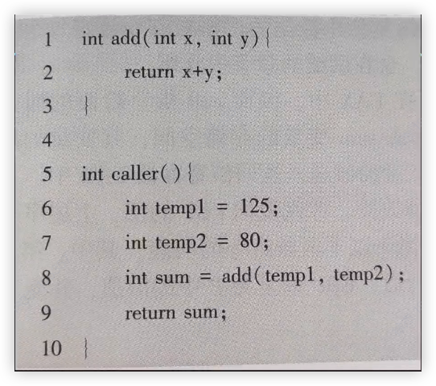
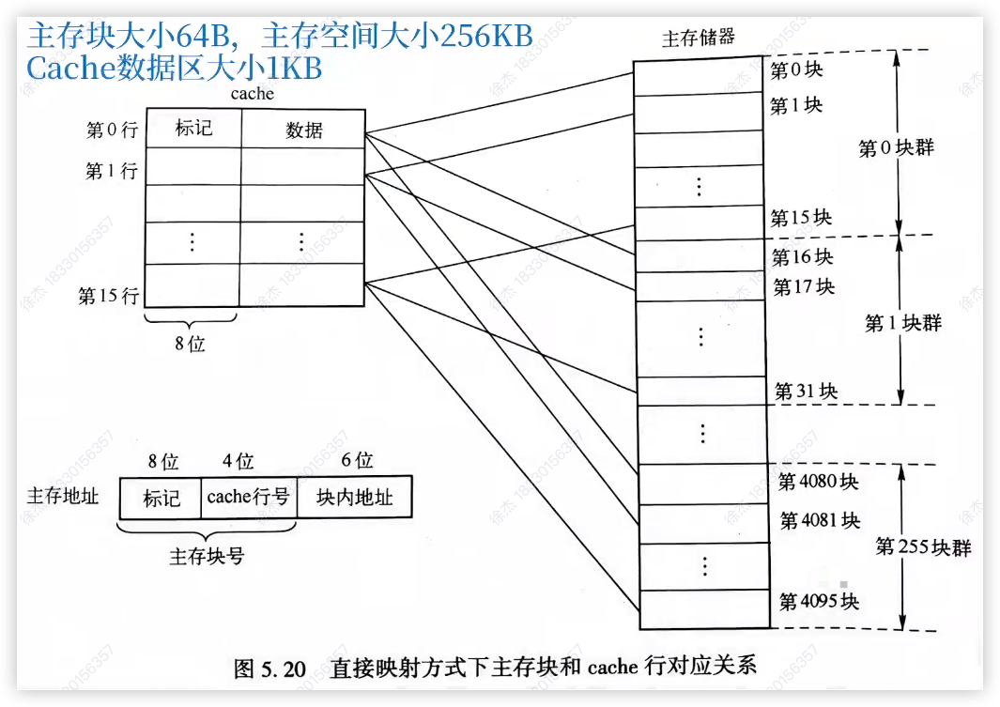
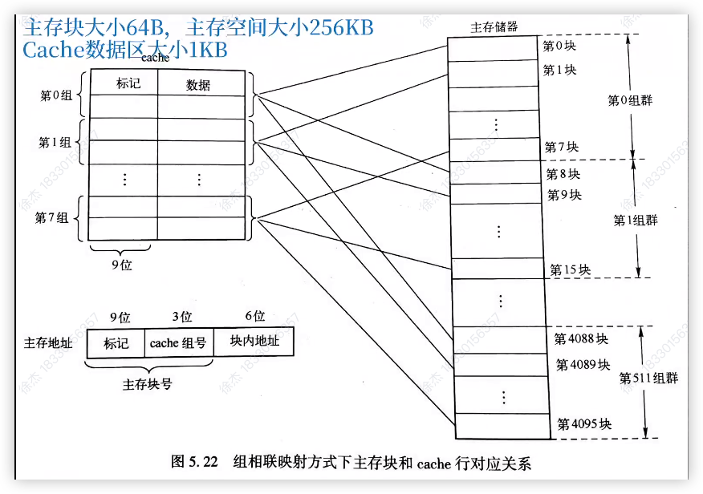

# 大题汇总

## 简答题

### 冯诺依曼

存储程序，主存储器，控制器，算数逻辑部件，输入输出，通用寄存器

部件正常工作

指令和数据采用二进制，指令分地址码与操作码

### 指令

指令是一串 0 / 1 序列，用来指示 CPU 完成特定的操作

### 指令系统

从具体问题到机器语言程序的每次转换都属于软件的范围，软件的桥梁就是指令体系结构，它是软硬件接口的完整定义，ISA 定义了可以执行的指令集合，每条指令规定了计算机的具体操作，操作数的地址与类型，机器语言就是 ISA 规定的，计算机执行机器语言的过程就是让其一条一条执行指令。

### 说明进位和溢出在概念和应用上的不同

进位：二进制加法运算时向更高位进位，最高位的进位常用于无符号数的加法时判断是否溢出

溢出：两个有符号数进行加减运算的结果超出了给定的取值范围，常用于带符号数运算

### 简述计算机中有多字节数据存储时，大端和小端存储方式的差异

大端方式将**高位字节**放在**低地址**

小端方式将**低位字节**放在**高地址**

### 在浮点数加减法中对阶的目的是什么？对阶的原则是什么

对阶的目的是使参加运算的两个数的阶码相等，以使它们的尾数可以直接相加减。

对阶的原则是小阶向大阶看齐，即小阶的那个数的尾数右移

### 浮点数加减运算需要经过哪几个主要步骤

对阶、尾数相加减、规格化、尾数舍入和溢出判断

### 过程的调用步骤

1. P 将入口参数放到 Q 能访问的地方
1. P 保存自己的返回地址，然后将控制交给 Q
1. Q 保存 P 的现场，并为自己的非静态局部变量分配空间
1. 执行 Q 的过程体
1. Q 恢复 P 的现场，并释放局部变量所占空间
1. Q 取出返回地址，将控制交给 P

### i386 System V ABI对 struct 结构体数据的规则

1. 结构体的对齐方式跟它里面对齐要求**最严格的成员**相同。
1. 每个成员都要按照自己的对齐要求，放到**满足对齐要求的最小位置**，可能会有**内部空隙**。
1. 结构体的总大小是**对齐边界的整数倍**，这可能会有**尾部空隙**。

### 可重定位目标文件和可执行目标文件的主要差别

可执行目标文件由链接器将多个可重定位文件组合生成。可重定位文件中的代码和数据地址是相对于起始地址0的，而可执行文件中的地址则按照操作系统的要求，重定位到运行时的虚拟内存中。

与可重定位文件相比，可执行文件的主要区别：

1. ELF头中的 `e_entry` 字段给出程序入口地址，而可重定位文件中这个字段是0。
1. 可执行文件多了 `.init` 节，包含 `_init` 函数，用于程序启动时的初始化。
1. 可执行文件少了 `.rel` 节，因为它的指令和数据已被重定位，不再需要重定位信息。
1. 增加了程序头表，定义了节与虚拟内存段的映射关系。

### 简述全局符号解析的规则

1. `强符号`不能多次定义，否则链接报错
1. 一次`强符号`，多次 `COMMON`符号或`弱符号`，以`强符号`为准
1. 同时出现 `COMMON` 和`弱符号`，以 `COMMON` 符号为准
1. 一个 `COMMON` 符号出现多次，以所占`空间最大`的为准
1. 若是用`-fno-common`选项，则将 `COMMON` 符号当做`强符号`
1. .**强符号**：data 节中有初始值的全局变量、.bss 节中初始值为 0 的全局变量、函数
1. **COMMON**：未初始化的全局变量
1. WEAK 为弱符号

### CPU 对异常和中断的响应过程可分为三个步骤

保护断点和程序状态、关中断、识别异常和中断事件并转相应处理程序

### I/O 子系统工作过程

CPU在用户态运行用户进程时，遇到系统调用的陷阱指令，会从用户态切换到内核态。切换后，CPU根据EAX寄存器中的系统调用号执行相应的系统调用服务例程。服务例程中，可能需要调用设备驱动程序。设备驱动程序启动外设工作，当外设准备好数据后发出中断请求。CPU响应中断，调出中断服务程序，进行主机与设备间的数据交换。

### 指令ADD R2，(R1)中包含了哪些寻址方式?简述该指令的操作数的形成过程与功能

该指令中包含了寄存器寻址和寄存器间接寻址两种寻址方式。该指令的一个操作数在R2寄存器中，另一个操作数的地址在寄存器R1中：指令功能为将寄存器R2 中的值与内存地址 R1 所指向的值相加，结果存回寄存器 R2

寄存器寻址：操作数直接保存在寄存器中，指令中引用的寄存器就是操作数本身 R2

寄存器间接寻址：寄存器中存储的是一个内存地址，操作数保存在该内存地址所指向的内存单元中 R1

### CPU中设置的程序计数器(PC)和指令译码器(ID)的作用分别是什么?

程序计数器 (PC) 存放即将执行指令的地址，取指令时先将PC的内容发送到地址线；

指令译码器 (ID) 负责解析指令寄存器中的操作码，并生成相应的译码信号，供操作控制部件生成控制信号。

### 什么是程序计数器 PC？为什么要设置 PC 寄存器

程序计数器 PC 是用来存放指令地址信息的，其中存放的是下一条将要执行的指令地址，如果没有 PC 则计算机中的程序就不能自动连续的运行

### 简述补码做加法、减法的运算特点

符号位和数值部分可按相同规则运算，无需单独处理。

补码减法可转为加法运算。

补码加减法是模运算。

### 何谓虚拟存储器？其主要好处是什么

在硬件和操作系统的支持下，将“主存—辅存”结合为一个整体，提供比主存大得多的存储空间，称为虚拟存储器。

虚拟存储器结合了主存的速度和辅存的容量，既快又大，且每位存储的平均成本较低。

### 磁盘存储设备的技术指标

存储密度

存储容量

平均访问时间

数据传输率

密度、容量、平均访问时间、传输率

### 什么是指令格式？通常情况下一条指令由哪两部分组成

计算机指令编码的格式称为指令格式

通常情况下一条指令格式由操作码、地址码组成

### 溢出

在计算机中，每种数据编码都有其数据表示范围，将运算过程中出现数据超出这个表示范围的现象称为溢出

### 一条指令中应该显式或隐式地给出哪些信息

操作码

源操作数或其地址

结果的地址

下条指令的地址

### 程序状态字中的状态标志是什么？具体有哪些状态标志

作为条件转移类指令的测试条件，供 CPU 进行判断和测试，以决定下一步的操作

进位标志 CF，溢出标志 OF，零标志 ZF，符号标志 SF

### 应用软件

是面向用户应用的功能软件、专门为解决某个应用领域的具体任务而编写的软件

### 统一编址

将I/O设备的每个相关寄存器（如控制寄存器、数据寄存器、状态寄存器等）分配一个存储器地址，通过访问内存指令来访问外围设备，这就是外设接口寄存器与主存统一编址。

### 独立编址

为所有 I/O端口单独编号，与主存地址空间分开。采用该方式时，CPU 无法从地址码区分访问的是 I/O 端口还是主存单元，因此需要专门的 I/O 指令来表明访问 I/O 空间，I/O 指令中的地址码部分提供端口号。CPU 执行 I/O 指令时，会产生 I/O 读写的总线事务，通过此事务访问 I/O 端口

### ALU

运算器中算数逻辑运算单元，用来执行算数运算与逻辑运算

### API 与 ABI

1. API：`应用程序编程接口（Application Programming Interface, API）`。`API `定义了较高层次的源程序代码和库之间的接口，通常是与硬件无关的接口
1. ABI：`应用程序二进制接口（Application Binary Interface, ABI）`。<font color='#EF4444'>ABI</font> 是为了运行在特定 ISA 及特定操作系统平台上的应用程序规定的一种机器级目标代码接口，ABI 描述了应用程序和操作系统之间、应用程序和所调用的库之间、不同组成部分（如子程序或函数）之间在较低层次上的机器级代码接口。

### 编译过程

1. **预处理阶段：**预处理程序（cpp）对源程序中以字符`#`开头的命令进行处理，例如，将#include命令后面的`.h`开头文件内容嵌入源程序文件中。预处理程序的输出结果还是一个源程序文件，以`.i`为扩展名
1. **编译阶段：**编译程序（ccl）对预处理后的源程序进行编译，生成一个汇编语言源程序文件，以.s为扩展名，例如，hello.s 是一个汇编语言程序文件。因为汇编语言与具体的机器结构有关，所以对同一台机器来说，不管什么高级语言，编译转换后的输出结果都是同一种机器语言对应的汇编语言源程序
1. **汇编阶段：**汇编程序（as）对汇编语言源程序进行汇编，生成一个`可重定位目标文件（relocatable object file）` ，以.o 为扩展名，例如，hello.o 是一个可重定位目标文件。它是一种`二进制文件（binary file）`，因为其中的代码已经是机器指令，数据以及其他信息也都是用二进制表示的，所以它是不可读的，也即打开显示出来的是乱码
1. **链接阶段：**链接程序（ld）将多个可重定位目标文件和标准函数库中的可重定位目标文件合并成为一个`可执行目标文件（executable object file ）`，可执行目标文件简称可执行文件。本例中，链接器将hello.o和标准库函数printf()所在的可重定位目标模块printf.o进行合并，生成可执行文件hello.


## 第一章计算题

**1.设某计算机的时钟频率为2GHz,指令集中有A、B、C三种不同类型的指令，它们的平均CPI分别为1、2、3。某高级语言程序经两个不同的编译程序生成了两种不同的指令序列S1和S2,它们包含的指令情况如下表所示。**

| 指令类别        | A    | B    | C    |
| --------------- | ---- | ---- | ---- |
| 平均 CPI        | 1    | 2    | 3    |
| S1 包含的指令数 | 5    | 4    | 3    |
| S2 包含的指令数 | 4    | 6    | 3    |

**该计算机的峰值MIPS是多少?**

峰值 MIPS 是指在最佳情况下，计算机每秒钟可以执行的百万条指令数。在理想条件下，计算机的 CPI（每条指令的平均时钟周期数）为 1，即每个时钟周期执行一条指令。

$MIPS = \frac{主频}{CPI}$

由于计算机的时钟频率为 2 GHz，CPI = 1，因此峰值 MIPS 计算如下：

$MIPS = \frac{2000}{1} = 2000MIPS$

**S1和S2的执行时间分别是多少?**

$用户 CPU 时间 = \frac{程序总时钟周期数}{时钟频率}$

S1 中各类指令的执行时间：$5 \times 1 + 4 \times 2 + 3 \times 3 = 22$

$\frac{22}{2000} = \frac{22}{2 \times 10^9} = \frac{11}{10^9} = 11ns$

S1 中各类指令的执行时间：$4 \times 1 + 6 \times 2 + 3 \times 3 = 25$

$\frac{25}{2000} = \frac{25}{2 \times 10^9} = \frac{12.5}{10^9} = 12.5ns$

**S1和S2的CPI分别是多少?(结果保留到小数点后2位)**

$CPI = \frac{程序总时钟周期数}{程序总指令条数}$

$S1CPI= \frac{22}{12} \approx 1.83$

$S1CPI= \frac{25}{13} \approx 1.92$


**2.假设某个频繁使用的程序 p 在机器 M1 上运行需要 10s，M1 的时钟频率为 2Ghz。设计人员想开发一台与 M1 具有相同 ISA 的新机器 M2。采用新技术可使M2 的时钟频率增加，但同时也会使CPI 增加。假定程序 P 在 M2 上的时钟周期数是在 M1 上的 1.5 倍，则 M2 的时钟频率至少达到多少才能使程序 p 在 M2 上的运行时间缩短为 6s？**

解：程序 P 在 M1 上执行的时钟周期总数为 $用户 CPU 时间 \times 时钟频率 = 10s \times 2GHz = 20G$

因为程序 P 在 M2 上的时钟周期数是在 M1 上的 1.5 倍所以 $程序 2 的时钟周期总数 = 20G * 1.5 = 30G$

要使程序 P 在 M2上运行时间缩短到 6s，则 M2的时钟频率至少应为$程序总时钟周期数 \div 用户 CPU 时间 = 30G \div 6s = 5GHz$

由此可见，M2 的时钟频率是 M1 的 2.5 倍，但M2 的速度却是 M1 的 1.67 倍 $10s \div 6s = 1.67$

上述例子说明，由于时钟频率的提高可能会对 CPU 结构带来影响，从而使其他性能指标降低，因此，虽然时钟频率提高会加快 CPU 执行程序的速度，但不能保证执行速度有相同倍数的提高

**3.假设某个频繁使用的程序P在机器M1上运行需要20s,M1的时钟频率为1GH。设计人员想开发一台与M1具有相同ISA的新机器M2采用新技术可使M2的时钟频率增加，但同时也会使CPI增加。假定P在M2上执行时的时钟周期数是在M1上的2倍,则M2的时钟频率至少达到多少才能使程序P在M2上的运行时间缩短为4s? **

程序 P 在 M1 上执行的时间周期总数为$用户 CPU 时间 \times 时钟频率 = 20s \times 1GHZ = 20G$

因为程序 P 在 M2 上的时钟周期总数是在 M1 上的两倍所以$程序 2 的时钟周期总数 = 20 \times 2 = 40G$

要使程序 P 在M2 上运行的时间缩短到 4s，则M2 时钟频率应为$程序的总时钟周期数 \div 用户 CPU 时间 = 40G \div 4 = 10GHZ $

由此可见，M2 的时钟频率是 M1 的十倍，但M2 的速度却是 M1 的 $20s \div 4 = 5$倍

上述例子说明，由于时钟频率的提高可能会对 CPU 结构带来影响，从而使其他性能指标降低，因此，虽然时钟频率提高会加快 CPU 执行程序的速度，但不能保证执行速度有相同倍数的提高

**4.假设计算机 M 的指令集中包含 A、B、C 三类指令，其 CPI 分别为 1、2、4。某个程序 P 在 M 上被编译成两个不同的目标代码序列P1和P2，P1 所含 A、B、C三类指令的条数分别为8、2、2，P2 所含 A、B、C三类指令的条数分别为2、5、3。哪个代码序列总指令条数少？哪个执行速度快？它们的 CPI 分别为多少？**

解：P1：$8 + 2 + 2 = 12条$

P2：$2 + 5 + 3 = 10条$

P2 的总指令条数少

P1 的总时钟周期数：$8 \times 1 + 2 \times 2 + 2 \times 4 = 20$

P2的总时钟周期数：$2 \times 1 + 5 \times 2 + 3 \times 4 = 24$

P1执行速度快

CPI 的计算方式为 $程序总时钟周期数 \div 程序总指令条数$

P1CPI：$20 \div 12 = 1.67$

P2CPI：$24 \div 10 = 2.4$

上述例子说明，指令条数少并不代表执行时间短，同样，时钟频率高也不说明执行速度快。在评价计算机性能时，仅考虑单个因素是不全面的，必须三个因素同时考虑


**5.假定某程序 P 编译后生成的目标代码由 A、B、C、D四类指令组成，它们在程序中所占的比例分别为43%、21%、12%、24%，已知它们的 CPI 分别为1、2、2、2。现重新对程序 P 进行编译优化，生成的新目标代码中 A 类指令条数减少了 50%，其他类的指令条数没有变。请回答下列问题**

1. 编译优化前后程序的 CPI 各是多少
1. 假定程序在一台主频为 50MHz 的计算机上运行，则优化前后的 MIPS 各是多少

解：

- A 类指令：比例 43%，CPI 为 1

- B 类指令：比例 21%，CPI 为 2

- C类指令：比例 12%，CPI 为 2

- D 类指令：比例 24%，CPI 为 2

  编译优化前的 CPI 计算公式为：

  $CPI = \sum_{i=1}^n(CPI_i \times F_i) = 程序总时钟周期数 \div 程序总指令条数$

   CPI~before~$= 0.43 \times 1 + 0.21 \times 2 + 0.12 \times 2 + 0.24 \times 2 $

  CPI~before~$= 0.43 + 0.42 + 0.24 + 0.48 = 1.57$

  **编译优化后的 CPI**

  编译优化后，A 类指令减少了50%，其他类指令不变

- A 类指令比例：$43 \div 2 = 0.215$

- B 类指令比例：21%

- C 类指令比例：12%

- D 类指令比例：24%

总指令比例现在是：$0.215 + 0.21 + 0.12 + 0.24 = 0.785$

编译优化后的比例需要重新归一化（使得总比例为 1），各类指令的新比例为：

- A 类指令：$\frac{0.215}{0.785}$
- B 类指令：$\frac{0.21}{0.785}$
- C 类指令：$\frac{0.12}{0.785}$
- D 类指令：$\frac{0.24}{0.785}$

编译优化后的 CPI 计算公式为

CPI~after~ $= \frac{0.215}{0.785} \times 1 + \frac{0.21}{0.785} \times 2 + \frac{0.12}{0.785} \times 2 + \frac{0.24}{0.785} \times 2$

CPI~after~ $= 0.274 \times 1+0.267 \times 2+0.153 \times 2+0.306\times2$

CPI~after~ $= 0.274+0.534+0.306+0.612$

CPI~after~ $= 1.726$


MIPS 计算公式 $ = \frac{主频}{CPI}$

假定程序在一台主频为 50MHz 的计算机上运行。

**编译优化前的MIPS**

MIPS~before~ $= \frac{50}{1.57} = 31.85$

MIPS~after~ $= \frac{50}{1.762} = 28.97$

从 MIPS 数来看，优化后程序执行速度反而变慢了

与定点指令运行速度`MIPS` 相对应的用来表示浮点操作速度的指标是 `MFLOPS`。它表示每秒所执行的浮点运算有多少百万次，它是基于所完成的操作次数而不是指令数来衡量的。类似的浮点操作数还有 `GFLOPS`(10^9^\s)、`TFLOPS`(10^12^次\s) 、`PFLOPS`(10^15^次\s)、`EFLOPS`10^18^次\s


**6.假设某机器的时钟频率为4GHz，程序 P 在 M 上的指令条数为 $8 \times 10^8$，其 CPI 为 1.25，则 P 在 M 上的执行时间是多少？若在 M 上从程序 P 开始启动到执行结束所需时间为 4s，则 P 的用户 CPU 时间所占的百分比是多少**

解：执行时间 = 用户 CPU 时间

根据公式$用户CPU时间 = 时钟周期总数 \div 时钟频率$

$时钟周期总数 = 指令条数 \times CPI$

$用户 CPU 时间 = (8 \times 10^8 \times 1.25)\div 4 \times 10^9$

$= 10 \times 10^8 \div 4 \times 10^9$

$=10 \div 40 $

$=0.25s$

占比 $\frac{0.25}{4} = 6.25$%

**7.写出 z = (x-y)*y 所对应的指令序列**

z=(x-y) * y，x、y 在主存的 5、6号单元，z 存在 7 号单元

格式 R：0000 （送 mov）、0001（加 add）、0010（减 sub）、0011（乘 mul）

格式 M：1110（取 load）、1111（存 store）

| 主存地址 | 主存单元内容 | 内容说明                                     | 指令        |
| :------: | :----------: | -------------------------------------------- | ----------- |
|    0     |  1110 0110   | I1： R[0] $\leftarrow$M[6];  op = 1110 取数  | load r0, 6# |
|    1     |  0000 0100   | I2：R[1]$\leftarrow$R[0]; op = 0000 传送     | mov r1,r0   |
|    2     |  1110 0101   | I3：R[0]$\leftarrow$M[5]; op=1110 取数       | load r0,5#  |
|    3     |  0010 0001   | I4：R[0]$\leftarrow$ R[0] - R[1]; op-0010 减 | sub r0,r1   |
|    4     |  0011 0001   | I5：R[0]$\leftarrow$R[0] * R[1];op=1100 乘   | mul r0,r1   |
|    5     |  1111 0111   | I6：M[7]$\leftarrow$R[0];op=1111 存数        | store 7#,r0 |
|    6     |  0001 0001   | 操作数 x = 17                                |             |
|    7     |  0000 0001   | 操作数 y = 1                                 |             |
|    8     |  0000 0000   | 结果为 z，初始值为 0                         |             |

## 第二章计算题

**1.设补码位数为 8，求 1101100 和 -1101100 的补码**

$[X_T]_补 = M + X_T（mod {\kern 5pt} M）$

$[110110]_补 = 2^8 + 110 1100 = 0110 1100(mod {\kern 5pt} 2^8)$

$[-1101100]_补 = 2^8 - 1101100 = 10010100(mod {\kern 5pt} 2^8)$

由于不够 8 位所以前面补 0 `01101100` 取反 `10010011`  然后加 1 `10010100`

 **简便方法：**

X~T~是正的，X~T~的补码就是他自身

X~T~是负的，符号位写 1，数值部分取反，末位+1

**例题：**

已知[X~T~]~补~=1011 0100，求真值 X~T~

  1011 0100 -1 = -100 1100


$\begin{array}{cccccccc} 1 & 0 & 1 & 1 & 0 & 0 & 1 & 2 \\ - & 0 & 0 & 0 & 0 & 0 & 0 & 1 \\ \hline 1 & 0 &1 &1 &0 &0 &1 &1\\ \end{array}$   取相反数-100 1100 

<font color='#EF4444'>二进制减法规则：借 1 当 2，由于第一位减1 不够减所以向第二位借，第二位为 0 无法借向第三位借，第三位为 1 可以借，借给第二位此时第二位变为 2，第二位借给第一位 1，第二位变为 1 第一位变为 2 所以 2-1 = 1 1-0 = 1</font>

**2.已知[X~T~]~补~ = 1 011 0100，求[-X~T~]~补~**

已知补码，先减1 `1 011 0011` 得到真值的反码，取反 `1 100 1100`得到真值，求该真值取负的补码，符号位由负的变为正的 `0 100 1100`

**把十进制数 10.25 转换成单精度浮点数表示**

**解**：

1. 符号是正号
1. (10)~10~ = (1010)~2~   (0.25)~10~ = (0.01)~2~
1. (10.25)~10~ = (1010.01)~2~
1. $1.01001 \times 2^3$ `01001 尾数` `3 为指数参与计算指数偏移`
1. 3 + 127 = 130 得到指数偏移 转换为二进制 `10000010` 得到阶码
1. 合并符号、阶码、尾数 10.25 为正数 `0` `10000010`（如果不足 8 位前面补 0 补到八位）`01001` （不足 23 位补 0 补满）

**3.把十进制数-0.75转换为单精度浮点数表示**

**解**：

1. 符号是负号 所以用 1 来表示
1. (0)~10~ = (0)~2~ (0.75)~10~ = (11)~2~
1. (0.75)~10~ = (0.11)~2~
1. $1.1 \times 2^{-1}$ `1 尾数` `-1 为指数参与计算指数偏移`
1. -1 + 127 = 126 得到指数偏移 转换为二进制 `01111110` 得到阶码
1. 合并符号、阶码、尾数 -0.75 为负数 `1` `01111110` `1（后面 22 个 0）`

**4.求机器数为 C0A0 0000H 的 IEEE 754 单精度浮点数值**

**解**：

首先将十六进制转换为二进制

`1` `100 0000 1` `010 0000 0000 0000 0000 0000`

可以得到符号位（1 位）为 1 可知该数为负数

 指数位（8 位） (100 0000 1)~2~ = (129)~10~

尾数位（23 位） (010 0000 0000 0000 0000 0000)~2~

组合计算：

1. 该数为负数
1. 129 - 127 = 2 得到指数（如果计算`浮点数表示` <font color='#EF4444'>阶码 = 127 + 指数</font> 如果计算`浮点数值` <font color='#EF4444'>阶 = 指数 - 127</font>）（32 位单精度格式其`基数隐含为 2`）所以表示 2^2^
1. 尾数用源码表示，第一位总为 1，因而可在尾数中默认第一位的 1，称为`隐藏位`，使得单精度格式的 23 位尾数实际上表示了 `24`位有效数字，双精度格式的 52 位尾数实际上表示了 `53 `位有效数字。IEEE 754 规定 `隐藏位 1`的位置在小数点之前
   1. 尾数 (1.01)~2~ 因为后面全为 0 所以无效，转换为 10 进制`1.25`
   1. $1 \times 2^0 + 0 \times 2^{-1} + 1 \times 2^{-2}$
   1. $1 + 0 + \frac{1}{2^{-2}} = 1.25$
1. $1.25 \times 2^2 = 5.0$
1. 根据符号位可以得到该数为负数 所以 -5.0

**5.假定变量 i、f、d 的类型分别是 int、float、double，它们可以取正无穷、负无穷、NaN以外的任意值，判断下面C 语言关系表达式在 32位机器上运行时是否为真**

1. i == (int)(float) i `不是`， 因为 int 的精度比 float 高，当 i 转换为 float 在转换为 int 时有效数字可能丢失 `可能会发生舍入`
1. f == (float)(int) f  `不是`，因为 float 型有小数部分，当 f 转换为 int 在转换为 float 时，小数部分可能丢失`可能会发生溢出`
1. i == (int)(double) i  `是`，double 比 int 有更大的精度和范围，当 i 转换为 double 在转换为 int 时，数值不变
1. f == (float)(double) f `是`，double 比 float 有更大的精度和范围，当 f 转换为 double 在转化为 float 时，数值不变
1. d == (float) d `不是`，double 比 float 有更大的精度和范围，当 d 转换为 float 数值可能会改变`可能发生溢出`
1. f == -(f) `是`，浮点数取负就是简单将数取反
1. (d+f)-d == f `d + f 会发生类型转换变为双精度，不会与单精度相等`

**6.设有一条指令长度为48位，它的编码格式如下:**

| 47:40  | 39:32    | 31:16  | 15:0   |
| ------ | -------- | ------ | ------ |
| 操作码 | 寻址特征 | 位移量 | 立即数 |

**操作码 `34H`** 位于最左边（位 47:40），是最高字节。

**立即数 `1200H`** 位于最右边（位 15:0），是最低字节。

其中，操作码为34H，寻址特征为18H,位移量为0215H,立即数为1200H。将该指令分别按照小端方式和大端方式存储在2000号开始的按字节编址的存储单元中。试画出如下表格，并将结果用十六进制数填入。

给定的指令格式是48位长，分为4个部分：操作码（8位）、寻址特征（8位）、位移量（16位）和立即数（16位）。数据的存储需要按照**小端方式**和**大端方式**进行。小端存储意味着低字节优先（低位字节存储在低地址），大端存储则是高字节优先（高位字节存储在低地址）。

我们先根据给定的指令部分进行分解：

- 操作码：34H （8位）
- 寻址特征：18H （8位）
- 位移量：0215H （16位）
- 立即数：1200H （16位）

总的指令长度是6个字节。

小端存储方式：

小端方式将**低位字节**放在**低地址**，即：

1. 立即数 `1200H`：低位 `00H` 存在 `2000` 地址，高位 `12H` 存在 `2001` 地址
1. 位移量 `0215H`：低位 `15H` 存在 `2002` 地址，高位 `02H` 存在 `2003` 地址
1. 寻址特征 `18H` 存在 `2004` 地址
1. 操作码 `34H` 存在 `2005` 地址

大端存储方式：

大端方式将**高位字节**放在**低地址**，即：

1. 操作码 `34H` 存在 `2000` 地址
1. 寻址特征 `18H` 存在 `2001` 地址
1. 位移量 `0215H`：高位 `02H` 存在 `2002` 地址，低位 `15H` 存在 `2003` 地址
1. 立即数 `1200H`：高位 `12H` 存在 `2004` 地址，低位 `00H` 存在 `2005` 地址

指令存储格式（小端和大端）

| 单元地址 | 2000 | 2001 | 2002 | 2003 | 2004 | 2005 |
| -------- | ---- | ---- | ---- | ---- | ---- | ---- |
| 小端     | 00   | 12   | 15   | 02   | 18   | 34   |
| 大端     | 34   | 18   | 02   | 15   | 12   | 00   |

**7.设某机器子长为 32 位，数值位 31 位，符号位 1 位。定点原码小数表示时，最大正数（十进制）为多少？最小负数（十进制）为多少？**

对于定点小数的表示，数值部分（不包括符号位）对应的是一个小于 1 的二进制分数。31 位的二进制小数从小数点开始，依次表示：

$b_1 \times 2^{-1} + b_2 \times 2^{-2} + b_3 \times 2^{-3} + …… b_{31} \times 2^{-31} $

其中$b_1,b_2,b_3 …… b_{31}$是二进制位可以是 0 或 1

**最大正数**：

当符号位为 0 其余 31 位全为 1 时

0.1111……1(31个 1)

转换为二进制

$1 \times 2^{-1} + 1 \times 2^{-2} + 1 \times 2^{-3} + …… 1 \times 2^{-31}$

可以看作是一个等比数列求和，使用等比数列求和公式

$S = 1 - 最小项$

$S = 1 - 2^{-31}$

**最小负数**：

符号位是 1，其余 31 位也是 1

$-(1 \times 2^{-1} + 1 \times 2^{-2} + 1 \times 2^{-3} + …… 1 \times 2^{-31})$

$S = -(1-2^{-31})$

## 第三章 计算题

1.**将以下 Intel格式的汇编指令转换为GCC 默 认 的AT&T 格 式汇编指令。说明每条指令的含义。**

1. **push  ebp**
   1.  pushl %ebp 
   1. **含义**：
      1. R[esp] $\leftarrow$ R[esp] - 4 将栈指针寄存器的内容腾出来，将栈指针下移
      1. M[R[esp]] $\leftarrow$ R[esp] 将基址寄存器的内容放入内存中，内存地址为R[esp]
   1. 因为是基于 x86 格式的是32 位所以使用 pushl 将基址寄存器的内容压入栈中
1. **mov   edx，DWORD PTR [esp + 8]**
   1. movl 8(%esp) , %edx
   1. **含义**：
      1. R[edx] $\leftarrow$ M[R[esp] + 8] 
   1.  DWORD 表示 double word 双字 l，源操作数 `DWORD PTR[esp + 8]` 目的操作数`edx`
1. **mov   al，255**
   1. movb 255 , %al
   1. **含义**：
      1. R[al] $\leftarrow$255
   1. al 是 8 位寄存器，所以指令后缀为 `b `
1.  **mov   WORD PTR [ebp + 20]，cx**
   1. movw %cx , 20(%ebp)
   1. **含义**：
      1. M[R[ebp] + 20] $\leftarrow$ R[cx]
   1. `WORD PTR`指定数据大小为 16 位，20 是`比例因子` 
1. **lea   eax，[ecx + edx * 2 + 4]**
   1. leal 4(%ecx,%edx,2) , %eax
   1. **含义**：
      1. R[eax] $\leftarrow$ $R[ecx] + R[edx] \times 2 + 4$
   1. `lea` 地址传送指令；因为是基于 x86 格式是 32 位所以使用pushl；lea 是计算地址的指令，不放在内存中所以不使用 M

2.**将以下 Intel格式的汇编指令转换为GCC 默 认 的AT&T 格 式汇编指令。说明每条指令的含义**



```assembly
caller  表示代码段开始的标签

pushl %ebp;  将当前基址指针 ebp 保存到栈中

movl %esp,%ebp;  将当前栈指针 esp 复制到基址指针 ebp 为新的栈帧建立基准 （是为了保存 caller 函数的栈帧地址，当被调用函数执行完需要利用该地址进行返回）

subl $24,%esp; 在栈上分配 24 字节空间

movl $125，-12(%ebp); M[R[ebp]-12] <- 125 将常数 125 存储到 ebp 基址-12 处，即 temp1 = 125

movl $80，-8(%ebp); M[R[ebp]-8] <- 80将常数 80 存储到 ebp 基址-8 处，即 temp2 = 80

mvol -8(%ebp),%eax; R[eax] <- M[R[ebp]-8] 将 ebp 基址-8 偏移处的值（即 temp2）加载到调用者寄存器 eax 中

movl %eax,4(%esp); M[R[esp]+4] <- R[eax] 将 eax 的值（temp2）存储到寄存器 esp 基址+4 偏移处

movl -12(%ebp),%eax; R[eax] <- M[R[ebp]-12] 将 ebp 基址-12 偏移处的值（即 temp1）加载到 eax

movl %eax,(%esp); M[R[esp]] <- R[eax] 将 eax 中的值（即 temp1）的值存储到 esp 基址偏移 0 处 

call add; 调用add 函数，将函数返回值保存在 eax 中

movl %eax,-4(%ebp); M[R[ebp]-4] <- R[eax] 将 eax 中的返回值存入 ebp 基址-4 偏移处（保存为 sum）

movl -4(%ebp),%eax; R[eax] <- M[R[ebp]-4] 将 ebp 基址-4 偏移处的值（sum）加载到寄存器 eax 中

leave  恢复栈指针和基址指针

ret 从当前函数返回到调用者
```

3. 已知形式参数 p1 和 p2 对应的实参已压入调用过程的栈帧，p1和p2对应实参的存储地址分别为R[ebp] + 8、R[ebp] + 12。这里 EBP 指向栈帧底部，返回结果存放在 EAX 中，写出函数体对应的汇编代码，要求用 GCC 默认的 AT&T 格式书写

   ```c
   int get_lowaddr_content(int *p1, int *p2) {
     if(p1 > p2) {
       return *p2;
     }else {
       return *p1;
     }
   }
   ```

   ```assembly
    movl 8(%ebp),%eax; R[eax] <- M[R[ebp] + 8], 即 R[eax] = p1
    movl 12(%ebp),%edx; R[edx] <- M[R[ebp] + 8], 即 R[edx] = p2
    cmpl %edx,%eax; 比较p1和p2，即根据 p1 - p2 的结果设置标志
    jbe .L1 # 若p1 <= p2 则转 L1 处执行
    movl (%edx),%eax; R[eax] <- M[R[edx]], 即R[eax] = M[p2]，因为结果最终保存在 eax 寄存器中，所以当第一个条件不满足时直接将p2 的内容放在了 eax 寄存器中
    jmp .L2 # 无条件跳转到 L2 执行
   
    .L1:
    	movl (%eax),%eax; R[eax] <- M[R[eax]], 即R[eax] = M[p1]
    .L2
   ```

3. **根据汇编代码补全C 语言代码**

   ```assembly
   	movl 8(%ebp),%ebx; 将 ebp + 8 的值放入 ebx 中; ebx = x
   	movl $0,%eax; 将立即数 0 放入 eax 寄存器中; result eax = result
   	movl $0,%ecx; 将立即数 0 放入 ecx 存储器中; ecx = i
   .L12: # 这是一个标签用于标记循环的开始位置
   	leal (%eax,%eax),%edx; eax + eax 放到 edx 中; edx = result * 2;
   	movl %ebx,%eax; 将 ebx 的放入 eax 中;  eax = x
   	andl $1,%eax; eax = x & 1
   	orl %edx,%eax; eax = (x & 1) | (result * 2)
   	shrl %ebx; ebx 右移一位 x >> 1
   	addl $1,%ecx; i = i + 1
   	cmpl $32,%ecx; i 与 32 比较
   	jne .L12 # i != 32 循环，若相等则 跳出
   	
   	
     for(1;i 2; 3) {
   		4
     }
   ```

   ```c
   int func_test(unsigned x) {
     int result = 0;
     int i;
     for(i = 0;i != 32; i++) {
       result = (result * 2) | (x & 0x01);
       x = x >> 1;
     }
     return result;
   }
   ```

3. **找出下列 AT&T 格式代码的错误**

   1. movl 0xFF,(%eax)  0xFF 是一个立即数需要在前面加$
   1. movb %ax,12(%ebp)   ax寄存器是 16位的 b 是表示 8 位需要将 b 换位 w
   1. addl %ecx,$0xF0  目标地址不能是常数
   1. addl %esi,%esx   没有 esx 寄存器
   1. movw 8(%ebp,,4),%ax  少写了一个变址 

3. **假设变量 x 和 ptr 的类型声明如下**

   ```assembly
   src_type x; x是 src_type 这个类型的值
   dst_type * ptr; ptr 是 dst_type 这个类型的指针
   ```

   这里，src_type和 dst_type是用 typedef 声明的数据类型。有以下一个 C 语言赋值语句

   ```c
   *ptr = (dst_type) x; // 将 x 的值转换成dst_type类型 放入 prt 这个指针型变量
   ```

   若 x 存储在寄存器 EAX（32 位） 或 AX（16 位） 或 AL（8 位） 中，ptr 存储在寄存器 EDX （32 位）中，则对于表3.12中给出的src_type和 dst_type的类型组合，写出实现上述赋值语句的机器级代码。要求用 AT&T 格式表示机器级代码

   |      src_type      |    dst_type    | 机器级表示                                                   |
   | :----------------: | :------------: | :----------------------------------------------------------- |
   |     char(8位)      |   int(32位)    | movsbl %al,%eax   movs符号位扩展指令;   <br /> 指令会将源操作数（8 位）的符号位（最高位）扩展到目标操作数的更高位。<br/>b 表示源操作数是一个字节; l 表示目的操作数是 32 位<br /> mvol %eax,(%edx)      括号表示 edx 寄存器的值是一个内存地址 |
   |     int(32位)      |   char(8位)    | movb %al,(%edx)<br/>只需要用到低 8 位即可所以使用 AL 寄存器  |
   |     int(32位)      | unsigned(32位) | movl %eax,(%edx)                                             |
   |    short(16位)     |   int(32位)    | movswl %ax,%eax  <br />movl %eax,(%edx)                      |
   | unsigned char(8位) | unsigned(32位) | 无符号不需要进行符号位扩展，但是需要零扩展<br />movzbl %al,%eax<br />mvol %eax,(%edx) |
   |     char(8位)      | unsigned(32位) | movzbl %al,%eax<br />movl %eax,(%edx)                        |
   |     int(32位)      |   int(32位)    | movl %eax,(%edx)                                             |

3. **假设函数product 的 C 语言代码如下，其中 num_type 是用 typeef 声明的数据类型**

   ```c
   void product(num_type * d, unsigned x, num_type y) {
     *d = x * y;
   }
   ```

   函数 product 的过程体对应的主要汇编代码如下

   ```assembly
   movl 12(%ebp),%eax;  R[eax] <- M[R[ebp] + 12]
   
   movl 20(%ebp),%ecx;  R[ecx] <- M[R[ebp] + 20]
   
   imull %eax,%ecx; imull 表示有符号乘法 R[ecx] <- R[eax] * R[ecx]
   
   mull 16(%ebp); 
   # mull 表示无符号乘法 mull 默认使用 eax 寄存器中的一个值作为一个乘数
   # 从内存地址 EBP + 16 处取一个32 位无符号整数，
   # 将这个整数与 EAX 寄存器中的值进行运算
   # 将乘法结果存储在 EDX:EAX寄存器中
   	# EAX 存储低32 位
   	# EDX 存储高32 位
   # R[edx]R[eax] <- M[R[ebp] + 16] * R[eax] R[edx]R[eax] 高 32 位发放在 edx 低 32 位放在 eax 中
   
   leal (%ecx,%edx),%edx; R[edx] <- R[ecx] + R[edx]
   
   movl 8(%ebp),%ecx; R[ecx] <- M[R[ebp] + 8]
   
   movl %eax,(%ecx); M[R[ecx]] <- R[eax]
   
   mvol %edx,4(%ecx); M[R[ecx] + 4] <- R[edx]
   ```

   请给出上述每条汇编指令的注释，并说明 num_type 是什么类型

   因为 EBP 是基址寄存器存放的是该函数的返回值，ebp + 4 表示返回地址，ebp + 8 表示第一个形参的地址，ebp + 12 表示第二个形参的地址，ebp + 16 表示第三个形参的地址 `movl 12(%ebp),%eax;`表示的是第二个参数，`mvol 20(%ebp),%ecx;`表示的是第三个参数，因为第三个参数是 ebp + 16 但是汇编代码表示为 + 20，所以 y 的类型肯定比 32 位要大，16-20 字节是低 32 位，20-24 是高 32 位，并且第四步进行的是无符号乘法，这里没有数组与结构体以及浮点数操作所以只能是 long long int 类型

3. **函数lproc 的过程体对应的汇编代码如下**

    回答下列问题或完成下列任务

   1. 给每条汇编指令添加注释

   1. 参数 x 和 k 分别存放在哪个寄存器中？局部变量 val 和 i 分别存放在哪个寄存器中

      x 存放在 edx 中

      k 存放在 ecx 中

      val 存放在 esi 中

      i 存放在 edi 中

   1. 局部变量 val 和 i 的初始值分别是什么

      val 的初始值 255

      i 的初始值 -2147483648

   1. 循环终止条件是什么？循环控制变量 i 是如何被修改的

      循环的终止条件是 i 等于 0，i 是通过每次循环逻辑右移k 位来修改的

   1. 填写 C 代码中缺失部分

   ```assembly
     mvol 8(%ebp),%edx; R[edx] <- M[R[ebp] + 8] // 将参数 x 传递给 edx 寄存器
     
     movl 12(%ebp),%ecx; R[ecx] <- M[R[ebp] + 12] // 将参数 k 传递给 ecx 寄存器
     
     movl $255,%esi; M[R[esi]] <- 255 // 将局部变量 val 初始化为 255
     
     movl $-2147483648, %edi; M[R[edi]] <- -2147483648 // 将局部变量 i 初始化为 -2147483648
     
   .L3:
   
   	mvol %edi,%eax; R[eax] <- R[edi] // 将 i 的值复制到 eax 寄存器
   	
   	andl %edx,%eax; R[eax] <- R[eax] & R[edx] // 执行 i & x 操作
   	
   	xorl %eax,%esi; R[esi] <- R[eax] ^ R[esi]  // 执行 val ^ (i & x) (^ 表示异或操作)
   	
   	movl %ecx,%ebx; R[ebx] <- R[ecx] // 将 k 的值复制到 ebx
   	
   	shrl %bl,%edi; R[edi] <- R[edi] >> R[bl] // 将 i 的值逻辑右移 k 位 
   		# 右移操作分为逻辑右移与算数右移，
   		# 算数右移 对有符号数进行操作的时候会保留符号位
   		# 逻辑右移 对无符号数进行右移操作时不会保留符号位
   		# 这里 如果 i 是有符号整数，直接右移会进行算数右移，这与汇编中的逻辑右移不一致，所以需要将 i 转换为无符号整数，以确保右移操作是逻辑右移
   	
   	testl %edi,%edi; // 设置标志寄存器 测试 i 是否为 0
   	
   	jne .L3 # 如果 i 不为 0 则继续执行 L3 如果 i 为 0 则跳出循环
   	
   	movl %esi,%eax; R[eax] <- R[esi] // 将 val 的值复制到 eax 寄存器
   ```

   ```c
   int lproc(int x, int k)  {
     int val = 255;
     int i;
     for(i= -2147483648;i != 0; i= (unsigned)i >> k) {
       val ^= (i & x);
     }
     return val;
   }
   
   int lproc(int x, int k)  {
     int val = __;
     int i;
     for(i= __;i != __; i= __) {
       val ^= __;
     }
     return val;
   }
   ```


## 第四章 计算题

## 第五章 计算题

**1.设有一个具有20位地址和32位字长的存储器，问：**

1. 该存储器能存储多少个字节的信息？ 

   存储器有 20 位地址线，能表示的地址空间为 $2^{20}$个存储单元，每个存储单元存储 32 位（即4 字节的信息）

   存储容量为：$2^{20}\times4 = 2^{22}$字节

   $2^{22} = 4MB$

1. 如果存储器由64K×8位的SRAM芯片组成，需要多少片？

   **64K × 8 位**表示每个SRAM芯片有 64K 个存储单元，每个存储单元存储 8 位（即 1 字节）。因此，每片SRAM芯片的存储容量是 **64KB**。

   计算机的总存储容量是$2^{22}$字节，即 4MB（通过(1)问题已经计算出来）。

   $\frac{2^{22}}{2^{16}} = 2^6 = 64 片$

1. 需多少位地址作芯片选择？
   $2^{16} = 64K$，即芯片片内地址线 16 位，存储器地址线为 20 位，故需 4 位地址线作芯片片选选择

**2.设CPU执行一段程序时, cache完成存取次数为1900次,主存完成存取次数为100次。已知 cache的存取周期为2ns,主存的存取周期为30ns求 cache的命中率和平均访存时间。**

Cache 的命中率 = $\frac{命中次数}{程序总访问次数}$

完成存取次数 1900

读取内存次数 100

总访问次数 = 1900 + 100 = 2000

Cache 的命中率 = $\frac{1900}{2000} = 0.95$

cpu Cache 到主存的平均访问时间 = $T_c + (1 -  p) \times T_m$ = Cache 存取周期 + 未命中率 * 主存存取周期

$2 + (1-0.95) \times 30$

$2 + 0.05 \times 30$

$2 + 1.5 = 3.5ns$

**3.设有一个存储器,其地址寄存器有16位,已知每个存储单元可存放8位二进制数。计算出该存储器的容量。若该存储器全部用于存放汉字信息,每个汉字采用内码方式存人,则该存储器可存入多少个汉字?**

地址寄存器有 16 位，表示该存储器的地址范围为$2^{16}$个存储单元。

每个存储单元存放 8 位（1 字节）数据，因此存储器的总容量为：

$2^{16} \times 8 = 2^6 \times 2^{10} \times 8 = 65536 字节 = 64KB$

每个汉字采用内码方式存储，一般使用 2 个字节（16 位）表示一个汉字。

该存储器可以存储的汉字数量为：

$65536 \div 2 = 32768$个汉字

**4.已知 Cache命中率 h=0.98，已知Cache存取周期为50ns，主存存取周期为200ns，求cache-主存层次的平均访问时间**

cpu Cache 到主存的平均访问时间 = $T_c + (1 -  p) \times T_m$ = Cache 存取周期 + 未命中率 * 主存存取周期

$50 + 0.02  \times 200 = 54ns$

**5.已知Cache系统的效率为85%，平均访问时间为60ns,Cache比主存快5倍，求主存存取周期是多少？**

$T_c + (1 - P) * T_m$

$60 = T_c + (1-0.85) \times 5T_C$

$60 = T_c + 0.15 \times 5T_C$

$60 = T_c + 0.75T_c$

$1.75T_c = 60$

$T_c \approx 34.28ns$

$T_m = 34.28 \times 5 = 171.4ns$

**6.某计算机主存最大寻址空间为4GB, 按字节编址，假定用64M×8位的具有8个位平面的DRAM 芯片组成容量为512MB、传输宽度为64位的内存条(主存模块)。回答下列问题：**

1. **每个内存条需要多少个 DRAM  芯片?**

   **每个 DRAM 芯片的规格是 $64M \times 8$位，**这表示每个芯片的容量是$64M \times 8 位 = 64MB$。其中，64M 是芯片的存储容量，8 位表示每个存储单元是 8 位（1 字节），所以一个芯片可以存储 64MB 数据

   **每个内存条的容量是 512MB**

   **内存条的传输宽度是 64 位，即 8 字节**

   **内存条宽度的理解**：

   - 内存条的传输宽度是 64 位，即每次内存访问可以读取或写入 64 位（8 字节）的数据
   - 但是每个 DRAM 芯片只能提供 8 位（1 字节）的数据，所以为了满足每次传输 64 位数据的要求，我们**需要 8 个 DRAM 芯片并行工作**，每个芯片提供 1 字节，8 个芯片一起提供 8 字节

   **计算需要多少芯片**

   - 每个芯片提供 64MB 的容量，而内存条的总容量是 512MB，因此：

     $\frac{512MB}{64MB} = 8 组$并行访问的芯片数量

   - 每组8 个芯片共需

     $8 \times 8 = 64 个芯片$

1. **构建容量为2GB 的主存时，需要几个内存条?**

   - 每个内存条的容量是 512MB
   - 需要构建的内存总容量 2GB

   2GB = 2048MB，内存条的容量是 512MB，因此需要

   $\frac{2048MB}{512MB} = 4 条$

1. **主存地址共有多少位?其中哪几位用于 DRAM 芯片内地址?哪几位用于选择芯片?**

   1. **主存地址共有多少位**

      **主存的最大寻址空间为 4GB**，并且**按字节编址**，这意味着每个地址对应一个字节。因此，计算机需要的地址位数是 32 位

      位（bit）是最小的单位

      字节（Byte，B）1 字节 = 8 位 $2^3$

      千字节 $1KB = 1024 字节 = 2^{10}$

      兆字节 $1MB = 1024KB = 2^{20}$

      千兆字节 $1GB = 1024MB = 2^{30}$

      $4GB = 2^2 \times 2^{30} = 2^{32}$

      因此需要 32 位地址线来表示所有的字节地址（$2^{32}$表示32 位地址空间，可以寻址 4GB 的存储空间）

   1. **哪几位用于 DRAM 芯片内寻址**

      每个 DRAM 芯片的规格是 $64M \times 8 位$，表示每个芯片的容量是$64M \times 8 位 = 64MB$

      **如何理解 DRAM 芯片的地址线**：

      - 64MB 的容量意味着 DRAM 芯片内有 64M 个存储单元
      - 64M = $2^{26}$，所以每个 DRAM 芯片内需要 26 位地址线来寻址这 64M 个存储单元

      因此，每个 DRAM 芯片内有 26 位地址线用于芯片内部寻址

      A~0~ - A~25~

   1. **哪几位用于选择芯片**

      题目说，内存条的总容量是 512MB，并且每个芯片的容量是 64MB

      - 一个内存条有$512MB \div 64MB - 8$个芯片
      - 由于内存条的传输宽度是 64 位，而每个芯片只能提供 8 位数据，因此每次传输 64 位数据时，实际上是通过 8 个并行的 DRAM 芯片一起提供的
      - 因此，实际上需要 8 组这样的 DRAM 芯片，共 64 个芯片

      为了选择每个芯片组中的一个芯片，需要使用 3 位地址线来选择（$2^3 = 8$）

      A~26~ - A~28~

**7.假定 cache采用直接映射相联方式，主存块大小为64B，按字节编址。cache 数据区大小为 2KB,主存空间大小为256KB。 试回答下列问题：**

1. **主存地址如何划分?**

   

1. **假定 cache 当前为空，说明CPU 对主存单元0240CH的访问过程。**


**设 Cache 采用直接映射，主存块大小 64B，按字节编址。Cache 数据区大小为 1KB，主存空间大小为 256KB 问：**

1. **主存地址如何划分？用图表表示主存块和 Cache 行的映射关系**

   

   **计算主存块号**：首先用主存大小乘 1024 转换单位为 B，除以 64，得到将主存一共划分为多少块

   $\frac{256 \times 1024}{64} = 4096$ 块 

   要计算 4096 需要使用多少位 2 进制来表示，要确定一个整数需要多少位二进制来表示，可以使用对数运算公式为 $log_2{(n + 1)}$

   $log_2{(4096 + 1)}  = log_2{4097} \approx 12$

   共需要 12 位二进制表示，根据上图主存地址部分可以看出主存块号正好需要 12 位二进制

   **计算块内地址**：主存储器中某一块里面的内容，一块大小 64B，按字节编址一块中有 64 字节，共需要$log_2{64} = 6$位来表示，正好与主存地址的块内地址相符

   **接下来计算 cache 的行号**，已知 cache 每一行的大小与内存块大小一致，cache 的大小为 1KB，每一块主存的大小为 64B

   $1024 \div 64 = 16$ 也就是说 cache 共 16 行

   $log_2{16} = 4$ 16 需要使用 4 位二进制来表示，得到了 cache 行号

   上面已知主存块号共 12 位，由标记与 cache 行号组成，经过计算 cache 行号为 4 位二进制表示，那么标记则为 $12 - 4 = 8$ 位二进制

1. **假设 Cache 为空，说明 CPU 对主存单元 0240CH 的访问过程**

   (0240C)~16~ = (9228)~10~ 

   $12 \times 16^0 + 0 \times 16^1 + 4 \times 16^2 + 2 \times 16^3$

   那么得到实际想访问的地址为 9228

   内存地址是连续的，每一块内存区域为 64B

   $9228 \div 64 = 144$ 得到该存储单元在内存 144 块

   

   **第二种计算方式**：

   将 (0240C)~16~ = (~~00~~00 0010 01｜0000｜00 1100)~2~ 因为主存地址共 18 位，该地址共 20 位需要删除前两的两个 0

   该地址的前 12 位为主存块号 转换为 10 进制为 144 与上面的计算结果相同

   

    **根据题目 Cache 为空，访问 0240CH 单元的过程如下：**

   首先根据地址中间 4 位 cache 行号 0000，找不到 cache 第 0 行，因为 cache 当前为空，所以，每个 cache 行的有效位都为 0，因此不管第 0 行的标志是否等于 00 0010 01，都不命中。此时，将 0240CH 单元所在的主存第 144 块复制到 cache 第 0 行，并置有效位为 1，置`标记`为 00 0010 01（表示信息取自主存第 9 块群）

**全相联映射例题**：

**设 Cache 采用全相联方式，主存块大小 64B，按字节编址。Cache 数据区大小为 1KB，主存空间大小为 256KB 问：**

1. **主存地址如何划分？用图表表示主存块和 Cache 行的映射关系**

   

   **首先计算主存块号**，首先用主存大小乘以 1024 将单位转换为 B 除以 主存块大小 算出主存一共有多少块

   $\frac{256 \times 1024}{64} = 4096 $ 块

   计算 4096 需要多少位二进制来表示，要确定一个整数需要多少位二进制表示需要使用对数公式$log_2{n+1}$

   $log_2{(4096 + 1)}  = log_2{4097} \approx 12$

   共需 12 位二进制表示，可以看出全相联映射方式下主存块号为 12 位二进制

   **计算快内地址**：主存块大小为 64B 64 需要使用 $log_2{64} = 6$ 位二进制表示，根据上图可以看出块内地址为 6 位二进制

1. **说明 CPU 对主存单元 0240CH 的访问过程**

   (0240C)~16~ = (9228)~10~ 

   $12 \times 16^0 + 0 \times 16^1 + 4 \times 16^2 + 2 \times 16^3$

   那么得到实际想访问的地址为 9228

   内存地址是连续的，每一块内存区域为 64B

   $9228 \div 64 = 144$ 得到该存储单元在内存 144 块

   

   **第二种计算方式**：

   将 (0240C)~16~ = (~~00~~00 0010 0100 00｜00 1100)~2~ 因为主存地址共 18 位，该地址共 20 位需要删除前两的两个 0

   该地址的前 12 位为主存块号 转换为 10 进制为 144 与上面的计算结果相同

   

   **访问 0240CH 单元的过程如下**：

   首先将高 12 位标记 00 0010 0100 00 与每个 cache 行标记进行比较，若有一个相等且有效位为 1，则命中，此时，CPU 根据块内地址 00 1100 从该行中取出信息；若都不相等，则不命中，此时，需要将 0240CH 单元所在主存第 00 0010 0100 00 块（即第 144 块）读出，并装入任意一个空闲 cache 行中，置有效位为 1，置标记为 00 0010 0100 00（表示信息取自主存第 144 块）

1. **设 Cache 采用 2 路组相联映射，主存块大小 64B，按字节编址。Cache 数据区大小为 1KB，主存空间大小为 256KB 问：**

   1. **主存地址如何划分？画图表示主存块和 Cache 行的映射关系**

      

      **首先计算主存块号**，首先用主存大小乘以 1024 将单位转换为 B 除以 主存块大小 算出主存一共有多少块

      $\frac{256 \times 1024}{64} = 4096 $ 块

      **计算 Cache 中有多少块** 主存块大小 64B，Cache 大小1KB

      $\frac{1024}{64} = 16$ 块

      **计算Cache 有多少组** 由于是采用两路组相联，即每两块 Cache 为一组

      $16 \div 2 = 8$ 组

      根据上图可知 cache 组号为 3 位二进制表示，$log_2{8} = 3$

      **计算将内存分为多少组** 内存共 4096 块，Cache 共 8 组

      $4095 \div 8 = 512$组

      内存分为 512 个组群，每个组群中有 8 块，每个组群的第 0 块则对应 Cache 中的第 0 组，第 1 块对应 Cache 的第 1 组

   1. **说明 CPU 对主存单元 0240CH 的访问过程**

      (0240C)~16~ = (9228)~10~ 

      $12 \times 16^0 + 0 \times 16^1 + 4 \times 16^2 + 2 \times 16^3$

      那么得到实际想访问的地址为 9228

      内存地址是连续的，每一块内存区域为 64B

      $9228 \div 64 = 144$ 得到该存储单元在内存 144 块

      

      **第二种计算方式**：

      将 (0240C)~16~ = (~~00~~00 0010 010｜000｜00 1100)~2~ 因为主存地址共 18 位，该地址共 20 位需要删除前两的两个 0

      该地址的前 12 位为主存块号 转换为 10 进制为 144 与上面的计算结果相同  

      

      **访问0240CH 单元的过程如下**：

      首先根据地址中间 3 位 Cahce 组号 000，找到 Cache 第 0 组，将标记 00 0010  010 与第 0 组中两个 Cache 行的标记进行比较，若有一个相等且有效位为 1，则命中。此时，根据低六位块内地址从对应行中取出单元内容送 CPU；若都不相等或有一个相等但有效位为 0，则不命中。此时，将 0240CH 单元所在的主存第 0 0001 0010 000块（即第 144 块）复制到 Cache 第 0 组任意一个空行中，并置有效位为 1，置标记为 0 0001 0010（`表示信息取自第 18 组群`）  

## 第六章 计算题

​                  

## 填空题

1. 将计算机的五大基本部件连接起来，成为它们之间相互传递信息的公共通路，这种公共通路称为<font color='#EF4444'>总线</font>

1. 在程序执行前，必须将程序要执行的一条指令的存储单元地址送入<font color='#EF4444'>程序计数器</font>

   为了保证程序能够连续地执行下去，CPU 必须具有某种手段来确定下一条指令的地址。在程序开始执行前，必须将程序的第一条指令地址送入程序计数器。执行指令时，CPU 将自动修改程序计数器的内容

1. 在采用单符号的进位判断溢出的补码运算中可用符号位进位与最高数值位进位异或来判断溢出。如果两个同号数相加产生了最高位进位，此时若最高数值位<font color='#EF4444'>无进位</font>，则可以判断发生了溢出

1. -27 可以用子长 8 位的补码表示为<font color='#EF4444'>11100101</font>

   (-27)~10~ = (10011011)~2~ 

   按位取反 (11100100)~1~ + 1 (11100101)~2~

1. 机器指令以什么方式提供操作数或操作数地址，称为<font color='#EF4444'>寻址方式</font>

1. C 语言中循环结构有三种：<font color='#EF4444'>for</font>语句、while语句和 do-while语句

1. 8(%edx,%ecx,4)的地址是<font color='#EF4444'>R[edx] + 4 * R[ecx] + 8</font>

1. Cache 是一种高速缓冲存储器，是为了解决 CPU 和主存之间<font color='#EF4444'>速度</font>不匹配而采用的一种技术

1. 联合体的存储空间总是按<font color='#EF4444'>最大数据长度</font>成员所需空间大小为目标

1. C 语言在调用函数时，可以采用按值传递和按<font color='#EF4444'>地址</font>传递

1. <font color='#EF4444'>符号解析</font>的目的是将每个符号的引用与一个确定的符号定义建立关联

1. <font color='#EF4444'>装入位</font>也称有效位或存在位，用来表示对应页面是否再主存

1. I/O 数据传送主要有三种不同的控制方式：程序直接控制、<font color='#EF4444'>关中断</font>控制、<font color='#EF4444'>DMA</font>控制

1. 存储器有<font color='#EF4444'>2</font>个能自行保持的稳定状态

1. 磁盘的平均存取时间由<font color='#EF4444'>寻道时间</font>、<font color='#EF4444'>旋转等待时间</font>、<font color='#EF4444'>数据传输时间</font>三部分构成

1. <font color='#EF4444'>时间局部性</font>是指被访问的某个存储单元的临近单元再一个较短的时间间隔内很可能也被访问到

1. 已调入主存而被缓冲再 DRAM 中的页称为<font color='#EF4444'>缓存页</font>

1. 地址转换由 CPU 中的<font color='#EF4444'>存储器管理部件（MMU）</font>完成

1. <font color='#EF4444'>.data</font>节用来存储已初始化且初值不为 0 的全局变量和静态变量

1. 同步控制方式的缺点是<font color='#EF4444'>对时间利用不经济</font>

1. 计算机系统以硬件为基础，通过配置各种软件来扩充系统功能，形成一个有机组合的复杂计算机系统。在一个计算机系统中，软件和硬件的分界线是<font color='#EF4444'>指令集体系结构ISA</font>

1. IEEE754 单精度浮点数用二进制表示时，阶码的长度为<font color='#EF4444'>8</font>位，尾数的长度为<font color='#EF4444'>23位</font>

1. 按指令格式的复杂程度来分，可分为 CISC 与<font color='#EF4444'>RISC</font>两种类型指令系统

1. 中断服务程序一般包含三个阶段，<font color='#EF4444'>准备</font>阶段，<font color='#EF4444'>处理</font>阶段，<font color='#EF4444'>恢复</font>阶段

1. 根据指令给出的地址个数，指令可分为三地址指令、<font color='#EF4444'>二地址指令</font>、<font color='#EF4444'>单地址指令</font>、<font color='#EF4444'>零地址指令</font>

1. 符号分为全局静态变量名和函数名，而<font color='#EF4444'>非静态局部变量名</font>不是符号

1. movq 指令用于传送一个<font color='#EF4444'>64</font>位的

1. 整个结构体变量的对齐方式与其中对齐方式<font color='#EF4444'>最严格的成员</font>相同

1. 可重定位文件中的代码区和数据区都是从地址<font color='#EF4444'>0</font>开始的

1. <font color='#EF4444'>.text</font>节用来存放目标代码部分

1. IEEE754 浮点数标准中，规格化尾数的隐藏位取值为 <font color='#EF4444'>1</font>，非规格化尾数的隐藏位取值为<font color='#EF4444'>0</font>

1. I/O接口是介于 I/O 总线和<font color='#EF4444'>外设</font>之间的硬件部分

1. 运算部件的组成主要由<font color='#EF4444'>加法器</font>、<font color='#EF4444'>ALU</font>、<font color='#EF4444'>移位器</font>

1. 计算机各部件之间相互传递信息的公共通路是<font color='#EF4444'>总线</font>

1. <font color='#EF4444'>软件识别</font>通常是在CPU中设置一个原因寄存器，该寄存器中有一些标识异常原因或中断类型的标志信息

1. CPU 取出并执行一条指令的时间称为<font color='#EF4444'>指令周期</font>

1. CPU 包括地址寄存器、指令寄存器、指令译码器

1. 符号表的三种类型：全局、本地、外部

1. 

