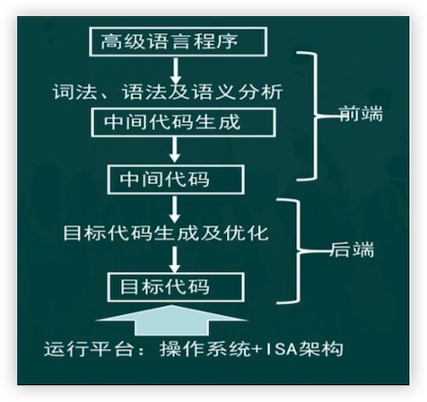
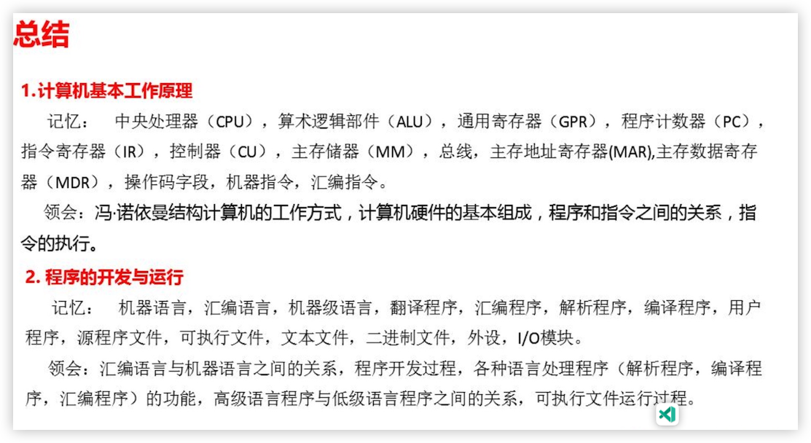

# 计算机系统原理

# 第一章 计算机系统概述

## 1.1 计算机基本工作原理

### 1.1.1 冯·诺依曼结构基本思想

**冯·诺伊曼结构** (von Neumann architecture) 是现代计算机设计的基础理念之一，由数学家和物理学家约翰冯·诺伊曼(Joho von Neumann) 提出。其基本思想包含以下几个主要方面：

**存储程序概念：**程序和数据以相同的方式存储在同一存储器中。这意味着计算机可以灵活地读写程序指令和数据，不需要装用的硬件单元分别处理编程和数据操作

分为五大部分：

**控制单元**(Control Unit)：负责解释并执行存储在存储器中的指令

**运算单元**(Arithmetic Logic Unit, ALU)：执行基本的算数和逻辑运算

**存储器**(Memory)：存储程序指令和数据

**输入设备**(input Device)：用于接收外部数据

**输出设备**(Output Device)：用于输出计算结果

**顺序执行**：程序指令按照其在存储器中的顺序逐条执行，除非遇到控制转移指令（入条件跳转指令），这使得程序的流程较为简单和直观

**二进制运算**：使用二进制数据表示所有数据和指令，这简化了物理实现，因为物理电路可以很容易地表示和处理二进制数据（如高/低电压或开/关状态）

**统一存储**：在冯·诺伊曼结构中，存储器中的所有位置都是平等的，没有本质上的区别（如没有程序存储专用区和数据存储专用区之分），这增加了计算机操作的灵活性

这些思想不进影响了最早期的计算机设计，还在今天的大多数计算机系统中得到了继续应用。这种结构使得计算机可以灵活地执行复杂程序、处理不同类型的数据、以及高效地完成各种任务

**冯·诺依曼结构主要部件**

1. 用来存放指令和数据的主存储器，简称**主存或内存**
1. 用来进行算数逻辑运算的部件    ，即**算数逻辑部件**（Arithmetic Logic Unit, ALU），在 `ALU`操作控制信号 `ALUop`的控制下，`ALU`可以对输入端 A 和 B 进行不同的运算，得到结果 F；
1. 用于自动逐条取出指令并进行编译的部件，即`控制元件`（Control Unit,CU），也称`控制器`
1. 用来和用户交互的**输入设备和输出设备** 

**冯·诺依曼结构相关的寄存器**

- 为了临时存放从主存取来的数据或运算的结果，还需要若干**通用寄存器**（Gemeral Purpose Gegiter）组成`通用寄存器组`（GPRs）,`ALU`两个输入端 A 和 B 的数据来自通用寄存器
- ALU 运算的结果会产生标志信息，例如，结果是否为 0（零标志 ZF）、是否为负数（符号标志 SF）等，这些标志信息需要记录在专门的`标志寄存器`中
- 从主存取来的指令需要临时保存在**指令寄存器**(Instruction Register,IR)中
- `CPU `为了自动按序读取主存中的指令，还需要有一个**程序计数器**（Program Counter,PC）,在执行当前指令的过程中，自动计算出下一条指令的地址并送到 PC 中保存。通常把控制部件、运算部件和各类寄存器互连组成的电路称为**中央处理器**(Central Processing Unit, CPU)，简称`处理器`

**冯·诺依曼通用寄存器编号**

CPU 需要从通用寄存器中取数据到 `ALU`运算，或把 `ALU`运算的结果保存到通用寄存器中，因此，需要给每个通用寄存器编号。同样，主存中每个单元也需要编号，称为**主存单元地址**，简称**主存地址**。通用寄存器和主存都属于存储部件，计算机中的存储部件都从 0 开始编号

**冯·诺依曼中的总线**

CUP 为了从主存取指令和存取数据，需要通过传输介质和主存相连，通常把连接不同部件进行信息传输的介质称为**总线**，其中，包含了用于传输`地址信息`、`数据信息`和`控制信息`的`地址线`、`数据线`和`控制线`。CPU 访问主存时，需先将主存地址、读/写命令分别送到总线的地址线、控制线和数据线，然后通过数据线发送或接收数据。CPU 送到地址线的主存地址应先存放在**主存地址存储器**（Memory Address register,MAR）中，发送到或从数据线取来的信息存放在**主存数据寄存器**（MemoryData Register，MDR）中

**冯·诺依曼硬件结构图**


### 1.1.2 程序和指令的执行过程

`程序`是由一系列`有序`的`指令`组成，用于让计算机执行特定任务或解决特定问题的`集合`。这些指令是用特定的编程语言编写的。程序通常包括`输入`、`处理`和`输出`三个部分。通过将这些指令按照逻辑顺序组织起来，程序可以完成从简单的算数运算到复杂的数据处理和用户交互等各种任务。

**程序的关键特点**：

1. **有序性：**所有指令按照特定顺序执行
1. **确定性：**相同的输入在相同条件下会产生相同的输出
1. **可以移植性：**很多程序可以在多个系统上运行，前提是有先赢的编译器或解释器支持

`指令`是一个单独的命令，指示计算机执行一个特定的操作。指令可以是低级的机器代码，也可以是高级编程语言中的单个语句。在低级编程中，指令通常是二进制格式的，在高级编程语言中，指令则是类似于自然语言的代码行

**指令的关键特点**：

1. **原子性：**每条指令通常代表一个原子的操作或步骤
1. **执行性：**指令是由计算机处理单元直接执行的操作

**程序与指令的区别与联系**

|              程序              |                   指令                   |
| :----------------------------: | :--------------------------------------: |
|         由多个指令组成         |              单个命令或操作              |
|          高级组织形式          |                 基本单位                 |
|        用于完成复杂任务        |          用于执行具体的基本操作          |
|       提现整体逻辑和功能       |         提现具体的运算和操作步骤         |
| 例如：一个计算两个数相加的程序 | 例如：将值从一个寄存器加载到另一个寄存器 |

**冯·诺依曼**结构计算机的功能通过执行程序实现，程序的执行过程就是包含的指令的执行过程。

**指令**（instruction）是用0和 1 表示的一串0/1序列，用来指示 `CPU`完成一个特定的原子操作，例如，

- **取数指令**（load）从`主存`单元中取出数据存放到`通用寄存器`中
- **存数指令**（store）将`通用寄存器`的内容写入`主存单元`
- **加法指令**（add）将两个`通用寄存器`内容相加后送入`结果寄存器`
- **传送指令**（mov）将一个`通用寄存器`的内容送到另一个`通用寄存器`

**定长指令格式**

该模型机采用 8 位定长指令字，即每条指令有 8 位，因此指令寄存器 IR 的宽度为 8 位。指令格式有R 型和 M 型两种


`op`为操作码字段，`R` 型指令的 `op` 为0000、0001 时，分别定义为寄存器间`传送(mov)`和`加(add)`操作；`M `型指令的 `op `为`1110`和` 1111`，分别定义为`取数(load)`和`存数(store)`，`rs` 和` rt`为通用寄存器编号，`addr`为主存单元地址

R[r]表示编号为 r 的通用寄存器中的内容，M[addr]表示地址为 addr 的主存单元内容，$\leftarrow$表示从右向左传送数据。

指令 1110 0110的功能为 R[0] $\leftarrow$ M[0110] 表示将 6 号主存单元（地址为0110）中的内容取到 0 号寄存器；指令 0001 0001 的功能为 R[0] $\leftarrow$ R[0] + R[1],表示将0 号和 1 号寄存器内容相加的结果送到 0 号寄存器


`存储程序`工作方式规定，程序执行前，需将程序包含的指令和数据先送入主存，一旦启动程序执行，则计算机必须能够在无须操作人员干预的情况下自动完成逐条指令取出和执行的任务


如图所示，一个程序的执行就是周而复始执行一条一条指令的过程。每条指令的执行过程：从主存取指令 $\rightarrow$ 对指令进行译码 $\rightarrow$ pc增量（图中的 `PC+1`表示 PC 的内容加上当前这一条指令的长度）$\rightarrow$ 取操作数并执行 $\rightarrow$ 将结果送至主存或寄存器保存

程序执行前，首先将程序的起始地址存放在 PC 中，取指令时，将 PC 的的内容作为地址访问主存。每条指令执行过程中，都需要计算下条指令将要执行指令的主存地址，并送到 PC 中。若当前指令为顺序型指令，则下条指令地址为 PC 的内容加上当前指令的长度；若当前指令为跳转型指令，则下条指令地址为指令中指定的目标地址。当前指令执行完后，根据 PC 的值到主存中取到的是下条将要执行的指令，因而计算机能够周而复始地自动取出并执行一条一条指令

程序首地址（即指令 I1 所在地址）为 0，因此，程序开始执行时，PC 的内容为 0000.根据程序执行流程，该程序运行过程中，所执行的指令顺序为 I1 $\rightarrow$ I2 $\rightarrow$ I3 $\rightarrow$ I4 $\rightarrow$ I5

**实现 z = x + y 功能的每条指令执行过程**

| 指令阶段   | I1:1110 0110             | I2: 0000 0100            | I3: 1110 0101            | I4: 0001 0001                                 | I5: 1111 0111            |
| ---------- | ------------------------ | ------------------------ | ------------------------ | --------------------------------------------- | ------------------------ |
| 取指令     | IR $\leftarrow$ M[0000]  | IR $\leftarrow$ M[0001]  | IR $\leftarrow$ M[0010]  | IR $\leftarrow$ M[0001]                       | IR $\leftarrow$ M[0100]  |
| 指令译码   | op=1110，取数            | op=0000，传送            | op=1110，取数            | op=0001，加                                   | op=1111，存              |
| PC 增量    | PC $\leftarrow$ 0000 + 1 | PC $\leftarrow$ 0001 + 1 | PC $\leftarrow$ 0010 + 1 | PC $\leftarrow$ 0011 + 1                      | PC $\leftarrow$ 0100 + 1 |
| 取数并执行 | MDR $\leftarrow$ M[0110] | A $\leftarrow$ R[0]、mov | MDR $\leftarrow$ M[0101] | A $\leftarrow$ R[0]、B $\leftarrow$ R[1]、add | MDR $\leftarrow$ R[0]    |
| 送结果     | R[0] $\leftarrow$ MDR    | R[1] $\leftarrow$ F      | R[0] $\leftarrow$ MDR    | R[0]$\leftarrow$ F                            | M[0111] $\leftarrow$ MDR |
| 执行结果   | R[0] = 33                | R[1] = 33                | R[0] = 16                | R[0]= 33 + 16 = 49                            | M[7] = 49                |

**解读：**指令 I1 存放在第 0 单元，故取指令操作为 IR $\leftarrow$ M[0000]，表示将主存 0 单元中的内容取到指令寄存器 IR 中，故取指令阶段结束时，IR 中内容为 `1110 0110`；然后，将高 4 位 `1110`（op字段）送到控制部件进行指令译码；同时控制 PC 进行`+1`操作，PC 中内容变为 `0001`；因为是取数指令，所以控制器产生`主存读`控制信号 `Read`，并控制在取数并执行阶段将 `Read` 信号送控制线，将指令后 4 位的 `0110（addr 字段）`作为主存地址送 `MAR` 并自动送地址线，经过一段时间后，主存将 `0110`（6#）单元中的 `33`（变量 y）送到数据线并自动存储在 `MDR` 中；最后由控制器将 `MDR` 内容送至 `0 `号通用寄存器，因此，指令`I1` 的执行结果为 `R[0]=33`

其他指令的执行过程类似。程序最后执行的结果为主存 0111（7#）单元内容（变量 z）变为 49，即 M[7]=49

## 1.2 程序的开发与运行

现代通用计算机都采用`存储程序`工作方式，需要计算机完成的任何任务都应先表示为一个程序。首先，应将应用问题（任务）转化为`算法（Algorithm）`描述，使得应用问题的求解变成流程化的清晰步骤，并能确保步骤是有限的。任何一个问题可能有多个求解算法，需要进行算法分析以确定哪种算法在时间和空间上能够得到优化。其次，将算法转换为用编程语言描述的程序，这个转换通常是手工进行的，也就是说，需要程序员进行程序设计。`程序设计语言（Programming Language）`与自然语言不同，它有严格的执行顺序，不存在二义性，能够唯一地确定计算机执行指令的顺序

### 1.2.1 程序设计语言和翻译程序

程序设计语言可以按照不同抽象层、不同适用领域、不同描述结构等分为多种类型，目前大约由上千种程序设计语言，从抽象层次上来分，可以分成高级语言和低级语言两类。

使用特定计算机规定的指令格式而形成的 0/1 序列称为`机器语言`，计算机能够理解和执行的程序称为`机器代码`或`机器语言程序`，其中每条指令都由 0 和 1 组成，称为`机器指令`

最早人们采用机器语言编写程序。机器语言程序的可读性很差，也不易记忆，给程序员的编写和阅读带来极大的困难。因此，热门引入了一种机器语言的符号表示语言，通过简短的英文符号和机器指令建立对应关系，以方便程序员编写和阅读程序。这种语言称为`汇编语言（Assembl yLanguage）`，机器指令对应的符号表示称为`汇编指令`

汇编指令和机器指令一一对应，每条汇编指令表示的功能与对应的机器指令功能完全相同，因而汇编指令和及其指令都与特定的机器结构有关，因此汇编语言和机器语言都属于`低级语言`，他们统称为`机器级语言`

因为每条指令的功能非常简单，所以使用机器级语言描述程序功能时，需描述的细节很多，不仅程序设计工作效率很低，而且同一个程序不能在不同机器上运行。为此，程序员多采用高级程序设计语言编写程序。`高级程序设计语言（High Level Programming Language）`简称`高级编程语言`

因为计算机无法直接理解和执行高级编程语言程序，因而需要将高级语言程序转换成机器语言程序。这个转换过程通常由计算机自动完成，进行这种转换的软件统称为`翻译程序（Translator）`，被翻译的语言和程序分别称为`源语言`和`源程序`，翻译生成的语言和程序分别称为`目标语言`和`目标程序`

**翻译程序有以下三类：**

1. **汇编程序（Assembler）：**也称`汇编器`。用于将汇编语言源程序翻译成机器语言目标程序
1. **解释程序（Interpreter）**：也称`解释器`。用于将源程序中的语句按其执行顺序逐条翻译成机器指令并立即执行
1. **编译程序（Compiler）**：也称`编译器`。用于将高级语言源程序翻译成汇编语言或机器语言目标程序

### 1.2.2 从源程序到可执行文件

```c
#include <stdio.h>

int main () {
  printf("hello,world\n");
}
```

hello.c 在计算机中以 `ASCII 码`的方式存放，第一个字节的值是 35 代表字符`#`，通常把用 ASCII 码或汉字字符表示的文件称为`文本文件（Text File）`,源程序文件都是文本文件，是可显示和可读的

将 hello.c 进行预处理、编译、汇编和链接，最终生成可执行目标文件

例如在 UNIX 系统中，可用 GCC 编译驱动程序进行处理

```shell
unix > gcc -o hello hello.c

最前面的 unix> 为`shell 命令行解释器` 的命令行提示符，`gcc`为 GCC 编译驱动程序名，`-o` 表示后面为输出文件名，hello.c 为要处理的源程序
```


1. **预处理阶段：**预处理程序（cpp）对源程序中以字符`#`开头的命令进行处理，例如，将#include命令后面的`.h`开头文件内容嵌入源程序文件中。预处理程序的输出结果还是一个源程序文件，以`.i`为扩展名
1. **编译阶段：**编译程序（ccl）对预处理后的源程序进行编译，生成一个汇编语言源程序文件，以.s为扩展名，例如，hello.s 是一个汇编语言程序文件。因为汇编语言与具体的机器结构有关，所以对同一台机器来说，不管什么高级语言，编译转换后的输出结果都是同一种机器语言对应的汇编语言源程序
1. **汇编阶段：**汇编程序（as）对汇编语言源程序进行汇编，生成一个`可重定位目标文件（relocatable object file）` ，以.o 为扩展名，例如，hello.o 是一个可重定位目标文件。它是一种`二进制文件（binary file）`，因为其中的代码已经是机器指令，数据以及其他信息也都是用二进制表示的，所以它是不可读的，也即打开显示出来的是乱码
1. **链接阶段：**链接程序（ld）将多个可重定位目标文件和标准函数库中的可重定位目标文件合并成为一个`可执行目标文件（executable object file ）`，可执行目标文件简称可执行文件。本例中，链接器将hello.o和标准库函数printf()所在的可重定位目标模块printf.o进行合并，生成可执行文件hello.

### 1.2.3 可执行文件的启动和执行


## 1.3 计算机系统的层次结构

### 1.3.1 计算机系统抽象层转换

图是计算机系统层次转换示意图，描述了从最终用户希望计算机完成的应用（问题）到电子工程师使用器件完成基本电路设计的整个转换过程


在进行高级语言程序设计时，需要有相应的应用程序`开发支撑环境`。例如，需要有一个`程序编辑器`，以方便源程序的编写；需要一套`翻译转换软件`处理各类源程序，包括预处理程序、编译器、汇编器、链接器等：还需要一个可以执行各类程序的用户界面，如 GUI 方式下的图形用户界面或 CLI 方式下的命令行用户界面（如 shell 程序）。提供程序编辑器和各类翻译转换软件的工具包统称为`语言处理系统`或软件的`集成开发环境`（Integrated Development Environment, IDE）；而具有人机交互功能的用户界面和底层系统调用服务历程则由`操作系统`（Operating System, OS）提供。当然，所有的语言处理系统都必须在操作系统提供的平台中运行，操作系统是对计算机底层结构和计算机硬件的一种抽象。

从应用问题到机器语言程序的每次转换所涉及的概念都是属于软件的范畴，而机器语言程序所运行的计算机硬件和软件之间需要有一个`桥梁`，这个在软件和硬件之间的界面就是`指令集体系结构`（Instruction Set Architecture，ISA），简称`指令集架构`或`指令系统`，它是软件和硬件之间接口的一个完整定义。ISA 定义了一套计算机可以执行的所有指令的集合，每条指令规定了计算机执行什么操作，以及所处理的操作数存放的地址空间以及操作数类型。机器语言程序就是一个 ISA 规定的指令的序列，因此，计算机硬件执行机器语言程序的过程就是让其执行一条一条指令的过程。

实现 ISA 的电路逻辑结构称为`计算机组织`（Computer Organization）或`微体系结构`（Mi-croarchitecture），简称`微架构`。ISA 和微架构是两个不同层面上的概念，例如，是否提供加法指令是 ISA 需要考虑的问题，而加法器采用串行进位还是并行进位方式则属于微架构问题。相同的 ISA 可能具有不同的微架构，例如，对于Inter x86 这种 ISA，很多处理器的组织方式不同，也即具有不同的微架构，但因为它们具有相同的 ISA，因此，一种处理器运行的程序，在另一种微架构的处理器上也能运行。

微架构中的功能由`逻辑电路`（Logic Circuit）实现，一个功能部件用不同的逻辑实现方式得到的性能和成本有差异，每个基本逻辑电路通过相应的`器件技术`（Device Technology）实现

### 1.3.2  计算机系统的不同用户

计算机系统所完成的所有任务都是通过执行程序所包含的指令来实现。计算机系统由`硬件`和`软件`两部分组成，`硬件`（Hardware）是物理装置的总称，人们看到的各种芯片、板卡、外设、电缆等都是计算机硬件。`软件`（Software）包括运行在硬件上的程序和数据以及相关的文档。`程序`（Program）是指挥计算机如何操作的一个指令序列，`数据`（Data）是指令操作的对象。根据软件的用途，一般将软件分成`系统软件`和`应用软件`两大类。

**系统软件**（System Software）包括为有效、安全地使用和管理计算机以及为开发和运行应用软件而提供的各种软件，介于计算机硬件与应用程序之间，它与具体应用关系不大。系统软件包括`操作系统`（如Windows、UNIX、Linux）、`语言处理系统`（如 Visual Studio、GCC）、`数据库管理系统`（如 Oracle）和`各类实用程序`（如磁盘碎片整理程序、备份程序）等软件。`操作系统`主要用来管理整个计算机系统的资源，包括对它们进行调度、管理、监视和服务等，操作系统还提供计算机用户和硬件之间的人机交互界面，并提供对应用软件的支持。`语言处理系统`主要用于提供一个用高级语言编程的环境，包括源程序编辑、翻译、调试、链接、装入运行等功能。

**应用软件**（Application Software）专门为数据处理、科学计算、事务管理、多媒体处理、工程设计以及过程控制等应用所编写的各类程序。例如，人们平时经常使用的电子邮件收发软件、多媒体播放软件、游戏软件、炒股软件、文字处理软件、电子表格软件、演示文稿制作软件等都是应用软件

按照在计算机上完成任务的不同，可以把适用计算机的用户分成四类：`最终用户、系统管理员、应用程序员和系统程序员`

1. **最终用户：(End User)**使用应用程序完成特定任务的计算机用户称为最终用户（end user）。几乎每个人都成为了计算机的最终用户。计算机最终用户使用键盘和鼠标等外设与计算机交互，通过操作系统提供的用户界面启动执行应用程序或系统命令，从而完成用户任务。因此，最终用户能够感知到的只是系统提供的简单人机交互界面和安装在计算机中的相关应用程序。
1. **系统管理员：(System Administrator)**是指利用操作系统、数据库管理系统等软件提供的功能对系统进行配置、管理和维护，以建立高效合理的系统环境供计算机用户使用的操作人员。其职责主要包括：安装、配置和维护系统的硬件和软件，建立和管理用户账户，升级软件，备份和恢复业务系统和数据等
1. **应用程序员：(Application Programmer)**是指适用高级编程语言编制应用软件的程序员。应用程序员大多使用高级语言编写程序。程序设计高级语言是面向算法设计的接近日常所用的英语书面语言的程序设计语言，例如：BASIC、C/C++、Fortran、Java 等。
1. **系统程序员：(System Programmer)**指设计和开发系统软件的程序员。系统程序员开发操作系统、编译器和适用程序等系统软件时，需要熟悉计算机底层相关硬件和系统结构，甚至可能需要直接与计算机硬件和指令系统打交道。因此，系统程序员必须熟悉指令系统、机器结构和相关的机器功能特性，有时还要直接用汇编语言等低级语言编写程序代码。

### 1.3.3 计算机系统核心层之间的关联



高级程序语言的编译程序将高级语言源程序转换为机器级目标代码，或者转换为机器代码直接执行，这个过程需要完成多个步骤，包括词法分析、语法分析、语义分析、中间代码生成、代码优化、目标代码优化等。如果不考虑中间代码优化，则整个过程可划分为`前端`和`后端`两个阶段，通常把中间代码生成及其之前各步骤称为`前端`。因此`前端`主要完成对源程序的分析，把源程序切分为一些基本块，并生成中间语言表示，`后端`在分析结果正确无误的基础上，将中间语言表示（中间代码）转化为目标机器支持的机器级语言程序。

程序转换的前端处理与高级编程语言标准规范密切相关，而后端处理则必须遵循 ISA 的规定和 ABI 规范。

1. **程序转换和编程语言标准之间的关系**

   每一种程序设计语言都有相应的标准规范，进行语言转换的编译程序前端必须按照编程语言标准规范进行设计，程序员编写程序时，也只有按照编程语言的标准规范进行程序开发，才能被编译程序正确转换。如果编写了不符合语言规范的高级语言源程序，编译过程就会发生错误或编译生成不符合程序员预期的目标代码

   1. <font color='#EF4444'>未定义行为</font> 指语言标准规范中没有明确指定其行为的情况。若编写了未定义行为的源程序，则每次执行结果可能不同，或在不同平台下执行结果可能不同。例如以下 C 程序就属于未定义行为代码

      ```c
      int x = 1234;
      printf("%lf",x);
      ```

   1. <font color='#EF4444'>未指定行为</font>是指语言标准规范中没有强制规定程序行为，而是列出多种结果供编译器选择，不同编译器可能选择不同行为结果。若源程序包含未指定行为，则采用不同编译器或同一编译器的不同版本，目标程序的运行结果都可能不同。例如，对于程序段 `int i = 1; f(i++,i++); `C语言标准规定，函数调用的参数求值顺序未指定，故编译器可能按`f(1,2)`处理也可能按`f(2,1)`处理

   1. <font color='#EF4444'>实现定义行为</font>指语言标准规范的实现（如编译器）需要在文档中说明其选中的未指定行为。若源程序包含实现定义行为，在相同环境下运行可能得到相同结果，但将程序移植到另一个环境时，运行结果可能不同。例如，C 语言标准规定，char 属于带符号整数还是无符号整数类型是实现定义行为。当程序员想当然地认为 char 类型一定按带符号整数运算时，编译器可能把 char 类型当成无符号整数处理，从而使程序得到非预期的结果

1. **<font color='#EF4444'>目标代码</font>与 ISA 和 ABI 规范之间的关系**

   编译程序的后端处理应根据 ISA 和`应用程序二进制接口（Application Binary Interface, ABI）`规范进行设计实现

   ISA 是对指令系统的一种规定，ISA 定义了一台计算机可以执行的所有指令的集合，以及每条指令执行什么操作、所处理的操作数存放的地址空间和操作数类型等。因为编译程序的后端将生成在目标机器中能够运行的目标代码，所以，它必须按照目标机器的 ISA 规范生成相应的目标代码。对于不符合 ISA 规范的目标代码，将无法正确运行在根据该 ISA规范而设计的计算机上。

   <font color='#EF4444'>ABI</font> 是为了运行在特定 ISA 及特定操作系统平台上的应用程序规定的一种机器级目标代码接口，包含了在生成特定平台上的目标代码时所必须遵循的一些约定。ABI 描述了应用程序和操作系统之间、应用程序和所调用的库之间、不同组成部分（如子程序或函数）之间在较低层次上的机器级代码接口。例如，过程之间的调用约定（如参数和返回值如何传递等）、系统调用约定（系统调用的参数和调用号如何传递以及如何从用户态陷入操作系统内核等）、目标文件的二进制格式和函数库使用约定、机器中寄存器的使用约定、程序的虚拟地址空间划分等。不符合 ABI 规范的目标程序，将无法正确运行在根据该 ABI 规范提供的操作系统运行环境中

   ABI 不同于`应用程序编程接口（Application Programming Interface, API）`。`API `定义了较高层次的源程序代码和库之间的接口，通常是与硬件无关的接口。因此，同样的源程序代码可以在支持相同 API 的任何系统中进行编译以及生成目标代码。在 ABI 相同或兼容的系统上，一个已经编译好的目标代码可以无须改动而直接运行

1. **ISA 与硬件、ABI 规范和操作系统之间的关系**

   在 ISA 层之上，操作系统向应用程序提供的运行时环境需要符合 ABI 规范，同时，操作系统也需要根据 ISA 规范来使用硬件提供的接口，包括硬件提供的各种控制寄存器和状态寄存器、原子操作、中断机制等。如果操作系统没有按照 ISA 规范使用硬件接口，则无法提供操作系统的重要功能。在 ISA 层之下，处理器设计时需要根据 ISA 规范来设计相应的硬件接口给操作系统和应用程序使用，不符合 ISA 规范的处理器设计，将无法支撑操作系统和应用程序的正确运行。

## 1.4 计算机系统性能评价

### 1.4.1 计算机性能的测试

`吞吐率（Throughput）`和`响应时间（Response Time）`是考量一个计算机系统性能的两个基本指标。吞吐率表示在单位时间内所完成的工作量，类似的概念是`带宽（Bandwidth）`，它表示单位时间内所传输的信息量。响应时间是指从作业提交开始到作业玩成所用的时间，类似的概念是`执行时间（Execution Time）`和`等待时间（Latency）`，它们都是用来表示一个任务所用时间的度量值

**在对用户 CPU 时间进行计算时需要用到以下几个重要的概念和指标**

- **时钟周期**计算机执行一条指令的过程被分为若干步骤，由每一步中相应的操作来玩成指令功能。每一步操作都要有相应的控制信号进行控制，用于对控制信号进行定时的同步信号就是 CPU 的<font color='#EF4444'>时钟信号</font>，其宽度为一个<font color='#EF4444'>时钟周期</font>
- **时钟频率**CPU 的主频就是 CPU 时钟信号的时钟频率，是 CPU 时钟周期的倒数。时钟频率的单位通常为 MHz 或 GHz。主频为 1.0MHz表示每秒钟发生$10^6$个时钟信号，因此时钟周期为$10^-6$（秒）= $1\mu$（微秒）；主频未 1.0GHz 表示每秒钟发生$10^9$个时钟信号，因此时钟周期为$10-9s$ = 1ns（纳秒）
- **CPI：**CPI（Cycles Per Instruction）表示执行一条指令所需的时钟周期数。由于不同指令的功能不同，所需的时钟周期数也不同。对于一条特定指令而言，其 CPI 指执行该指令所需的时钟周期数，此时 CPI 是一个确定的值；对于一个程序或一台机器来说其<font color='#EF4444'>CPI 指该程序或该机器指令集中的所有指令执行所需的平均时钟周期数，此时 CPI 是一个平均值</font>

## 练习 

1. 用于存放计算机指令和数据的临时存储器是`主存储器`

1. 计算机最基本运算单位是 `位/bit`

1. 在计算机系统中，`控制器`是让计算机按照事先编制好的指令序列来完成各种操作的

1. 在计算机系统中，`运算器`负责对信息进行运算处理

1. 计算机操作原理中`指令周期`是指`一条指令从开始执行到执行完毕的时间`

1. 请简要介绍一下计算机的工作原理

   1. 输入阶段，用户通过输入设备将需要处理的数据输入到计算机中
   1. 存储阶段，计算机将输入的数据暂时存放在主存储器中
   1. 运算阶段，计算机通过运算器对存储器中的数据进行运算处理
   1. 输出阶段，计算机将处理完的数据通过输出设备输出给用户

1. 写出 z = (x-y)*y 所对应的指令序列

   z=(x-y) * y，x、y 在主存的 5、6号单元，z 存在 7 号单元

   格式 R：0000 （送 mov）、0001（加 add）、0010（减 sub）、0011（乘 mul）

   格式 M：1110（取 load）、1111（存 store）

| 主存地址 | 主存单元内容 | 内容说明                                     | 指令        |
| :------: | :----------: | -------------------------------------------- | ----------- |
|    0     |  1110 0110   | I1： R[0] $\leftarrow$M[6];  op = 1110 取数  | load r0, 6# |
|    1     |  0000 0100   | I2：R[1]$\leftarrow$R[0]; op = 0000 传送     | mov r1,r0   |
|    2     |  1110 0011   | I3：R[0]$\leftarrow$M[5]; op=1110 取数       | load r0,5#  |
|    3     |  0010 0001   | I4：R[0]$\leftarrow$ R[0] - R[1]; op-0010 减 | sub r0,r1   |
|    4     |  0011 0001   | I5：R[0]$\leftarrow$R[0] * R[1];op=1100 乘   | mul r0,r1   |
|    5     |  1111 0111   | I6：M[7]$\leftarrow$R[0];op=1111 存数        | store 7#,r0 |
|    6     |  0001 0001   | 操作数 x = 17                                |             |
|    7     |  0000 0001   | 操作数 y = 1                                 |             |
|    8     |  0000 0000   | 结果为 z，初始值为 0                         |             |



# 第二章 数据的表示和运算

# 第三章 程序的转换及机器级表示

# 第四章 可执行文件的生成与加载执行

# 第五章 程序的存储访问

# 第六章 程序中的 I/O 操作实现
