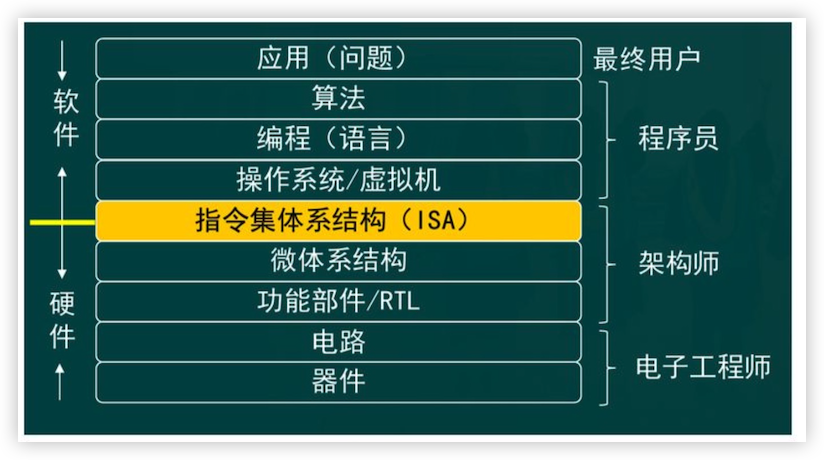
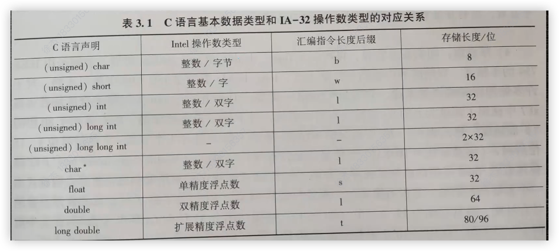
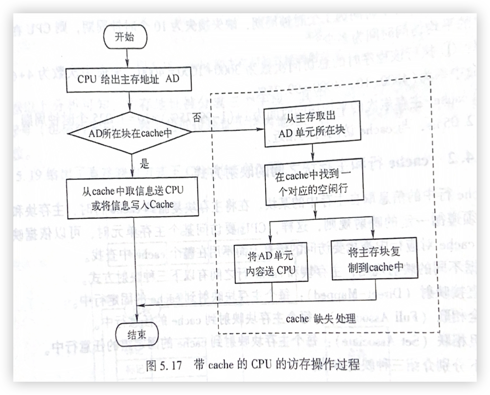

# 计算机系统原理

# 第一章 计算机系统概述

## 冯·诺依曼思想

- 采用`存储程序`的工作方式
- **五大基本部件：**主存储器、算数逻辑部件、控制器、通用寄存器、输入/输出部件
- 部件要能正常工作
- 指令和数据用二进制表示，指令分为操作码，地址码两部分

**冯·诺依曼硬件结构图**


## 计算机系统硬件结构

**冯·诺依曼结构主要部件**

1. 用来存放指令和数据的主存储器，简称**主存或内存**
1. 用来进行算数逻辑运算的部件    ，即**算数逻辑部件**（Arithmetic Logic Unit, ALU），在 `ALU`操作控制信号 `ALUop`的控制下，`ALU`可以对输入端 A 和 B 进行不同的运算，得到结果 F；
1. 用于自动逐条取出指令并进行编译的部件，即`控制元件`（Control Unit,CU），也称`控制器`
1. 用来和用户交互的**输入设备和输出设备** 

**冯·诺依曼结构相关的寄存器**

- 为了临时存放从主存取来的数据或运算的结果，还需要若干**通用寄存器**（Gemeral Purpose Gegiter）组成`通用寄存器组`（GPRs）,`ALU`两个输入端 A 和 B 的数据来自通用寄存器
- ALU 运算的结果会产生标志信息，例如，结果是否为 0（零标志 ZF）、是否为负数（符号标志 SF）等，这些标志信息需要记录在专门的`标志寄存器`中
- 从主存取来的指令需要临时保存在**指令寄存器**(Instruction Register,IR)中
- `CPU `为了自动按序读取主存中的指令，还需要有一个**程序计数器**（Program Counter,PC）,在执行当前指令的过程中，自动计算出下一条指令的地址并送到 PC 中保存。通常把控制部件、运算部件和各类寄存器互连组成的电路称为**中央处理器**(Central Processing Unit, CPU)，简称`处理器`

**冯·诺依曼通用寄存器编号**

CPU 需要从通用寄存器中取数据到 `ALU`运算，或把 `ALU`运算的结果保存到通用寄存器中，因此，需要给每个通用寄存器编号。同样，主存中每个单元也需要编号，称为**主存单元地址**，简称**主存地址**。通用寄存器和主存都属于存储部件，计算机中的存储部件都从 0 开始编号

**冯·诺依曼中的总线**

CUP 为了从主存取指令和存取数据，需要通过传输介质和主存相连，通常把连接不同部件进行信息传输的介质称为**总线**，其中，包含了用于传输`地址信息`、`数据信息`和`控制信息`的`地址线`、`数据线`和`控制线`。CPU 访问主存时，需先将主存地址、读/写命令分别送到总线的地址线、控制线和数据线，然后通过数据线发送或接收数据。CPU 送到地址线的主存地址应先存放在**主存地址存储器**（Memory Address register,MAR）中，发送到或从数据线取来的信息存放在**主存数据寄存器**（MemoryData Register，MDR）中

**根据冯·诺依曼思想采用存储程序的工作方式**，将需要执行的程序写好，数据准备好，通过输入输出设备放入主存中，CPU 访问主存将地址放入 IR 指令寄存器中，CPU 访问主存将收到的指令放入指令寄存器中，对指令进行译码，获得地址，将地址放入地址寄存器中取完一个指令后程序计数器加一表示下一次访问要访问加一的指令，对译码后的指令放入算数逻辑部件进行运算对需要进行临时保存的变量存入临时寄存器中，对最后运算的结果放回主存然后进行输出。

## **指令格式**

`程序`是由一系列`有序`的`指令`组成，用于让计算机执行特定任务或解决特定问题的`集合`。这些指令是用特定的编程语言编写的。程序通常包括`输入`、`处理`和`输出`三个部分。通过将这些指令按照逻辑顺序组织起来，程序可以完成从简单的算数运算到复杂的数据处理和用户交互等各种任务。

**程序的关键特点**：

1. **有序性：**所有指令按照特定顺序执行
1. **确定性：**相同的输入在相同条件下会产生相同的输出
1. **可以移植性：**很多程序可以在多个系统上运行，前提是有相应的编译器或解释器支持

`指令`是一个单独的命令，指示计算机执行一个特定的操作。指令可以是低级的机器代码，也可以是高级编程语言中的单个语句。在低级编程中，指令通常是二进制格式的，在高级编程语言中，指令则是类似于自然语言的代码行

**指令的关键特点**：

1. **原子性：**每条指令通常代表一个原子的操作或步骤
1. **执行性：**指令是由计算机处理单元直接执行的操作

**程序与指令的区别与联系**

|              程序              |                   指令                   |
| :----------------------------: | :--------------------------------------: |
|         由多个指令组成         |              单个命令或操作              |
|          高级组织形式          |                 基本单位                 |
|        用于完成复杂任务        |          用于执行具体的基本操作          |
|       提现整体逻辑和功能       |         提现具体的运算和操作步骤         |
| 例如：一个计算两个数相加的程序 | 例如：将值从一个寄存器加载到另一个寄存器 |

**冯·诺依曼**结构计算机的功能通过执行程序实现，程序的执行过程就是包含的指令的执行过程。

**指令**（instruction）是用0和 1 表示的一串0/1序列，用来指示 `CPU`完成一个特定的原子操作，例如，

- **取数指令**（load）从`主存`单元中取出数据存放到`通用寄存器`中
- **存数指令**（store）将`通用寄存器`的内容写入`主存单元`
- **加法指令**（add）将两个`通用寄存器`内容相加后送入`结果寄存器`
- **传送指令**（mov）将一个`通用寄存器`的内容送到另一个`通用寄存器`

**定长指令格式**

该模型机采用 8 位定长指令字，即每条指令有 8 位，因此指令寄存器 IR 的宽度为 8 位。指令格式有R 型和 M 型两种


`op`为操作码字段，`rs` 和` rt`为通用寄存器编号，`addr`为主存单元地址

**格式R**

1. `0000` 传送 mov
1. `0001` 加 add

**格式 M**

1. `1110` 取数 load
1. `1111` 存数 store

R[r]表示编号为 r 的通用寄存器中的内容，M[addr]表示地址为 addr 的主存单元内容，$\leftarrow$表示从右向左传送数据。

指令 1110 0110的功能为 R[0] $\leftarrow$ M[0110] 表示将 6 号主存单元（地址为0110）中的内容取到 0 号寄存器；指令 0001 0001 的功能为 R[0] $\leftarrow$ R[0] + R[1],表示将0 号和 1 号寄存器内容相加的结果送到 0 号寄存器

## 指令执行过程 


`存储程序`工作方式规定，程序执行前，需将程序包含的指令和数据先送入主存，一旦启动程序执行，则计算机必须能够在无须操作人员干预的情况下自动完成逐条指令取出和执行的任务


如图所示，一个程序的执行就是周而复始执行一条一条指令的过程。每条指令的执行过程：从主存取指令 $\rightarrow$ 对指令进行译码 $\rightarrow$ pc增量（图中的 `PC+1`表示 PC 的内容加上当前这一条指令的长度）$\rightarrow$ 取操作数并执行 $\rightarrow$ 将结果送至主存或寄存器保存

程序执行前，首先将程序的起始地址存放在 PC 中，取指令时，将 PC 的的内容作为地址访问主存。每条指令执行过程中，都需要计算下条指令将要执行指令的主存地址，并送到 PC 中。若当前指令为顺序型指令，则下条指令地址为 PC 的内容加上当前指令的长度；若当前指令为跳转型指令，则下条指令地址为指令中指定的目标地址。当前指令执行完后，根据 PC 的值到主存中取到的是下条将要执行的指令，因而计算机能够周而复始地自动取出并执行一条一条指令

程序首地址（即指令 I1 所在地址）为 0，因此，程序开始执行时，PC 的内容为 0000.根据程序执行流程，该程序运行过程中，所执行的指令顺序为 I1 $\rightarrow$ I2 $\rightarrow$ I3 $\rightarrow$ I4 $\rightarrow$ I5

**实现 z = x + y 功能的每条指令执行过程**

| 指令阶段   | I1:1110 0110             | I2: 0000 0100            | I3: 1110 0101            | I4: 0001 0011                                 | I5: 1111 0111            |
| ---------- | ------------------------ | ------------------------ | ------------------------ | --------------------------------------------- | ------------------------ |
| 取指令     | IR $\leftarrow$ M[0000]  | IR $\leftarrow$ M[0001]  | IR $\leftarrow$ M[0010]  | IR $\leftarrow$ M[0011]                       | IR $\leftarrow$ M[0100]  |
| 指令译码   | op=1110，取数            | op=0000，传送            | op=1110，取数            | op=0001，加                                   | op=1111，存              |
| PC 增量    | PC $\leftarrow$ 0000 + 1 | PC $\leftarrow$ 0001 + 1 | PC $\leftarrow$ 0010 + 1 | PC $\leftarrow$ 0011 + 1                      | PC $\leftarrow$ 0100 + 1 |
| 取数并执行 | MDR $\leftarrow$ M[0110] | A $\leftarrow$ R[0]、mov | MDR $\leftarrow$ M[0101] | A $\leftarrow$ R[0]、B $\leftarrow$ R[1]、add | MDR $\leftarrow$ R[0]    |
| 送结果     | R[0] $\leftarrow$ MDR    | R[1] $\leftarrow$ F      | R[0] $\leftarrow$ MDR    | R[0]$\leftarrow$ F                            | M[0111] $\leftarrow$ MDR |
| 执行结果   | R[0] = 33                | R[1] = 33                | R[0] = 16                | R[0]= 33 + 16 = 49                            | M[7] = 49                |

**解读：**指令 I1 存放在第 0 单元，故取指令操作为 IR $\leftarrow$ M[0000]，表示将主存 0 单元中的内容取到指令寄存器 IR 中，故取指令阶段结束时，IR 中内容为 `1110 0110`；然后，将高 4 位 `1110`（op字段）送到控制部件进行指令译码；同时控制 PC 进行`+1`操作，PC 中内容变为 `0001`；因为是取数指令，所以控制器产生`主存读`控制信号 `Read`，并控制在取数并执行阶段将 `Read` 信号送控制线，将指令后 4 位的 `0110（addr 字段）`作为主存地址送 `MAR` 并自动送地址线，经过一段时间后，主存将 `0110`（6#）单元中的 `33`（变量 y）送到数据线并自动存储在 `MDR` 中；最后由控制器将 `MDR` 内容送至 `0 `号通用寄存器，因此，指令`I1` 的执行结果为 `R[0]=33`

其他指令的执行过程类似。程序最后执行的结果为主存 0111（7#）单元内容（变量 z）变为 49，即 M[7]=49

## 程序的运行

因为计算机无法直接理解和执行高级编程语言程序，因而需要将高级语言程序转换成机器语言程序。这个转换过程通常由计算机自动完成，进行这种转换的软件统称为`翻译程序（Translator）`，被翻译的语言和程序分别称为`源语言`和`源程序`，翻译生成的语言和程序分别称为`目标语言`和`目标程序`

**翻译程序有以下三类：**

1. **解释程序（Interpreter）**：也称`解释器`。用于将源程序中的语句按其执行顺序逐条翻译成机器指令并立即执行
1. **编译程序（Compiler）**：也称`编译器`。用于将高级语言源程序翻译成汇编语言或机器语言目标程序
1. **汇编程序（Assembler）：**也称`汇编器`。用于将汇编语言源程序翻译成机器语言目标程序


| 阶段       | 处理程序 | 处理结果（扩展名）           |
| ---------- | -------- | ---------------------------- |
| 预处理阶段 | 预处理器 | 源程序（.i）                 |
| 编译阶段   | 编译器   | 汇编语言程序（.s）           |
| 汇编阶段   | 汇编器   | 可重定位目标文件二进制（.o） |
| 链接阶段   | 链接器   | 可执行文件二进制             |

1. **预处理阶段：**预处理程序（cpp）对源程序中以字符`#`开头的命令进行处理，例如，将#include命令后面的`.h`开头文件内容嵌入源程序文件中。预处理程序的输出结果还是一个源程序文件，以`.i`为扩展名
1. **编译阶段：**编译程序（ccl）对预处理后的源程序进行编译，生成一个汇编语言源程序文件，以.s为扩展名，例如，hello.s 是一个汇编语言程序文件。因为汇编语言与具体的机器结构有关，所以对同一台机器来说，不管什么高级语言，编译转换后的输出结果都是同一种机器语言对应的汇编语言源程序
1. **汇编阶段：**汇编程序（as）对汇编语言源程序进行汇编，生成一个`可重定位目标文件（relocatable object file）` ，以.o 为扩展名，例如，hello.o 是一个可重定位目标文件。它是一种`二进制文件（binary file）`，因为其中的代码已经是机器指令，数据以及其他信息也都是用二进制表示的，所以它是不可读的，也即打开显示出来的是乱码
1. **链接阶段：**链接程序（ld）将多个可重定位目标文件和标准函数库中的可重定位目标文件合并成为一个`可执行目标文件（executable object file ）`，可执行目标文件简称可执行文件。本例中，链接器将hello.o和标准库函数printf()所在的可重定位目标模块printf.o进行合并，生成可执行文件hello.

## 可执行文件的启动和执行


## 层次结构

**计算机系统层次结构**



从应用问题到机器语言程序的每次转换所涉及的概念都是属于软件的范畴，而机器语言程序所运行的计算机硬件和软件之间需要有一个`桥梁`，这个在软件和硬件之间的界面就是`指令集体系结构`（Instruction Set Architecture，ISA），简称`指令集架构`或`指令系统`，它是软件和硬件之间接口的一个完整定义。ISA 定义了一套计算机可以执行的所有指令的集合，每条指令规定了计算机执行什么操作，以及所处理的操作数存放的地址空间以及操作数类型。机器语言程序就是一个 ISA 规定的指令的序列，因此，计算机硬件执行机器语言程序的过程就是让其执行一条一条指令的过程。

实现 ISA 的电路逻辑结构称为`计算机组织`（Computer Organization）或`微体系结构`（Mi-croarchitecture），简称`微架构`。ISA 和微架构是两个不同层面上的概念，例如，是否提供加法指令是 ISA 需要考虑的问题，而加法器采用串行进位还是并行进位方式则属于微架构问题。相同的 ISA 可能具有不同的微架构，例如，对于Inter x86 这种 ISA，很多处理器的组织方式不同，也即具有不同的微架构，但因为它们具有相同的 ISA，因此，一种处理器运行的程序，在另一种微架构的处理器上也能运行。

微架构中的功能由`逻辑电路`（Logic Circuit）实现，一个功能部件用不同的逻辑实现方式得到的性能和成本有差异，每个基本逻辑电路通过相应的`器件技术`（Device Technology）实现

**计算机系结构的层次划分**

**虚拟机级别：**

1. 应用语言机器级
1. 高级语言机器级
1. 汇编语言机器级
1. 操作系统 `中介`

**硬件级别：**

1. 机器语言机器级
1. 微程序机器级

**API 与 ABI**

1. API：`应用程序编程接口（Application Programming Interface, API）`。`API `定义了较高层次的源程序代码和库之间的接口，通常是与硬件无关的接口
1. ABI：`应用程序二进制接口（Application Binary Interface, ABI）`。<font color='#EF4444'>ABI</font> 是为了运行在特定 ISA 及特定操作系统平台上的应用程序规定的一种机器级目标代码接口，ABI 描述了应用程序和操作系统之间、应用程序和所调用的库之间、不同组成部分（如子程序或函数）之间在较低层次上的机器级代码接口。

## 性能评价

**计算机系统性能评价**

1. **吞吐率(Throughput)：**吞吐率表示在单位时间内所完成的工作量，类似的概念是`带宽（Bandwidth）`，它表示单位时间内所传输的信息量
1. **响应时间(Response Time)：**响应时间是指从作业提交开始到作业完成所用的时间，类似的概念是`执行时间（Execution Time）`和`等待时间（Latency）`，它们都是用来表示一个任务所用时间的度量值
1. **执行时间**
   1. 用户 CPU 时间
   1. 系统 CPU 时间
   1. 其他时间（I/O 等待时间）
1. **流畅度、清晰度、实时性**

**在对用户 CPU 时间进行计算时需要用到以下几个重要的概念和指标**

- **时钟周期**计算机执行一条指令的过程被分为若干步骤，由每一步中相应的操作来完成指令功能。每一步操作都要有相应的控制信号进行控制，用于对控制信号进行定时的同步信号就是 CPU 的<font color='#EF4444'>时钟信号</font>，其宽度为一个<font color='#EF4444'>时钟周期</font>，<font color='#EF4444'>计算机最小时间单位</font>
- **时钟频率**CPU 的主频就是 CPU 时钟信号的时钟频率，是 CPU 时钟周期的倒数。时钟频率的单位通常为 MHz 或 GHz。主频为 1.0MHz表示每秒钟发生$10^6$个时钟信号，因此时钟周期为$10^-6$（秒）= $1\mu$（微秒）；主频为 1.0GHz 表示每秒钟发生$10^9$个时钟信号，因此时钟周期为$10^{-9}s$ = 1ns（纳秒），`表示每秒钟可以执行多少个时钟周期`
- **CPI：**CPI（Cycles Per Instruction）表示执行一条指令所需的`时钟周期数`。由于不同指令的功能不同，所需的时钟周期数也不同。对于一条特定指令而言，其 CPI 指执行该指令所需的时钟周期数，此时 CPI 是一个确定的值；对于一个程序或一台机器来说其<font color='#EF4444'>CPI 指该程序或该机器指令集中的所有指令执行所需的平均时钟周期数，此时 CPI 是一个平均值，通常称为综合 CPI</font>

<font color='#EF4444'>时钟周期与时钟频率互为倒数关系</font>

已知上述参数或指标，可以通过以公式来计算 用户程序的<font color='#EF4444'>CPU 执行时间，即用户 CPU 时间</font>

$用户 CPU 时间 = 程序总时钟周期数 \div 时钟频率 = 程序总时钟周期数 \times 时钟周期$

上述公式中，程序总时钟周期数可由程序总指令条数和相应的 CPI 求的

如果已知程序总指令条数和综合 CPI，则可用如下公式计算程序总时钟周期数

$程序总时钟周期数 = 程序总指令条数 \times CPI$

 如果已知程序中共有n种不同类型的指令，第 i 种指令的条数和 CPI 分别为$C_i$ 和$CPI_i$，则

$程序总时钟周期数 = \sum_{i=1}^n (CPI_i \times C_i)$

**程序的综合 CPI** 也可以由以下公式求得，其中，$F_i$ 表示第$i$种指令在程序中所占的`比例`

$CPI = \sum_{i=1}^n(CPI_i \times F_i) = 程序总时钟周期数 \div 程序总指令条数$

因此，若已知程序综合 CPI 和总指令条数，则可用下列公式计算用户 CPU 时间

$用户 CPU 时间 = CPI \times 程序总指令条数 \times 时钟周期$

有了用户 CPU 时间，就可以评判两台计算机性能的优劣。<font color='#EF4444'>计算机的性能可以看成是用户 CPU 时间的倒数</font>，因此，两台计算机性能之比就是用户 CPU 时间之比的倒数。若计算机 M1 和 M2 的性能之比为n，则说明“计算机 M1 的速度是计算机 M2 的速度的 n 倍”，也就是说，“在计算机 M2 上执程序的时间是在计算机 M1 上执行时间的 n 倍 ”

**例题1：**假设某个频繁使用的程序 p 在机器 M1 上运行需要 10s，M1 的时钟频率为 2Ghz。设计人员想开发一台与 M1 具有相同 ISA 的新机器 M2。采用新技术可使M2 的时钟频率增加，但同时也会使CPI 增加。假定程序 P 在 M2 上的时钟周期数是在 M1 上的 1.5 倍，则 M2 的时钟频率至少达到多少才能使程序 p 在 M2 上的运行时间缩短为 6s？

解：程序 P 在 M1 上执行的时间周期总数为 $用户 CPU 时间 \times 时钟频率 = 10s \times 2GHz = 20G$

因为程序 P 在 M2 上的时钟周期数是在 M1 上的 1.5 倍所以 $程序 2 的时钟周期总数 = 20G * 1.5 = 30G$

要使程序 P 在 M2上运行时间缩短到 6s，则 M2的时钟频率至少应为$程序总时钟周期数 \div 用户 CPU 时间 = 30G/6s = 5GHz$

由此可见，M2 的时钟频率是 M1 的 2.5 倍，但M2 的速度却是 M1 的 1.67 倍 $10s \div 6s = 1.76$

上述例子说明，由于时钟频率的提高可能会对 CPU 结构带来影响，从而使其他性能指标降低，因此，虽然时钟频率提高会加快 CPU 执行程序的速度，但不能保证执行速度有相同倍数的提高

**例题 2：**假设计算机 M 的指令集中包含 A、B、C 三类指令，其 CPI 分别为 1、2、4。某个程序 P 在 M 上被编译成两个不同的目标代码序列P1和P2，P1 所含 A、B、C三类指令的条数分别为8、2、2，P2 所含 A、B、C三类指令的条数分别为2、5、3。哪个代码序列总指令条数少？哪个执行速度快？它们的 CPI 分别为多少？

解：P1：$8 + 2 + 2 = 12条$

P2：$2 + 5 + 3 = 10条$

P2 的总指令条数少

P1 的总时钟周期数：$8 \times 1 + 2 \times 2 + 2 \times 4 = 20$

P2的总时钟周期数：$2 \times 1 + 5 \times 2 + 3 \times 4 = 24$

P1执行速度快

CPI 的计算方式为 $程序总时钟周期数 \div 程序总指令条数$

P1CPI：$20 \div 12 = 1.67$

P2CPI：$24 \div 10 = 2.4$

上述例子说明，指令条数少并不代表执行时间短，同样，时钟频率高也不说明执行速度快。在评价计算机性能时，仅考虑单个因素是不全面的，必须三个因素同时考虑

##  用指令执行速度进行性能评估

指令速度所用的计量单位为` MIPS`（Million InstructionsPer Second），其含义是平均每分钟执行多少百万条指令 

假定某程序 P 编译后生成的目标代码由 A、B、C、D四类指令组成，它们在程序中所占的比例分别为43%、21%、12%、24%，已知它们的 CPI 分别为1、2、2、2。现重新对程序 P 进行编译优化，生成的新目标代码中 A 类指令条数减少了 50%，其他类的指令条数没有变。请回答下列问题

1. 编译优化前后程序的 CPI 各是多少
1. 假定程序在一台主频为 50MHz 的计算机上运行，则优化前后的 MIPS 各是多少

解：

- A 类指令：比例 43%，CPI 为 1

- B 类指令：比例 21%，CPI 为 2

- C类指令：比例 12%，CPI 为 2

- D 类指令：比例 24%，CPI 为 2

  编译优化前的 CPI 计算公式为：

  $CPI = \sum_{i=1}^n(CPI_i \times F_i) = 程序总时钟周期数 \div 程序总指令条数$

   CPI~before~$= 0.43 \times 1 + 0.21 \times 2 + 0.12 \times 2 + 0.24 \times 2 $

  CPI~before~$= 0.43 + 0.42 + 0.24 + 0.48 = 1.57$

  **编译优化后的 CPI**

  编译优化后，A 类指令减少了50%，其他类指令不变

- A 类指令比例：$43 \div 2 = 0.215$

- B 类指令比例：21%

- C 类指令比例：12%

- D 类指令比例：24%

总指令比例现在是：$0.215 + 0.21 + 0.12 + 0.24 = 0.785$

编译优化后的比例需要重新归一化（使得总比例为 1），各类指令的新比例为：

- A 类指令：$\frac{0.125}{0.785}$
- B 类指令：$\frac{0.21}{0.785}$
- C 类指令：$\frac{0.12}{0.785}$
- D 类指令：$\frac{0.24}{0.785}$

编译优化后的 CPI 计算公式为

CPI~after~ $= \frac{0.125}{0.785} \times 1 + \frac{0.21}{0.785} \times 2 + \frac{0.12}{0.785} \times 2 + \frac{0.24}{0.785} \times 2$

CPI~after~ $= 0.274 \times 1+0.267 \times 2+0.153 \times 2+0.306\times2$

CPI~after~ $= 0.274+0.534+0.306+0.612$

CPI~after~ $= 1.726$


MIPS 计算公式 $ = \frac{主频}{CPI}$

假定程序在一台主频为 50MHz 的计算机上运行。

**编译优化前的MIPS**

MIPS~before~ $= \frac{50}{1.57} = 31.85$

MIPS~after~ $= \frac{50}{1.762} = 28.97$

从 MIPS 数来看，优化后程序执行速度反而变慢了

与定点指令运行速度`MIPS` 相对应的用来表示浮点操作速度的指标是 `MFLOPS`。它表示每秒所执行的浮点运算有多少百万次，它是基于所完成的操作次数而不是指令数来衡量的。类似的浮点操作数还有 `GFLOPS`(10^9^\s)、`TFLOPS`(10^12^次\s) 、`PFLOPS`(10^15^次\s)、`EFLOPS`10^18^次\s

## 用基准程序进行性能评估

<font color='#EF4444'>基准程序</font>（benchmarks）是进行计算机性能测评的一种重要工具。基准程序是专门用来进行性能评价的一组程序，能够很好地反应机器在运行实际负载时的性能，可以通过在不同机器上运行相同的基准程序来比较不同机器上的运行时间，从而评测其性能

基准程序最好是用户经常使用的一些实际程序，或是某个应用领域的一些典型的简单程序，对于不同的应用场合，应该选择不同的基准程序。例如，对于用于软件开发的计算机进行评测时，最好选择包含编译器和文档处理软件的一组基准程序；而如果是用于 CAD 处理的计算机进行测评时，最好选择一些典型的图形处理小程序作为一组基准程序

## 练习 

1. 用于存放计算机指令和数据的临时存储器是`主存储器`

1. 计算机最基本运算单位是 `位/bit`

1. 在计算机系统中，`控制器`是让计算机按照事先编制好的指令序列来完成各种操作的

1. 在计算机系统中，`运算器`负责对信息进行运算处理

1. 计算机操作原理中`指令周期`是指`一条指令从开始执行到执行完毕的时间`

1. 请简要介绍一下计算机的工作原理

   1. 输入阶段，用户通过输入设备将需要处理的数据输入到计算机中
   1. 存储阶段，计算机将输入的数据暂时存放在主存储器中
   1. 运算阶段，计算机通过运算器对存储器中的数据进行运算处理
   1. 输出阶段，计算机将处理完的数据通过输出设备输出给用户

1. 写出 z = (x-y)*y 所对应的指令序列

   z=(x-y) * y，x、y 在主存的 5、6号单元，z 存在 7 号单元

   格式 R：0000 （送 mov）、0001（加 add）、0010（减 sub）、0011（乘 mul）

   格式 M：1110（取 load）、1111（存 store）

   | 主存地址 | 主存单元内容 | 内容说明                                     | 指令        |
   | :------: | :----------: | -------------------------------------------- | ----------- |
   |    0     |  1110 0110   | I1： R[0] $\leftarrow$M[6];  op = 1110 取数  | load r0, 6# |
   |    1     |  0000 0100   | I2：R[1]$\leftarrow$R[0]; op = 0000 传送     | mov r1,r0   |
   |    2     |  1110 0101   | I3：R[0]$\leftarrow$M[5]; op=1110 取数       | load r0,5#  |
   |    3     |  0010 0001   | I4：R[0]$\leftarrow$ R[0] - R[1]; op-0010 减 | sub r0,r1   |
   |    4     |  0011 0001   | I5：R[0]$\leftarrow$R[0] * R[1];op=1100 乘   | mul r0,r1   |
   |    5     |  1111 0111   | I6：M[7]$\leftarrow$R[0];op=1111 存数        | store 7#,r0 |
   |    6     |  0001 0001   | 操作数 x = 17                                |             |
   |    7     |  0000 0001   | 操作数 y = 1                                 |             |
   |    8     |  0000 0000   | 结果为 z，初始值为 0                         |             |

1. 名词解释：时钟周期、时钟频率、CPI、吞吐率、响应时间

   1. 时钟周期：计算机执行一条指令被分为若干步，每一步中都有相应的操作来完成指令功能，每一步操作都要有相应的控制信号进行控制，用于对控制信号进行定时的同步信号就是 CPU 的时钟信号，其宽度为一个时钟周期，是计算机最小时间单位
   1. 时钟频率：就是 CPU 的主频，是时钟周期的倒数，单位通常为 MHz 或 GHz，表示每秒钟可以执行多少个时钟周期
   1. CPI：表示一条指令所需的时钟周期数，不同指令功能不同，所需的时钟周期数也不同，对于一条特定指令而言，其 CPI 指的是执行该指令所需的时钟周期数，此时的 CPI 是一个确定的值；对于一个程序或一台机器来说其 CPI 是指该程序或机器指令集中所有指令执行所需的平均时钟周期数，此时CPI 是一个平均值，称为综合 CPI
   1. 吞吐率：单位时间内所完成的工作量，类似的概念是带宽，表示单位时间内所传输的信息量
   1. 响应时间：从作业提交到作业完成所用的时间，类似的概念是执行时间和等待时间，都是用来表示一个任务所用时间的度量值

1. 假设某机器的时钟频率为4GHz，程序 P 在 M 上的指令条数为 $8 \times 10^8$，其 CPI 为 1.25，则 P 在 M 上的执行时间是多少？若在 M 上从程序 P 开始启动到执行结束所需时间为 4s，则 P 的用户 CPU 时间所占的百分比是多少

   解：执行时间 = 用户 CPU 时间

   根据公式$用户CPU时间 = 时钟周期总数 \div 时钟频率$

   $时钟周期总数 = 指令条数 \times CPI$

   $用户 CPU 时间 = (8 \times 10^8 \times 1.25)\div 4 \times 10^9$

   $= 10 \times 10^8 \div 4 \times 10^9$

   $=10 \div 40 $

   $=0.25s$

   占比 $\frac{0.25}{4} = 6.25$%

   

# 第二章 数据的表示和运算

## 信息的二进制编码

在计算机内部，所有信息都用二进制数字表示。这是因为：

1. 二进制只有两种基本状态，而使用有两个稳定状态的物理器件可以容易地表示二进制数的每一位
1. 二进制的编码、计数和运算规则都很简单，可用开关电路实现，简便易行
1. 两个符号`1`和 `0`正好与逻辑命题的两个值`真`和`假`相对应，为计算机中实现逻辑运算和程序中的逻辑判断提供了便利的条件，特别是能通过逻辑门电路方便地实现算数运算

指令所处理的基本数据类型分为两种：<font color='#EF4444'>数值数据</font>和<font color='#EF4444'>非数值数据</font>

1. 数值数据可用来表示数量的多少，可比较其大小，分为整数和实数
1. 整数又分为无符号整数和带符号整数。在计算机内部，整数用定点数表示，实数用浮点数表示
1. 非数值数据没有大小之分，不表示数量的多少，主要包括字符数据和逻辑数据

表示一个数值数据要确定的三个要素：

1. 进位记数制
1. 定/浮点表示
1. 编码规则

任何给定一个二进制 0/1 序列，在未确定它采用什么进位记数制、定点还是浮点表示以及编码表示方法之前，它所代表的数值数据的值是无法确定的

日常生活中，常使用带正负号的十进制数表示数值数据。例如6.18，-127等。但是，在计算机内部，数值数据通常用二进制数表示。如果采用十进制数表示数值数据的话，也要将十进制数编码成二进制数，即`采用二进制编码的十进制数`（BCD）

##  进位计数制

在 R 进制数字系统中，应采用 R 个基本符号（0,1,2,3……,R-1）表示各位上的数字，采用`逢 R 进一`的运算规则，对于每一个数位 i，该位上的权为R^i^，R 被称为该数字系统的基

一般采用 B 表示二进制，O 表示八进制，D 表示十进制，H 表示十六进制，也可以在十六进制之前用 0X 做前缀

**R 进制转换为十进制数：**

将二进制数(10101.01)~2~ = ($1 \times 2^4 + 0 \times 2^3 + 1\times 2^{2} + 0 \times 2^1 + 1 \times 2^0 + 0 \times 2^{-1} + 1 \times 2^{-2}$)~10~ = (21.25)~10~

<font color='#EF4444'>一个数的负数次方计算方式 计算该数正数次方的倒数</font>

$x^{-n} = \frac{1}{x^n}$ 

**十进制小数转化R进制：**

<font color='#EF4444'>将小数部分与基数 R 做乘法运算，把乘积中的整数部分取出作为对应进制的高位，剩余小数部分继续与基数 R 做乘法运算，直到小数部分为 0</font>

**8 或 16 进制转换二进制**:

对 8 进制进行一位展开为三位，16 进制一位展开为四位，<font color='#EF4444'>小数部分按同样规则展开</font>

## 定点数的编码表示

**原码：**是一种用于表示有符号数的编码方法。在这种表示方法中，最高位（最左边的一位）被用作符号位，其值为 `0` 表示正数，为 `1` 表示负数。其余的位数被用来表示数值的绝对值（即数的大小）

+5 的原码表示为 00000101（假设使用 8 位表示）

+18 的原码表示为 00010010（假设使用 8 位表示）

−5 的原码表示为 10000101（假设使用 8 位表示）

−18 的原码表示为 10010010（假设使用 8 位表示）

优点：

1. 直观，方便

缺点：

1. 存在两个表示零的编码：+0 表示为 00000000 和 −0 表示为 10000000。这在计算和表示上会导致一些不便。
1. 加减法实现复杂

**补码表示法：**

`模`的概念：对于 n 位二进制数 那么该二进制数的`模`就是 2^n^

1.  正数的补码是自身：$[X_T]_补 = X_T = M + X_T(mod {\kern 5pt} M)$

   例如 X~T~ = 5；M = 10

   $[5]_补 = 5 = 10 + 5(mod {\kern 5pt} M)$

   5 = 15 % 10

1. 负数的补码是模与该数绝对值的差：$[X_T]_补 = M = |X_T| = M + X_T(mod {\kern 5pt} M)$

1. 无论正负数 它的补码都是 `模`加这个数

   $[X_T]_补 = M + X_T(mod {\kern 5pt} M)$

1. 补码的区间为 $[-2^{n-1},2^{n-1})$ 其中 -2^n-1^可以取到 2^n-1^无法取到

   如果 n = 8 则是 -2^7^到 2^7^-1      -128 - 127

1. 0 的补码：$[+0]_补 = [-0]_补 = 2^n \pm 0 = 10…0 = 00…0(mod {\kern 5pt} 2^n)$

   0 的二进制 `00000000` 取反后得到 `11111111`

   加 1 `11111111` 加 1 后得到 `00000000`因为 8 位全1 加 1 后会溢出，结果回到 0

1. -1的补码：$[-1]_补 = 2^n -1 = 11…1(n 个 1)$

   绝对值二进制表示：1 的二进制表示 `00000001`

   取反 `11111110`加 1 得到 `11111111`

   **例题：**

   当补码位数分别为 n 位、n+1 位时，求-2^n-1^的补码

   $[X_T]_补 = M + X_T(mod {\kern 5pt} m)$

   n: $[-2^{n-1}]_补 = 2^n + (-2^{n-1}) = 2^n - 2^{n-1} = 2^{n-1} = 100000000 （n-1个 0）(mod {\kern 5pt} 2^n)$

   n+1:$[-2^{n-1}]_补 = 2^{n+1} + (-2^{n-1}) = 2^{n+1} - 2^{n-1} = 2^n + 2^{n-1} = 110…0(n-1个 0)(mod {\kern 5pt} 2^{n+1})$

   $2^{n+1} - 2^{n-1} = 2^{n} + 2^{n-1}$推导过程：

   $2^{n+1} = 2^{n-1} \times 2^1 \times 2^1 = 2^{n-1+1+1} = 2^{n+1}$

   $2^{n-1} \times 2^1 \times 2^1 - 2^{n-1}$

   $4 \times 2^{n-1} - 2^{n-1}$

   $ = 3 \times 2^{n-1}$

   $= (2+1)2^{n-1}$

   $=2^1 \times 2^{n-1} + 2^{n-1}$

   =$2^n + 2^{n-1}$

   **例题：**

   设补码位数为 8，求 1101100 和 -1101100 的补码

   $[X_T]_补 = M + X_T（mod {\kern 5pt} M）$

   $[110110]_补 = 2^8 + 110 1100 = 0110 1100(mod {\kern 5pt} 2^8)$

   $[-1101100]_补 = 2^8 - 1101100 = 10010100(mod {\kern 5pt} 2^8)$

   由于不够 8 位所以前面补 0 `01101100` 取反 `10010011`  然后加 1 `10010100`

    **简便方法：**

   X~T~是正的，X~T~的补码就是他自身

   X~T~是负的，符号位写 1，数值部分取反，末位+1

   **例题：**

   已知[X~T~]~补~=1011 0100，求真值 X~T~

     1011 0100 -1 = -100 1100

   

   $\begin{array}{cccccccc} 1 & 0 & 1 & 1 & 0 & 0 & 1 & 2 \\ - & 0 & 0 & 0 & 0 & 0 & 0 & 1 \\ \hline 1 & 0 &1 &1 &0 &0 &1 &1\\ \end{array}$   取相反数-100 1100 

<font color='#EF4444'>二进制减法规则：借 1 当 2，由于第一位减1 不够减所以向第二位借，第二位为 0 无法借向第三位借，第三位为 1 可以借，借给第二位此时第二位变为 2，第二位借给第一位 1，第二位变为 1 第一位变为 2 所以 2-1 = 1 1-0 = 1</font>

**例题：**

已知[X~T~]~补~ = 1 011 0100，求[-X~T~]~补~

已知补码，先减1 `1 011 0011` 得到真值的反码，取反 `1 100 1100`得到真值，求该真值取负的补码，符号位由负的变为正的 `0 100 1100`

**补码的优点**

1. 0 的表示是唯一的
1. 用加法实现减法，加减法统一
1. 比源码和反码可以多表示一个最小负数
1. 不需要通过循环进位来调整结果

## 整数的表示

**IEEE 754 计数标准**

符号 + 阶码 + 尾数

1. 16 位半精度：1+5+10 偏移量 15
1. 32 位单精度：1+8+23 偏移量 127
1. 64 为双精度：1+11+52 偏移量 1023

指数（阶码）决定了范围，尾数决定了精度

**浮点数表示的计算步骤**

1. 分解成符号、指数、尾数三部分
1. 符号：0 正、1 负
1. 把十进制转换成二进制
1. 写成科学计数法
1. 指数偏移
1. 记录尾数
1. 写成计算机中的浮点数表示

**例题：**

把十进制数 10.25 转换成单精度浮点数表示

**解**：

1. 符号是正号
1. (10)~10~ = (1010)~2~   (0.25)~10~ = (0.01)~2~
1. (10.25)~10~ = (1010.01)~2~
1. $1.01001 \times 2^3$ `01001 尾数` `3 为指数参与计算指数偏移`
1. 3 + 127 = 130 得到指数偏移 转换为二进制 `10000010` 得到阶码
1. 合并符号、阶码、尾数 10.25 为正数 `0` `10000010`（如果不足 8 位前面补 0 补到八位）`01001` （不足 23 位补 0 补满）

**例题：**

把十进制数-0.75转换为单精度浮点数表示

**解**：

1. 符号是负号 所以用 1 来表示
1. (0)~10~ = (0)~2~ (0.75)~10~ = (11)~2~
1. (0.75)~10~ = (0.11)~2~
1. $1.1 \times 2^{-1}$ `1 尾数` `-1 为指数参与计算指数偏移`
1. -1 + 127 = 126 得到指数偏移 转换为二进制 `01111110` 得到阶码
1. 合并符号、阶码、尾数 -0.75 为负数 `1` `01111110` `1（后面 22 个 0）`

**例题：**

求机器数为 C0A0 0000H 的 IEEE 754 单精度浮点数值

**解**：

首先将十六进制转换为二进制

`1` `100 0000 1` `010 0000 0000 0000 0000 0000`

可以得到符号位（1 位）为 1 可知该数为负数

 指数位（8 位） (100 0000 1)~2~ = (129)~10~

尾数位（23 位） (010 0000 0000 0000 0000 0000)~2~

组合计算：

1. 该数为负数
1. 129 - 127 = 2 得到指数（如果计算`浮点数表示` <font color='#EF4444'>阶码 = 127 + 指数</font> 如果计算`浮点数值` <font color='#EF4444'>阶 = 指数 - 127</font>）（32 位单精度格式其`基数隐含为 2`）所以表示 2^2^
1. 尾数用源码表示，第一位总为 1，因而可在尾数中默认第一位的 1，称为`隐藏位`，使得单精度格式的 23 位尾数实际上表示了 `24`位有效数字，双精度格式的 52 位尾数实际上表示了 `53 `位有效数字。IEEE 754 规定 `隐藏位 1`的位置在小数点之前
   1. 尾数 (1.01)~2~ 因为后面全为 0 所以无效，转换为 10 进制`1.25`
   1. $1 \times 2^0 + 0 \times 2^{-1} + 1 \times 2^{-2}$
   1. $1 + 0 + \frac{1}{2^{-2}} = 1.25$
1. $1.25 \times 2^2 = 5.0$
1. 根据符号位可以得到该数为负数 所以 -5.0

**数值类型转换**

**当在 int、float、double 等类型数据之间进行强制类型转换时，程序将得到以下数值转换结果（假定 int 型数为 32 位）**

1. 从 `int` 型转换为 `float` 型时，不会发生溢出，但因为 float 型有效位更少，因而可能有有效数字被`舍入`（int 和 float 虽然都是 32 位的但是 int 可以精确的表示范围内的整数，flaot是通过科学计数法表示的，其中一部分需要表示指数所以 float 的经度有限）
1. 从 `int` 型或 `float` 型转换为 `double` 型时，因为 double 型的`有效位数更多`，故能保留精确值
1. 从 `double` 型转换为 `float` 型时，因为 float 型表示范围更小，故可能发生`溢出`，此外，由于有效位数变少，可能被`舍入`
1. 从 `float` 型或`double` 型转换为 `int` 型时，因为 `int` 型没有小数部分，所以数据可能会向 `0 方向被截断`。例如，1.9999 被转换为 1，-1.9999被转换为-1。此外，因为 `int` 型表数范围更小，故可能发生溢出。将大浮点数转换为整数可能会导致程序错误

1. 溢出
   1. 表示范围
   1. 可能引发的问题：极大/小值、符号错误、无穷大值
1. 舍入
   1. 表示精度
   1. 接近真实值但不完全相同

 **C 语言的数值类型转换**

1. int、float、double
1. int、float $\rightarrow$ double `无问题`
1.  double $\rightarrow$ float `溢出、舍入` 
1. double $\rightarrow$ int `溢出 舍入`
1. float $\rightarrow$ int `溢出 舍入`
1. int $\rightarrow$ float `不会溢出 舍入`

**例题：**

假定变量 i、f、d 的类型分别是 int、float、double，它们可以取正无穷、负无穷、NaN以外的任意值，判断下面C 语言关系表达式在 32位机器上运行时是否为真

1. i == (int)(float) i `不是`， 因为 int 的精度比 float 高，当 i 转换为 float 在转换为 int 时有效数字可能丢失 `可能会发生舍入`
1. f == (float)(int) f  `不是`，因为 float 型有小数部分，当 f 转换为 int 在转换为 float 时，小数部分可能丢失`可能会发生溢出`
1. i == (int)(double) i  `是`，double 比 int 有更大的精度和范围，当 i 转换为 double 在转换为 int 时，数值不变
1. f == (float)(double) f `是`，double 比 float 有更大的精度和范围，当 f 转换为 double 在转化为 float 时，数值不变
1. d == (float) d `不是`，double 比 float 有更大的精度和范围，当 d 转换为 float 数值可能会改变`可能发生溢出`
1. f == -(f) `是`，浮点数取负就是简单将数取反
1. (d+f)-d == f `d + f 会发生类型转换变为双精度，不会与单精度相等`

**数据宽度和单位**

1. 比特：位 （元）b  组成二进制信息最小单位
1. 字节：Byte 
1. 字： 字的长度对于不同指令集架构是不同的
1. 字长：CPU 一次可以处理多少位数据，还影响系统总线的宽度，或寻址的能力

**数据存储和排列顺序**

1. 最低有效字节（LSB）
1. 最高有效字节（MSB）
1. 大端：数据地址是 MSB 所在地址，MSB 在低地址
1. 小端：数据地址是 LSB 所在地址，LSB 在高地址
1. 5 在 32 位机上用 int 类型表示时的 0/1 序列为 0000 0000 `左边高位 MSB` ｜ 0000 0000 ｜0000 0000 ｜ 0000 0101  `右边低位 LSB`


# 第三章 程序的转换及机器级表示

## **程序转换**

1. C 语言、汇编语言、机器语言的关系

   1. 指令的类型
      1. 伪指令：包含多个机器指令的一个序列属于软件范畴
      1. 机器指令：包含多个机器指令
      1. 微指令：属于硬件范畴
   1. 机器级指令
      1. 机器指令（0/1 序列）
      1. 汇编指令（符号表示、助记符）
1. **机器指令的格式**

   1. 操作码

   1. 寻址方式

   1. 寄存器编号

   1. 立即数（位移量，1B/2B/4B）

<table>
  <tr>
    <td>100010 D W</td>
    <td>mod</td>
    <td>reg</td>
    <td>r/m</td>
    <td>disp8</td>
  </tr>
  <tr>
    <td>100010 0 0</td>
    <td colspan="3">01 001 001</td>
    <td>11111010</td>
  </tr>
</table>
用来将汇编语言源程序中的汇编指令翻译成机器指令的程序称为`汇编程序`。而将机器指令反过来翻译成汇编指令的程序称为`反汇编程序`

## **寄存器传送语言**

M[R[bx] + R[di]-6] $\leftarrow$ R[cl]

将 Cl寄存器的内容传送到一个存储单元中，该存储单元的有效地址计算方法为 BX 和 DI 两个寄存器的内容相加再减6

**汇编指令的表示**

1. Intel 格式

   mov [bx + di - 6], cl

1. AT&T格式（本课程使用）

   movb %cl, -6(%bx , %di)

AT&T格式相对于 Inter 格式的区别

1. 指令名后的字母表示操作数的大小
1. 寄存器名前使用 % 前缀，立即数前使用$前缀
1. 内存引用使用括号而不是方括号
1. 在有偏移的内存引用中，基址、索引、比例和偏移量的顺序与 Intel 格式不同
1. AT&T 格式源操作数在目标操作数之前

<font color='#EF4444'>Intel 格式： 目标操作数  源操作数</font>

**指令集体系结构 ISA 规定的内容**

1. 指令格式、操作类型
1. 操作数的类型
1. 寄存器的名称、编号、长度、用途等
1. 操作数能存放的存储空间大小和编址方式
1. 大端序还是小端序
1. 寻址方式
1. 指令执行过程的控制方式，包括程序计数器等

**高级语言转换成机器语言**

1. 预处理成hello.i(源码)
1. 编译成汇编语言hello.s(源码)
1. 汇编成可重定位目标文件(二进制)
1. 链接成可执行目标文件(二进制)

**gcc 生成机器代码**

1. 一步到位：gcc -o1 hello1.c hello2.c -o hello
   1. -o1 表示一级优化
   1. 将hello1.c hello2.c 一起编译为 可执行程序 hello
1. 预处理：gcc -E hello1.c -o hello1.i
1. 编译：gcc -S hello1.i -o hello1.s
1. 汇编：gcc -c hello1.s -o hello1.o
1. 链接：gcc hello1.o hello2.0 -o hello

**指令系统风格**

1. **CISC 风格指令系统**：随着 `VLSI（超大规模集成电路）` 技术的迅速发展，计算机硬件成本不断下降，软件成本不断上升。为此，人们在设计指令系统时增加了越来越多功能强大的复杂指令，以使指令的风格接近高级语言语句的功能，这类计算机称为`复杂指令集计算机 CISC`，本课程的 Intel x86指令系统就是典型的 `CISC`架构

1. **RISC 风格指令系统**：RISC 的着眼点不是简单地放在简化指令系统上，而是通过简化指令使计算机结构更佳简单合理，从而提高机器的性能。

   与 `CISC`相比

   1.  指令数目少
   1. 指令格式规整，采用定长指令字方式，操作码和操作数地址等字段的长度固定
   1. 只有 `Load/Store` 指令中的数据需要访存，这种称为 `Load/Store` 型指令风格
   1. 采用大量通用寄存器

## **汇编指令**

AT&T：move %cl, -6(%bx,%di)

1. **寄存器内容**：%+名字，如 %ebp
   1. RTL：R[ebp]
1. **存储器内容**：偏移量（基址寄存器、变址寄存器、比例因子）
   1. 计算：基址寄存器 + (变址寄存器 * 比例因子) + 偏移量
   1. 例：100(%ebx, %esi, 4)
   1. 存储单元的地址为：寄存器ebx的内容加上（寄存器esi内容乘以 4），在加 100
   1. RTL：M[R[ebx] + 4xR[esi] + 100]
1. **汇编指令格式**：op src , dst，表示：dst $\leftarrow$ dst op src
   1. 例如：addl (, %ebx, 2),  %eax 
   1. RTL：R[eax] $\leftarrow$ R[eax] + M[2 * R[ebx]]
      1. **解析**：加 32 位，源操作数 `(, %ebx, 2)` 目标操作数 %eax ，寄存器 eax 的内容与主存 `(, %ebx, 2)` 的内容相加，将结果放入 eax 中 <font color='#EF4444'>M 表示主存 R 表示寄存器</font>
      1. `(, %ebx, 2)` 分别对应 基址、变址、比例因子，基址为空，偏移量为空，变址`ebx` 乘 2
   1. add**l** 中l 的含义
      1. b 8 位 字节传送
      1. w 16 位 字传送
      1. l 32 位 双字传送
      1. q 64 位

## IA-32 指令系统

**IA-32、x86-64**

1. Intel 8086、80286、i386等，架构称为x86
1. 现在 32x86架构的名称x86-32改为 IA-32
1. 由 16 位架构发展而来，规定一个字为 16 位，32 位是双字
1. AMD 提出了兼容 IA-32指令集的64位架构版本
   1. AMD 称为 amd64
   1. Intel 称为Intel64
   1. 统称为x86-64



**定点寄存器组**

1. 8 个通用寄存器
   1. EAX、EBX、ECX、EDX 用来存放操作数
   1. ESP、EBP、ESI、EDI 用来放变址或指针 <font color='#EF4444'>ESP 栈指针寄存器 EBP 基址寄存器</font>
1. 两个专用寄存器
   1. EIP：指令指针寄存器
   1. EFLAGS：标志寄存器
1. 6 个段寄存器

**常用条件标志含义说明**

1. **OF**：溢出标志；反应`带符号数`的操作结果是否超过相应的数值范围
   1. 例如字节运算结果超过-128 ～ +127或字节运算结果超出-32768 ～ +32767 称为溢出。<font color='#EF4444'>此时 OF=1，否则 OF=0</font>
1. **SF**：符号标志；反应带符号数运算结果的符号。<font color='#EF4444'>负数时，SF=1，否则 SF=0</font>
1. **ZF**：零标志；反映运算结果是否为 0。<font color='#EF4444'>若为 0，ZF=1，否则 ZF=0</font>
1. **CF**：进/借位标志：反应无符号整数加（减）运算后的进（借）位情况，<font color='#EF4444'>有进（借）位 CF = 1，否则 CF = 0</font>

**控制标志含义说明**

1. **DF**：方向标志。用来确定串操作指令执行时**变址寄存器**`SI （ESI）`和 `DI（EDI）`中的内容是自动递增还是递减。<font color='#EF4444'>若 DF = 1，则为递减，否则为递增</font>
1. **IF**：中断允许标志。<font color='#EF4444'>IF = 1 允许中断，否则禁止中断</font>
1. **TF**：陷阱标志。用来控制单步执行操作<font color='#EF4444'>TF = 1 时按单步方式执行指令</font>

**IA-32 寻址方式、指令的操作数类型**

1. **什么是寻址？** 根据指令给定信息得到操作数或其地址
1. **立即寻址**：在指令中，无须指定其存放位置
1. **寄存器寻址**：需要指定操作数所在寄存器的编号
1. **当操作数为存储单元内容时**：需要指定操作数所在存储单元的地址
1. **其他寻址**：操作数在存储器中（存储器操作数）
   1. 实地址模式
   1. 保护模式

## IA-32 常用指令类型及其操作

**常用指令类型**：

1. **传送指令**
   1. **通用数据传送指令**：传送的是寄存器或存储器的数据
      1. **MOV**：一般的传送指令，包括``movb(b表示一个字节)`、`movw`、`movl（l表示 32 位）`
      1. **MOVS**：符号扩展传送指令，将短的源数据高位符号扩展后传送到目的地址，如`movsbw(b表示 8 位，w 表示 16 位)`表示把一个字节进行符号扩展后送到一个 16 位寄存器中
      1. **MOVZ**：零扩展传送指令，将短的源数据高位零扩展后传送到目的地址，如 `movzwl`表示把一个字的高位进行零扩展后送到一个 32 位寄存器中
      1. **XCHG**：数据交换指令，将两个寄存器内容互换。例如，`xchgb`表示字节交换
      1. **PUSH**：压栈指令，先执行 R[sp] $\leftarrow$ R[sp] -2 或 R[esp] $\leftarrow$ R[esp] -4，然后将一个字或双字从指定寄存器送到 sp 或 ESP 指示的栈单元中。`pushl` 表示双字压栈，`pushw` 表示字压栈
      1. **POP**：将一个字或双字从 `SP` 或 `ESP` 指示的单元送入指定寄存器，在执行 R[sp] $\leftarrow$ R[sp] + 2或 R[esp] $\leftarrow$ R[esp] + 4。如 `popl` 表示双字出栈，`popw` 表示字出栈
   1. **地址传送指令**：传送的是操作数的存储地址
      1. **例**：对赋值语句 `x = i + j`，leal 指令用于加载有效地址，也可以用来做简单的算数加法运算；编译器使用了指令`leal(%edx,%eax),%eax`。该指令中源操作数的有效地址为`R[edx] + R[eax]`，故指令的功能为`R[eax]` $ \leftarrow $ `R[edx] + R[eax]`，该指令执行前，`R[edx] = i，R[eax] = j`，因此该指令执行后`R[eax] = i+j`
   1. **输入/输出指令**：输入/输出指令专门用于在累加寄存器 `AL/AX/EAX`和 `I/O`端口之间进行数据传送
   1. **标志传送指令**：对标志寄存器进行操作
1. **定点算数指令**
1. **位运算指令**
1. **执行流控制指令**

`栈`是一种采用`先进后出`的方式进行访问的一块存储区，在处理过程中调用时非常有用。大多数情况下，栈是从高地址向低地址增长的。在 IA-32 中，用 ESP 寄存器指向当前栈顶，而栈底通常在一个高地址上。


在图 3.6 中给出了在 16 位架构下的 `pushw`和`popw`指令执行结果示意图。如图所示，在执行 `pushw %ax`指令之后，SP 指向存放有 AX 内容的单元，也即新栈顶指向了当前刚入栈的数据。若随后在执行 `popw %ax` 指令，则原先在栈顶的两个字节退出栈，栈顶向高地址移动两个单元，又回到 `pushw %ax`指令执行前的位置，因为 Intel 架构采用小端方式，所以 AL 在低地址上，AH 在高地址上 

**例题**：

将以下 Intel 格式的指令转换为 AT&T 格式指令，并说明功能

1. push ebp
   1. **pushl %ebp**
   1. **说明**：
      1. R[esp] $\leftarrow$ R[esp] -4 **将栈指针寄存器中的内容腾出来；将栈指针下移**
      1.  M[R[esp]] $\leftarrow$ R[ebp] **将基址寄存器中的内容放入内存中，内存地址为 R[esp]**
   1. **解读**：因为是基于 x86 格式是 32 位所以使用pushl，%ebp 表示`寄存器`；将基址寄器内容压入栈中
1. mov ebp,esp
   1. movl %esp,%ebp
   1. **说明**：
      1. R[ebp] $\leftarrow$ R[esp]  **将栈指针寄存器内容移动到基指针寄存器**
   1. **解读**：由于是 Intel 格式操作数，目标操作数为 ebp, 源操作数为 esp，AT&T 格式与 Intel 格式正好相反
1. mvo edx, DWORD PTR[ebp + 8]
   1. movl 8(%ebp),%edx
   1. **说明**：
      1. R[edx] $\leftarrow$ M[R[ebp] + 8 ] **将 ebp基址寄存器地址加 8 的双字长内容移动到 edx 寄存器**
   1. **解读**：DWORD 表示 double word 双字 l，源操作数 `DWORD PTR[ebp + 8]` 目的操作数`edx`
1. mov bl,255
   1. movl $255, %bl
   1. **说明**：
      1. R[bl] $\leftarrow$255  **将一个立即数移动到 ebx 通用寄存器中**
   1. **解读**：bl 是 `ebx 通用寄存器`的低八位，255 是一个`立即数`也是一个`常量`，常量使用`$`
1. mov ax, WORD PTR[ebp+edx*4 +8]
   1. movw 8(%ebp, %edx,4),%ax
   1. **说明**：
      1. R[ax]  $\leftarrow$ $M[R[ebp] + R[edx] \times 4 + 8]$  **将内存中一个 16 位 的 ebp 基址寄存器地址 加 edx 寄存器地址 乘比例因子 4 加 8 的内容移动到 ax 寄存器**
   1. **解读**：`WORD PTR`指定数据大小为 16 位，4 是`比例因子`
1. mov WORD PTR [ebp + 20], dx
   1. movw %dx, 20(%ebp)
   1. **说明**：
      1. M[R[ebp] + 20] $\leftarrow$ R[dx]  **将内存中 ebp 基址寄存器地址 加 20 的内容移动到 dx 寄存器**
   1. **解读**：`WORD PTR` 指定数据大小为 16 位
1. $lea {\kern 5pt} eax, [ecx {\kern 5pt}+ {\kern 5pt} edx \times 4 + 8]$
   1. leal 8(%ecx,%edx,4) , %eax
   1. **说明**：
      1. R[eax] $\leftarrow$ $R[ecx] + R[edx] \times 4 + 8]$ **把** $R[ecx] + R[edx] \times 4 + 8$ **寄存器里的值写到 eax 寄存器**
   1. **解读**：`lea` 地址传送指令；因为是基于 x86 格式是 32 位所以使用pushl；lea 是计算地址的指令，不放在内存中所以不使用 M


## 定点算数运算指令


**对于标志位的影响**

1. **加/减**：影响 `OF、ZF、SF、CF`
1. **自加/自减**：不影响 `CF`
1. **乘**：影响 `OF、CF`
1. **除法**：都不影响

**例题**：

假设 R[ax]=FFFAH，R[bx]=FFF0H，则执行 Intel 格式的指令 `add ax，bx`之后，AX 和 BX 中的内容各是什么？标志位是什么？分别将操作数作为无符号整数和带符号整数来解释

因为是 Intel 指令格式 将 bx 寄存器的值加到 ax 寄存器中

R[ax]=FFFAH，R[bx]=FFF0H

**无符号整数**

将FFFAH和FFF0H分别转换为十进制为65530和65520

执行加法操作

65530 + 65520 = 130150

ax 寄存器是 16 位的，结果将被截断到 16 位，最大能表示 65535 

131050 转换16 （除16 倒取余或转化为`000`11111111111101010）进制 0x1FFEA

截断后，保留低16位：0xFFEA

因此执行 `add ax,bx` 后：

R[ax]=FFEA

R[bx]=FFF0

**标志位**

- CF 进位标志：结果超出 16 位所以 CF = 1
- ZF 零标志：结果不是 0，所以 ZF = 0
- SF 符号标志：最高位是 1是负数，所以 SF = 1
- OF 溢出标志：发生进位没有溢出 OF = 0

**带符号整数**

将 R[ax]和 R[bx]的值解释为有符号整数 补码形式

FFFAH（十六进制）= -6（十进制）

FFF0（十六进制） = -16（十进制）

执行加法操作

-6 + -16 = -22

将结果转回 16 进制 FFEA

**标志位**

- CF 进位标志：没有发生进位 CF = 0
- ZF 零标志： 结果不是 0 ZF = 0
- SF 符号标志： 负数，SF = 1
- OF 溢出标志：没有溢出 OF = 0

## 程序执行流控制指令

1. **无条件跳转指令 JMP**

   无条件跳转指令 JMP 的执行结果就是直接跳转到目标地址处执行。例如，直接跳转方式下，汇编指令` jmp.L1`的含义就是直接跳转到标号`.L1`处执行，在生成机器语言目标代码时，汇编器和链接器会根据跳转目标地址和当前 jmp 指令之间的相对距离，计算出 jmp 指令中的立即数（即偏移量）字段。间接跳转方式下，IA-32 中的汇编指令 `jmp * .L8(,%eax,4)`的功能直接跳转到由存储地址`.L8+R[eax] * 4`中的内容所指出的目标地址处执行，即 **R[eip]** $\leftarrow$ **M[.L8 + R[eax] * 4]**。这种间接跳转方式可用于利用跳转表进行 switch 语句实现的情形。`eip：指令指针寄存器 `

1. **条件跳转指令 Jcc**

   条件跳转指令 Jcc （其中 CC 为条件助记符）以标志位或标志位组合作为跳转依据。如果满足条件，则跳转到由标号 `label` 确定的目标地址处执行；否则继续执行下一条指令

   

1. **条件设置指令 SETcc**

   用来将条件标志组合得到的条件值设置到一个 8 位通用寄存器中

1. **条件传送指令 CMOVcc**

   如果符合条件就进行传送操作，否则什么都不做

   **格式**：`CMOVcc DST, SRC`

1. **调用和返回指令 CALL/RET**

   为便于模块化程序设计，往往把程序中某些具有独立功能的部分编写成独立的程序模块，称之为`子程序`

   子程序的使用主要是通过`过程调用`和`函数调用`实现

   **IA-32 提供的两条指令**

   1.  **调用指令**：包含两个操作：将返回地址入栈（相当于 `PUSH`操作）；跳转到指定地址处执行，`CALL` 指令会修改指针 `ESP`
   1. **返回指令**：返回指令 RET 也是一种无条件跳转指令，通常放在子程序的末尾，使子程序执行后返回主程序继续执行。该指令执行过程中，返回地址被从栈顶取出（相当于 POP 指令），并送到 `EIP 寄存器`（段内或段间调用时）和 CS 寄存器（仅段间调用），`RET 指令会修改栈指针`

1. **陷阱指令（中断/访管）**

   `陷阱`也称`自陷`或`陷入`，它是预先安排的一种`异常`事件就像预先设定的`陷阱`一样。当执行到`陷阱指令`（也称自陷指令）时，CPU 就调出特定的程序进行相应的处理，处理结束后返回到陷阱指令的下一条指令执行。

   `陷阱`的重要作用之一是在用户程序和操作系统内核之间提供一个类似过程调用的接口，称为`系统调用`

**例题**：

以下各种指令系列用于将变量 x 和 y 的某种比较结果记录到 CL 寄存器。根据以下各组指令序列，分别判断变量 x 和 y 在 C 语言程序中的数据类型，并说明指令序列的功能

1. **第一组**：cmpl %eax,%edx    #R[eax] = x, R[edx] = y

   setb %cl

   cmp指令是比较指令，比较 eax 寄存器的内容和 edx 寄存器的内容，eax 寄存器内容为 x，edx 寄存器内容为 y

   setb %cl 将结果设置到 cl 寄存器中

   setb 指令对应条件跳转指令表第 11 条，表示无符号整数 A < B，跳转条件为 CF = 1 并且 ZF = 0 ，有进位并且不为 0

   如果 x < y 则将值设置到 cl 寄存器中，eax 与 edx 寄存器都是 32 位寄存器，但是 setb 表示无符号，也就是说是 32 位无符号整数比较，因此 x 和 y 可能是`unsigned`、`unsigned long` 或指针型数据 

1. **第二组**：cmpw %ax，%dx R[ax] = x,  #R[ax] = x,R[dx] = y

   setl %cl

   setl 对应条件跳转指令表第 15 条，表示带符号整数A < B，跳转条件为SF != OF 并且 ZF = 0，w 表示 16 位数据，16 位带符号整数类型为 `short`

1. **第三组**：cmpl %eax,%edx    #R[eax] = x,R[edx] = y

   setne %cl

   setne 对应条件跳转指令表第4 条，表示不相等不等于 0，跳转条件为ZF = 0，l 表示 32 位数据 ，数据类型为 unsigned、int、unsigned long、指针型数据

1. **第四组**：cmpb %al,%dl    #R[al] = x, R[dl] = y

   setae %cl

   setae 对应对应跳转指令表第 10 条，表示无符号整数A >= B，CF = 0， ZF = 1，数据类型可能为 unsigned char 或 char，因为 C 语言没有明确规定 char 是带符号整数还是无符号整数，因此，编译器可能将 char 类型变量作为无符号整数类型处理 


**C 语言类型表**

| 数据类型             | 典型位数     | 典型字节数    | 描述                                                         |
| -------------------- | ------------ | ------------- | ------------------------------------------------------------ |
| `char`               | 8 位         | 1 字节        | 字符型                                                       |
| `signed char`        | 8 位         | 1 字节        | 有符号字符型，范围 -128 到 127                               |
| `unsigned char`      | 8 位         | 1 字节        | 无符号字符型，范围 0 到 255                                  |
| `short`              | 16 位        | 2 字节        | 有符号短整型，范围 -32768 到 32767                           |
| `unsigned short`     | 16 位        | 2 字节        | 无符号短整型，范围 0 到 65535                                |
| `int`                | 32 位        | 4 字节        | 有符号整型，范围 -2147483648 到 2147483647                   |
| `unsigned int`       | 32 位        | 4 字节        | 无符号整型，范围 0 到 4294967295                             |
| `long`               | 32 或 64 位  | 4 或 8 字节   | 有符号长整型，32位系统范围 -2147483648 到 2147483647，64位系统范围 -9223372036854775808 到 9223372036854775807 |
| `unsigned long`      | 32 或 64 位  | 4 或 8 字节   | 无符号长整型，32位系统范围 0 到 4294967295，64位系统范围 0 到 18446744073709551615 |
| `long long`          | 64 位        | 8 字节        | 有符号长长整型，范围 -9223372036854775808 到 9223372036854775807 |
| `unsigned long long` | 64 位        | 8 字节        | 无符号长长整型，范围 0 到 18446744073709551615               |
| `float`              | 32 位        | 4 字节        | 单精度浮点型，符合 IEEE 754 标准                             |
| `double`             | 64 位        | 8 字节        | 双精度浮点型，符合 IEEE 754 标准                             |
| `long double`        | 80 或 128 位 | 10 或 16 字节 | 扩展精度浮点型，具体尺寸和精度因平台而异                     |
| `_Bool`              | 1 或 8 位    | 1 字节        | 布尔类型，用于表示 true 和 false                             |
| `wchar_t`            | 16 或 32 位  | 2 或 4 字节   | 宽字符类型，用于表示更大范围的字符集                         |
| 指针类型             | 32 或 64 位  | 4 或 8 字节   | 取决于系统位数（32位或64位）                                 |

## C语言程序的机器级表示

 **IA-32 中用于过程调用的指令**

调用指令 `CALL` 和返回指令` RET` 是用于过程调用的主要指令，它们都属于一种无条件跳转指令，都会改变程序执行的顺序。为了支持嵌套和递归调用，通常利用`栈`来保存`返回地址`、`入口参数`和`过程内部定义的非静态局部变量`，因此，`CALL` 指令在跳转到被调用过程执行之前先要把返回地址压栈，`RET`指令在返回调用过程之前要从`栈`中取出返回地址

**过程调用的执行步骤**

假定过程 `P `调用过程` Q`，则 P 称为`调用者`（Caller），Q 称为`被调用者`（callee）。过程调用的执行步骤如下

1. `P` 将`入口参数`（实参）放到 `Q` 能访问到的地方
1. `P` 将返回地址存到特定的地方，然后将控制转移到` Q`
1. `Q` 保存 `P` 的现场，并为自己的`非静态局部变量`分配空间
1. 执行 `Q` 的`过程体`（函数体）
1. `Q` 恢复 `P` 的现场，并释放`局部变量`所占空间
1. `Q` 取出`返回地址`，将控制转移到 `P`

上述步骤中，第一步和第二步是在过程 P 中完成的，其中第二步是由 `CALL` 指令完成的，通过 `CALL` 指令，将控制过程从 P 转移到 Q。3-6 步都在被调用过程 Q 中完成，第三步称为`准备阶段`，用于保存 P 的现场并为 Q 的非静态局部变量分配空间。第五步称为结束阶段，用于恢复 P 的现场并释放 Q 的局部变量所占空间，第六步执行 `RET`指令返回到过程 P。每个过程的功能主要通过过程体的执行来完成。如果过程 Q 有嵌套调用的话，那么 Q 的过程体和被 Q 调用的过程体又会有上述 6 个步骤的执行过程

**现场**：当从调用过程跳转到被调用过程执行时，原来在通用寄存器中存放的调用过程中的内容，不能因为被调用过程要使用而将这些寄存器破坏掉，因此，在被调用过程使用这些寄存器之前，在准备阶段先将寄存器中的值保存到`栈`中，用完以后，在结束阶段再从栈中将这些值从新写回到寄存器中，这样，回到调用过程后，寄存器中存放的还是调用过程中的值，通常将这些寄存器中的值称为`现场`

**IA-32的寄存器使用约定**

I386 System V ABI 规范规定，寄存器 `EAX`、`ECX`、`EDX`是`调用者保存寄存器`。当过程 P 调用过程 Q 时，Q 可以直接使用这三个寄存器，不用将它们的值保存到栈中，这也意味着，如果 P 在从 Q 返回后还要用这三个寄存器中的值，P应该在转到 Q 之前先保存它们的值，并再从 Q 返回后先恢复它们的值再使用。寄存器 `EBX`、`ESI`、`EDI` 是`被调用者保存寄存器`，Q 必须先将它们的值保存到栈中再使用它们，并再返回 P 之前先恢复它们的值。还有两外两个寄存器 `EBP` 和 `ESP` 则分别是`帧指针寄存器`和`栈指针寄存器`，分别用来指向当前栈帧的底部和顶部

**IA-32的栈、栈帧及其结构**

**栈帧**：每个过程都有自己的栈区，称为`栈帧`，因此，一个栈由若干栈帧组成，每个栈帧用专门的`帧指针寄存器 EBP`指定起始位置。因而，`当前栈帧`的范围在帧指针 EBP 和栈指针 ESP 指向区域之间。过程执行时，由于不断有数据入栈，所以栈指针会动态移动，而帧指针则固定不变。对程序来说，用固定的帧指针来访问变量要比用变化的栈指针方便得多，也不易出错，因此，在一个过程内对栈中信息的访问大多通过帧指针 EBP 进行。


在调用过程` P` 中遇到一个`函数调用`（假定被调用函数为 Q）时，在调用过程 `P` 的栈帧中保存的内容如上图所示。首先，`P` 确定是否需要将某些`调用者保存寄存器`（如 EAX、ECX 和 EDX）保存到自己的栈帧中；然后，将`入口参数`按序保存到 `P` 的栈帧中，参数压栈的顺序是`先右后左`；最后执行 `CALL` 指令，先将返回地址保存到 `P` 的栈帧中，然后转去执行被调用过程 `Q`

在执行被调用函数 `Q `的准备阶段，在 `Q `的栈帧中保存的内容上图所示。首先，`Q` 将 `EBP` 的值保存到自己的栈帧（即被调用过程 Q 的栈帧）中，并设置 `EBP` 指向它，即 `EBP` 指向当前栈帧的底部；然后，根据需要确定是否将`被调用者保存寄存器`（EBX、ESI 和 EDI）保存到 `Q `的栈帧中；最后在栈中为 `Q` 的非静态局部变量分配空间。通常，如果非静态局部变量为简单变量且有空闲的通用寄存器，则编译器会将通用寄存器分配给局部变量，但是，对于非静态局部变量是数组或结构复杂数据类型的情况，则只能在栈中为其分配空间

在 `Q` 过程体执行后的结束阶段，`Q` 会恢复被调用者保存寄存器和 `EBP` 寄存器的值，并使`ESP `指向返回地址，这样，栈中的状态又回到了开始执行 `Q `时的状态。这时执行 `RET` 指令便能取出返回地址，回到过程 `P` 继续执行

**例题**：


所定义的汇编代码：

```assembly
caller  表示代码段开始的标签

pushl %ebp;  将当前基址指针 ebp 保存到栈中

movl %esp,%ebp;  将当前栈指针 esp 复制到基址指针 ebp 为新的栈帧建立基准 （是为了保存 caller 函数的栈帧地址，当被调用函数执行完需要利用该地址进行返回）

subl $24,%esp; 在栈上分配 24 字节空间

movl $125，-12(%ebp); M[R[ebp]-12] <- 125 将常数 125 存储到 ebp 基址-12 处，即 temp1 = 125

movl $80，-8(%ebp); M[R[ebp]-8] <- 80将常数 80 存储到 ebp 基址-8 处，即 temp2 = 80

mvol -8(%ebp),%eax; R[eax] <- M[R[ebp]-8] 将 ebp 基址-8 偏移处的值（即 temp2）加载到调用者寄存器 eax 中

movl %eax,4(%esp); M[R[esp]+4] <- R[eax] 将 eax 的值（temp2）存储到寄存器 esp 基址+4 偏移处

movl -12(%ebp),%eax; R[eax] <- M[R[ebp]-12] 将 ebp 基址-12 偏移处的值（即 temp1）加载到 eax

movl %eax,(%esp); M[R[esp]] <- R[eax] 将 eax 中的值（即 temp1）的值存储到 esp 基址偏移 0 处 

call add; 调用add 函数，将函数返回值保存在 eax 中

movl %eax,-4(%ebp); M[R[ebp]-4] <- R[eax] 将 eax 中的返回值存入 ebp 基址-4 偏移处（保存为 sum）

movl -4(%ebp),%eax; R[eax] <- M[R[ebp]-4] 将 ebp 基址-4 偏移处的值（sum）加载到寄存器 eax 中

leave  恢复栈指针和基址指针

ret 从当前函数返回到调用者
```


上图给出了 `caller` 栈帧的状态，其中，假定 `caller` 被过程 `P` 调用。图中 ESP 的位置是执行了第4条指令`subl $24,%esp; ` 后 `ESP` 的值所指的位置，可以看出 GCC 为 `caller` 的参数分配了 `24 字节`的空间。从汇编代码中可以看出，`caller` 中只使用了调用者保存寄存器 `EAX`，没有使用任何被调用者保存寄存器，因而在 `caller` 栈中无须保存除 `EBP` 以外的任何寄存器的值；`caller` 有三个局部变量 `temp1`、`temp2`、`sum`，皆被分配在栈帧中；在用 `call` 指令调用 `add` 函数之前，`caller` 先将入口参数从右向左依次将 `temp2`和 `temp1` 的值即 `80` 和 `125` 保存到栈中。在执行`call` 指令时再把返回地址压入栈中。此外，在最初进入 `caller` 时，还将 `EBP` 的值压入了栈中，因此 `caller` 的栈帧中用到的空间占4+12+8+4 = 28字节。但是 caller 的栈帧共有4+24+4=32 字节，其中浪费了4 字节空间（未使用）。这是因为 GCC 为保证x86架构中的数据的严格对齐而规定的每个函数的栈帧大小必须是 `16 字节的倍数`。

call 指令执行后，add 函数的返回参数存放在 `EAX` 中，因而 `call` 指令后面的两条指令中，序号为 23 的 `movl` 指令用来将 add 的结果存入 sum 变量的存储空间，其变量的地址为 `R[ebp]-4`；序号为 25 的 movl 指令用来将 sum 变量的值送入返回值寄存器 EAX 中

在执行 ret 指令前，应将当前过程的栈帧释放掉，并恢复旧`EBP` 的值，上述序号为 17 的 `leave` 指令实现了这个功能，leave 指令功能相当于以下两条指令的功能。其中，其中第一条指令指向当前 EBP 的位置，第二条指令执行后，EBP 恢复为 P 中的旧值，并使ESP 指向返回地址

```assembly
movl %ebp,%esp
popl %ebp
```

执行完 `leave` 指令后，`ret` 指令就可以从 `ESP` 所指处取返回地址，以返回 P 执行。当然，编译器也可以通过 `pop` 指令对 ESP 的内容做加法来进行退栈操作。

如果对栈帧不理解可以看 B站大佬[木讷ne阿](https://space.bilibili.com/1052405917)的对于栈帧的讲解，下面附上地址

[从汇编角度深刻理解函数调用过程 (参数如何传递？函数如何返回？栈帧是什么？)](https://www.bilibili.com/video/BV1iS4y1z7V5/?spm_id_from=333.788.recommend_more_video.1&vd_source=19b9332af775982b03d339aa11e690f7)

[汇编角度深刻理解函数调用（2） 比如变长参数如何传递？](https://www.bilibili.com/video/BV1RS4y1B75v/?spm_id_from=333.999.0.0&vd_source=19b9332af775982b03d339aa11e690f7)

## 按值传参和按地址传参

1. 按值传参：基本数据类型（整型、浮点型、字符型）
1. 按地址传参：数组、结构体、指针


```c
// 程序 1 输出
a = 15 b = 22
a = 22 b = 15
```

```c
// 程序 2 输出
a = 15 b = 22
a = 15 b = 22
```


 在给 swap() 过程传递参数时，程序一用了 leal指令，`lea指令专门用来计算地址`，而程序二用的是 mvol 指令，因而程序一传递的是地址，而程序二传送的是 a 和 b 的内容

## 选择语句的机器级表示

```c
int get_lowaddr_content(int *p1, int *p2) {
  if(p1 > p2) {
    return *p2;
  }else {
    return *p1;
  }
}
```

已知形式参数 p1 和 p2 对应的实参已压入调用过程的栈帧，p1和p2对应实参的存储地址分别为R[ebp] + 8、R[ebp] + 12。这里 EBP 指向栈帧底部，返回结果存放在 EAX 中，写出函数体对应的汇编代码，要求用 GCC 默认的 AT&T 格式书写

```assembly
 movl 8(%ebp),%eax; R[eax] <- M[R[ebp] + 8], 即 R[eax] = p1
 movl 12(%ebp),%edx; R[edx] <- M[R[ebp] + 8], 即 R[edx] = p2
 cmpl %edx,%eax; 比较p1和p2，即根据 p1 - p2 的结果设置标志
 jbe .L1 # 若p1 <= p2 则转 L1 处执行
 movl (%edx),%eax; R[eax] <- M[R[edx]], 即R[eax] = M[p2]，因为结果最终保存在 eax 寄存器中，所以当第一个条件不满足时直接将p2 的内容放在了 eax 寄存器中
 jmp .L2 # 无条件跳转到 L2 执行

 .L1:
 	movl (%eax),%eax; R[eax] <- M[R[eax]], 即R[eax] = M[p1]
 .L2
```

**cmp 指令**：cmp operand1, operand2，执行 `operand1 - operand2`

**jbe**：跳转指令表第 12 条，表示无符号整数 A <= B 跳转条件 CF = 1 或 ZF = 1 有进位或不为 0

**解**：因为`p1`和`p2`是指针类型参数，所以指令助记符中的长度后缀是 `l`，比较指令 `cmpl` 的两个操作数都来自寄存器，所以先将`p1`和`p2`对应的实参从`栈`中取到通用寄存器中，比较指令执行后得到的各个条件标志位，程序需要根据条件标志的组合选择执行不同的指令，因此需要用到条件跳转指令，跳转目标地址用标号`.L1`和`.L2`。

## for 循环的机器级表示

```c
for(begin_expr; cond_expr; update_expr)
  	loop_body_statement
```

for循环结构的执行过程大多可以用以下更近似于机器级语言的低级行为来描述

```assembly
begin_expr;  初始表达式
c = cond_expr; 条件表达式
if(!c) goto done; 如果条件不满足跳过循环
loop:loop_body_statement; 如果条件满足到条件标签开始执行循环体
  update_expr; 更新表达式
  c = cond_expr; 重新计算表达式
  if (c) goto loop; 如果表达式满足继续循环
done: # 条件表达式不满足跳出循环
```

**例题**：

根据汇编代码补全C 语言代码

```assembly
	movl 8(%ebp),%ebx; 将 ebp + 8 的值放入 ebx 中; ebx = x
	movl $0,%eax; 将立即数 0 放入 eax 寄存器中; result eax = result
	movl $0,%ecx; 将立即数 0 放入 ecx 存储器中; ecx = i
.L12: # 这是一个标签用于标记循环的开始位置
	leal (%eax,%eax),%edx; eax + eax 放到 edx 中; edx = result * 2;
	movl %ebx,%eax; 将 ebx 的放入 eax 中;  eax = x
	andl $1,%eax; eax = x & 1
	orl %edx,%eax; eax = (x & 1) | (result * 2)
	shrl %ebx; ebx 右移一位 x >> 1
	addl $1,%ecx; i = i + 1
	cmpl $32,%ecx; i 与 32 比较
	jne .L12 # i != 32 循环，若相等则 跳出
```

```c
int func_test(unsigned x) {
  int result = 0;
  int i;
  for(i = 0;i != 32; i++) {
    result = (result * 2) | (x & 0x01);
    x = x >> 1;
  }
  return result;
}
```


## 练习

1. **名词解释**：基址寄存器、栈指针寄存器、立即寻址

   1. **基址寄存器**：在计算机系统中用于存储基地址的寄存器，基址寄存器通常用于计算内存地址，尤其是在处理数组，记录或动态分配内存时，通常与变址寄存器，偏移量、比例因子一起计算一个有效的内存地址
   1. **栈指针寄存器**：用于指向栈顶的寄存器。栈是一个先进后出的数据结构，栈指针寄存器用于保存函数调用的返回地址和局部变量、在函数的执行过程中，用于分配和释放局部变量的空间
   1. **立即寻址**：是一种寻址方式，其中操作数是直接在指令中给出的常量值，这种寻址方式不需要访问内存或寄存器来获得操作数，因此执行速度快

1. **高级语言转换成机器语言需要经历哪些步骤**

   1. 处理成扩展名为 i 的文件
   1. 编译成扩展名为 s 的源码
   1. 汇编成可重定位目标文件二进制文件
   1. 链接成可执行目标文件二进制

1. **Intel 和 AT&T 指令格式有哪些区别**

   1. 指令名称后的字母表示操作数的大小
   1. 寄存器名称前使用 % 前缀，立即数前使用$前缀
   1. 内存引用使用括号而不是方括号
   1. 再有偏移的内存引用中，基址、变址、比例因子、偏移量的顺序与 Intel 不同
   1. AT&T 格式的源操作数在目标操作数之前

1. **写出写列指令的功能，根据操作数的长度确定指令长度后缀**

   1. mov 8(%ebp,%ebx,4),%ax

      1. 将 8(%ebp,%ebx,4) 的值移动到 ax 寄存器，ax 寄存器是 16 位寄存器，所以指令后缀为 `w` word

   1. mov %al, 12(%ebp)

      1. 将 al 寄存器的值移入 12(%ebp) 中，al 是 8 位寄存器，所以指令后缀为 `b `

   1. add (,%ebx,4),%ebx

      1.  从(,%ebx,4) 地址中取一个值与 ebx 寄存器中的值相加，将结果存回 ebx 寄存器，ebx 寄存器是 32 位寄存器所以指令后缀为 `l`

   1. push $0xF8

      1. $0xF8 是一个立即数，本不应该有指令后缀，但是本课程基于 x86 架构为 32 位，所以指令后缀为 `l`

   1. mov $0xFFF0,%eax

      1. eax寄存器是一个 32 位寄存器所以指令后缀为 `l`

   1. lea 8(%ebx,%esi),%eax  

      1. eax寄存器是一个 32 位寄存器所以指令后缀为 `l`

         

1. **名词解释**：CISC/RISC、调用者保存寄存器、栈帧、按地址传参

   1. **CISC**：随着超大规模集成电路技术的发展，计算机的硬件成本不断下降，软件成本不断上升。为此人们设计的指令系统也增加了很多功能强大的复杂指令，这些指令的功能也越来越接近高级语言的功能，给软件提供了更好的支持，这类计算机称为复杂指令计算机
   1. **RISC**：精简指令集计算机，不止简化了指令系统，提高了机器的性能。指令数目少，指令规格规整，只有 Load/Store 指令中的数据需要访存，采用了大量通用寄存器
   1. **调用者保存寄存器**：寄存器 EAX、ECX、EDX、是调用者保存寄存器，当过程 P 调用 Q 时，Q 可以直接使用这三个寄存器，不用将他们的值保存到栈中，这也意味着，如果 P 从 Q 返回后还要用这三个寄存器中的值，P 应该在转到 Q 之前先保存它们的值，并在从 Q 返回后先恢复它们的值再使用
   1. **栈帧**：每个过程都有自己的栈区，称为栈帧，因此，一个栈由若干栈帧组成，每个栈帧用专门的帧指针寄存器 EBP 指定起始位置。因而，当前帧的范围在帧指针 EBP 和栈指针 ESP 指向区域之间。过程执行时，由于不断有数据入栈，所以栈指针会动态移动而帧指针固定不变。对于程序来说，用固定的帧指针来访问变量要比用变化的帧指针方便得多，也不易出错，因此，在一个过程内对栈中信息的访问大多要通过帧指针 EBP 进行
   1. **按地址传参**：当形参是指针类型变量名或构造类型变量名时，采用按地址传递方式

1. **按值传参和按地址传参有什么区别**

   按值传参是将实际参数的值传递给函数的形式参数。函数接受到的是实际参数的副本，任何对形式参数的修改都不会影响实际参数，按地址传递是将实际参数的地址传递给函数的形式参数。形式参数通过该地址来访问实际参数，任何对形式参数的修改都会影响实际参数

   按值传参安全但有性能开销，适用于基本数据类型和不需要修改参数的场景

   按地址传参灵活但是需要注意安全，适用于适用于需要修改参数或传递大数据结构的场景

1. **无条件跳转指令和条件跳转指令有什么相同点和不同点**

   **相同点**：

   1. 两种指令都可以改变程序的执行顺序
   1. 无论是无条件跳转还是有天见跳转，都会跳转到一个指定的目标地址，这可以是一个标签或内存地址
   1. 两者都是控制流指令，常用于实现循环，分支和其他控制结构

   **不同点**：

   1. 无条件跳转指令无需任何条件都可以跳转到目标位置
   1. 条件跳转指令只有满足特定条件才可以跳转
   1. 无条件跳转只需要写 label 名，条件跳转指令需要满足跳转条件才能跳转到对应的label
   1. 无条件跳转指令常用于无限循环、无条件分支、函数调用和返回
   1. 条件跳转指令常用于实现条件分支、循环条件判断等场景

1. **找出下列 AT&T 格式代码的错误**

   1. movl 0xFF,(%eax)  0xFF 是一个立即数需要在前面加$
   1. movb %ax,12(%ebp)   ax寄存器是 16位的 b 是表示 8 位需要将 b 换位 w
   1. addl %ecx,$0xF0  目标地址不能是常数
   1. addl %esi,%esx   没有 esx 寄存器
   1. movw 8(%ebp,,4),%ax  少写了一个变址 

1. **假设变量 x 和 ptr 的类型声明如下**

   ```assembly
   src_type x; x是 src_type 这个类型的值
   dst_type * ptr; ptr 是 dst_type 这个类型的指针
   ```

   这里，src_type和 dst_type是用 typedef 声明的数据类型。有以下一个 C 语言赋值语句

   ```c
   *ptr = (dst_type) x; // 将 x 的值转换成dst_type类型 放入 prt 这个指针型变量
   ```

   若 x 存储在寄存器 EAX（32 位） 或 AX（16 位） 或 AL（8 位） 中，ptr 存储在寄存器 EDX （32 位）中，则对于表3.12中给出的src_type和 dst_type的类型组合，写出实现上述赋值语句的机器级代码。要求用 AT&T 格式表示机器级代码

   |      src_type      |    dst_type    |                          机器级表示                          |
   | :----------------: | :------------: | :----------------------------------------------------------: |
   |     char(8位)      |   int(32位)    | movsbl %al,%eax   movs符号位扩展指令;   <br />b 表示源操作数是一个字节; l 表示目的操作数是 32 位<br /> mvol %ax,(%edx)      括号表示 edx 寄存器的值是一个内存地址 |
   |     int(32位)      |   char(8位)    |                       movb %al,(%edx)                        |
   |     int(32位)      | unsigned(32位) |                        movl %eax,%edx                        |
   |    short(16位)     |   int(32位)    |           movswl %ax,%eax  <br />movl %eax,(%edx)            |
   | unsigned char(8位) | unsigned(32位) | 无符号不需要进行符号位扩展，但是需要零扩展<br />movzbl %al,%eax<br />mvol %eax,(%edx) |
   |     char(8位)      | unsigned(32位) |            movzbl %al,%eax<br />movl %eax,(%edx)             |
   |     int(32位)      |   int(32位)    |                       movl %eax,(%edx)                       |

1. **假设函数product 的 C 语言代码如下，其中 num_type 是用 typeef 声明的数据类型**

   ```c
   void product(num_type * d, unsigned x, num_type y) {
     *d = x * y;
   }
   ```

   函数 product 的过程体对应的主要汇编代码如下

   ```assembly
   movl 12(%ebp),%eax;  R[eax] <- M[R[ebp] + 12]
   
   mvol 20(%ebp),%ecx;  R[ecx] <- M[R[ebp] + 20]
   
   imull %eax,%ecx; imull 表示有符号乘法 R[ecx] <- R[eax] * R[ecx]
   
   mull 16(%ebp); 
   # mull 表示无符号乘法 mull 默认使用 eax 寄存器中的一个值作为一个乘数
   # 从内存地址 EBP + 16 处取一个32 位无符号整数，
   # 将这个整数与 EAX 寄存器中的值进行运算
   # 将乘法结果存储在 EDX:EAX寄存器中
   	# EAX 存储低32 位
   	# EDX 存储高32 位
   # R[edx]R[eax] <- M[R[ebp] + 16] * R[eax] R[edx]R[eax] 高 32 位发放在 edx 低 32 位放在 eax 中
   
   leal (%ecx,%edx),%edx; R[edx] <- R[ecx] + R[edx]
   
   movl 8(%ebp),%ecx; R[ecx] <- M[R[ebp] + 8]
   
   movl %eax,(%ecx); M[R[ecx]] <- R[eax]
   
   mvol %edx,4(%ecx); M[R[ecx] + 4] <- R[edx]
   ```

   请给出上述每条汇编指令的注释，并说明 num_type 是什么类型

   因为 EBP 是基址寄存器存放的是该函数的返回值，ebp + 4 表示返回地址，ebp + 8 表示第一个形参的地址，ebp + 12 表示第二个形参的地址，ebp + 16 表示第三个形参的地址 `movl 12(%ebp),%eax;`表示的是第二个参数，`mvol 20(%ebp),%ecx;`表示的是第三个参数，因为第三个参数是 ebp + 16 但是汇编代码表示为 + 20，所以 y 的类型肯定比 32 位要大，16-20 字节是低 32 位，20-24 是高 32 位，并且第四步进行的是无符号乘法，这里没有数组与结构体以及浮点数操作所以只能是 long long int 类型

1. **函数lproc 的过程体对应的汇编代码如下**

    回答下列问题或完成下列任务

    1. 给每条汇编指令添加注释

    1. 参数 x 和 k 分别存放在哪个寄存器中？局部变量 val 和 i 分别存放在哪个寄存器中

       x 存放在 edx 中

       k 存放在 ecx 中

       val 存放在 esi 中

       i 存放在 edi 中

    1. 局部变量 val 和 i 的初始值分别是什么

       val 的初始值 255

       i 的初始值 -2147483648

    1. 循环终止条件是什么？循环控制变量 i 是如何被修改的

       循环的终止条件是 i 等于 0，i 是通过每次循环逻辑右移k 位来修改的

    1. 填写 C 代码中缺失部分

    ```assembly
      mvol 8(%ebp),%edx; R[edx] <- M[R[ebp] + 8] // 将参数 x 传递给 edx 寄存器
      
      movl 12(%ebp),%ecx; R[ecx] <- M[R[ebp] + 12] // 将参数 k 传递给 ecx 寄存器
      
      mvol $255,%esi; M[R[esi]] <- 255 // 将局部变量 val 初始化为 255
      
      movl $-2147483648, %edi; M[R[edi]] <- -2147483648 // 将局部变量 i 初始化为 -2147483648
      
    .L3:
    
    	mvol %edi,%eax; R[eax] <- R[edi] // 将 i 的值复制到 eax 寄存器
    	
    	andl %edx,%eax; R[eax] <- R[eax] & R[edx] // 执行 i & x 操作
    	
    	xorl %eax,%esi; R[esi] <- R[eax] ^ R[esi]  // 执行 val ^ (i & x) (^ 表示异或操作)
    	
    	movl %ecx,%ebx; R[ebx] <- R[ecx] // 将 k 的值复制到 ebx
    	
    	shrl %bl,%edi; R[edi] <- R[edi] >> R[bl] // 将 i 的值逻辑右移 k 位 
    		# 右移操作分为逻辑右移与算数右移，
    		# 算数右移 对有符号数进行操作的时候会保留符号位
    		# 逻辑右移 对无符号数进行右移操作时不会保留符号位
    		# 这里 如果 i 是有符号整数，直接右移会进行算数右移，这与汇编中的逻辑右移不一致，所以需要将 i 转换为无符号整数，以确保右移操作是逻辑右移
    	
    	testl %edi,%edi; // 设置标志寄存器 测试 i 是否为 0
    	
    	jne .L3 # 如果 i 不为 0 则继续执行 L3 如果 i 为 0 则跳出循环
    	
    	movl %esi,%eax; R[eax] <- R[esi] // 将 val 的值复制到 eax 寄存器
    ```

    ```c
    int lproc(int x, int k)  {
      int val = 255;
      int i;
      for(i= -2147483648;i != 0; i= (unsigned)i >> k) {
        val ^= (i & x);
      }
      return val;
    }
    ```

# 第四章 可执行文件的生成与加载执行

## 可执行文件的生成

1. 预处理 预处理器为 `cpp`
   1. gcc -E hello.c -o hello1.i
   1. cpp hello1.c -o hello1.i
1. 编译 编译器为 `ccl`
   1. gcc -S hello.i -o hello1.s
   1. ccl hello1.i -o hello1.s
1. 汇编 汇编器是 `as`
   1. gcc -c hello1.s -o hello1.o
   1. as hello1.s -o hello1.o
   1. 通常把汇编生成的机器语言目标文件称为可重定位目标文件
1. 链接 链接器是 `ld`
   1. gcc helllo1.o hello2.o -o hello
   1. ld -o hello hello1.o hello2.o

**汇编与链接的区别**：

​	二者虽然生成的都是`二进制文件`，但是汇编生成的是`可重定位文件`，而链接生成的是`可执行文件`，所不同的是前者`单个模块`生成的，而后者是多个`模块组合`而成的。对于汇编代码总是从` 0 `开始，对于链接代码在` ABI `规范规定的`虚拟地址空间`中产生。


上述给出通过`objdump -d test.o`反汇编命令输出的结果包括指令的地址、机器代码和反汇编出来的汇编代码。可以看出，在可重定位文件 test.o中 add 函数的`起始地址为 0`，而在可执行文件 test 中 add 函数的`起始地址是080483d4`

每一个信息区称为一个`节`（sec-tion）、如`代码节`（.test）、`只读数据节`（.rodata）、`已初始化全局数据节`（.data）和`未初始化全局数据节`（.bss）

**符号解析**：符号解析的目的是将每个`符号的引用`与一个确定的`符号定义`建立关联。符号包括全局静态变量名和函数名，而非静态局部变量名则不是符号

**重定位**：可重定位文件中的代码区和数据区都是从地址 0 开始的，链接器需要将不同模块中相同的节合并起来生成一个新的单独的节，并将合并后的代码区和数据区按照 ABI 规范确定的`虚拟地址空间划分`（也称存储器映像）来重新确定位置。这种`重新确定代码和数据的地址`并`更新指令中被引用的符号地址`的操作称为`重定位`

## 目标文件格式

**目标代码**：编译器或汇编器处理源代码后生成的机器语言目标代码

**目标文件**：指存放目标代码的文件

**目标文件格式**：

1. 通用目标文件格式 （COFF）unix 早期使用
1. 可移植可执行格式（PE）Windows 系统使用
1. 可执行可链接格式（ELF）Linux、BSD、现代Unix 使用

**ELF 视图**

1. **链接视图（节）**：可重定位目标文件；主要由不同的`节`组成，节是 ELF 文件中具有`相同特征的最小可处理信息单元`，不同的节描述了目标文件中不同类型的信息及其特征
1. **执行视图（段）**：可执行目标文件；主要由不同的`段`组成，描述了目标文件中的节如何`映射`到存储空间的段中，可以将多个节合并后`映射`到同一个段


## 可重定位目标文件格式


1. **ELF 头**：位于目标文件的起始位置，包含文件结构说明信息
1. **.text**：目标代码部分
1. **.rodata**：只读数据，如 print 语句中的格式串
1. **.data**：已初始化且初值不为 0 的全局变量和静态变量
1. **.bss**：所有未初始化或初始化为 0 的全局变量和静态变量
1. **.symtab**：符号表
1. **.rel.text**：`.text`节相关的可重定位信息
1. **.rel.data**：`.data`节相关的可重定位信息
1. **节头表**：由若干表项组成，每个表项描述相应节的节名、在文件中的偏移、大小、访问属性、对齐方式等，目标文件中每个节都有一个表项与之对应

## 可执行目标文件格式


**与 ELF 可重定位文件格式相比，ELF 可执行文件的不同点主要有以下几个方面**

1. `ELF `头中字段 `e_entry`给出程序执行入口地址，可重定位文件中此字段为` 0`
1. `.init`和`.fini`节，其中`.init`节定义一个`_init`函数，用于可执行文件开始执行时的初始化工作；`.fini`节中包含进程终止时要执行的指令代码
1. 少了`.rel .text`和`.rel.data`等重定位信息节。因为可执行文件中的指令和数据已被重定位，故可去掉用于重定位的节
   1. 多了一个`程序头表`，也称`段头表`，它是一个结构数组。可执行文件中所有代码位置连续，所有`只读数据位置连续`，所有`可读可写数据位置连续`。因而在可执行文件中，`ELF 头`、`程序头表`、`.init节`、`.fini节`、`.text`节和`.rodata`节合起来可构成一个`只读代码段`。`.data`节和`.bss`节合起来可以构成一个`可读/写数据段`。显然，在可执行文件启动运行时，这两个段必须分配存储空间并装入内存，因而称为`可装入段`       

## 可执行文件存储映像


可执行文件与虚拟地址空间之间的`存储器映像`

1. **运行时堆**：在可读/写数据段后面 4kb 对齐的高地址处，通过调用malloc()库函数动态向高地址分配空间
1. **用户栈**：从用户空间最大地址往低地址方向增长
1. **共享库区域**：堆区和栈区中间有一块空间保留给共享库目标代码
1. **虚拟存储区**：用户栈区以上的高地址区是操作系统内核的虚拟存储区

## 符号与符号表

1. **全局符号**：非静态的函数名和全局变量名
1. **外部符号**：由其他模块定义并被当前模块引用，包括外部函数名、外部变量名
1. **本地符号**：当前模块定义和使用，静态函数名和全局变量名（`静态数据`区域，在`.data`或`.bss`节中分配空间）
1. 局部变量不是符号，不会记录在符号表中

**表项**

| 字段     | 字段说明                                                     |
| -------- | ------------------------------------------------------------ |
| st_name  | 给出符号在字符串表中的索引（字节偏移量），指向在字符串表（.strtab节）中的一个以 null 结尾的字符串，即符号 |
| st_value | 给出符号的值，在可重定位文件中，是指符号所在位置相对于所在节起始位置的字节偏移量<br />在可执行目标文件和共享目标文件中，st_value 则是符号所在的虚拟地址 |
| st_size  | 给出符号所表示对象的字节个数                                 |
| st_info  | 符号类型（低四位）<br />未指定（NOTYPE）；变量（OBJECT）；函数（FUNC）；节（SECTION）<br />和绑定属性（高四位）<br />本地（LOCAL）；全局（GLOBAL）；弱（WEAK） |
| st_other | 符号的可见性                                                 |
| st_shndx | 符号所在节的节头表索引，其中有三种特殊伪节<br />不重定位 （ABS）；未定义 （UNDEF）；未初始化变量 COMMON |

**例题**：

**代码和表格的对应关系**

```c
// main.c

extern void swap(void);

int buf[2] = {1,2};

int main() {
  swap();
  return 0;
}
```

```c
// swap.c

extern int buf[];

int *bufp0 = &buf[0];
int *bufp1;

void swap() {
  // 局部变量链接器不需要信息不会记录在符号表中
  int temp;
  bufp1 = &buf[1];
  temp = *bufp0;
  *bufp0 = *bufp1;
  *bufp1 = temp;
}
```

| 符号（main.c） | 符号类型 | 绑定属性 | 所在节 |
| -------------- | -------- | -------- | ------ |
| buf            | OBJECT   | GLOBAL   | .data  |
| main           | FUNC     | GLOBAL   | .text  |
| swap           | NOTYPE   | GlOBAL   |        |
| 符号（swap.c） |          |          |        |
| bufp0          | OBJECT   | GLOBAL   | .data  |
| buf            | OBJECT   | GLOBAL   |        |
| swap           | FUNC     | GLOBAL   | .text  |
| bufp1          | OBJECT   | GLOBAL   | .bss   |

## 符号解析和静态链接

**符号解析**的目的是将每个`符号的引用`与一个确定的`符号定义`建立关联。符号包括全局静态变量名和函数名，而非静态局部变量名则不是符号

**全局符号包括**：

1. **强符号**： 
   1. 函数
   1. `.data`节中有初始值的全局变量
   1. `.bss`节中初始化为 0 的全局变量
1. `COMMON` 伪节的未初始化全局变量
1. 绑定属性为 `WEAK` 的弱符号

**同名全局符号处理规则**

1. `强符号`不能多次定义，否则链接报错
1. 一次`强符号`，多次 `COMMON`符号或`弱符号`，以`强符号`为准
1. 同时出现 `COMMON` 和`弱符号`，以 `COMMON` 符号为准
1. 一个 `COMMON` 符号出现多次，以所占`空间最大`的为准
1. 若是用`-fno-common`选项，则将 `COMMON` 符号当做`强符号`

**例题**：

**定义两个强符号的例子**

> main.c 中的 x 有初始值是`强符号`，p1.c 中的 x 也有初始值是`强符号`，所以`链接报错`
>
> main.c 中的 y 没有初始值是`common`符号，p1.c 中的 y 有初始值是 0 在.bss中，是强符号，所以以 p1.c 中的 y 为准

```c
// main.c

int x=10; // 有初值是强符号
y; // y 没有初始值所以是 common 符号 
int p1(void);
int main() {
  x = p1();
  return x;
}
```

```c
// p1.c

int x = 20; // 有初值是强符号
int y = 0; // y 有初始值所以是强符号，在.bss 中 以p1.c 中为准
int p1() {
  return x;
}
```

**COMMON 符号定义的例子**

> main.c 中的 y 有初值，是`强符号`，p1.c 中的 y 是全局变量但没有初值是 `common` 符号，所有以`强符号`为准
>
> main.c 中的 z 没有初值，是 `common` 符号，在 p1.c 中也没有初值是`common`符号， 出现多个 `common` 符号以所占空间大的为准，int 为 32 位，short 是 8 位 所以以 main.c 中的为准

```c
// main.c

#include <stdio.h>

int y=100,z;
void p1(void);

int main() {
  z=1000;
  p1();
  printf("y=%d,z=%d\n",y,z);
  return 0;
}
```

```c
// p1.c

int y;
short z;

void p1() {
  y = 200;
  z = 2000;
}
```

**解决同名全局符号引起的问题**

1. 避免使用全局变量，必须用的话，定义为 `static`静态变量，如果定义为静态变量，即使重名会将两个变量记录在不同的符号表，变为两个不同的符号
1. 给全局符号赋初值，变成强符号
1. 外部全局变量尽量使用`extern`

**静态链接**

1. 将多个目标模块以及其依赖的库在编译时进行合并的过程，程序所必须的库函数和代码被打包到一个单独的可执行文件中，使得生成的可执行文件不需要依赖任何外部库文件
1. 多个目标模块打包成一个单独的库文件，称为静态库
1. 在类 Unix 系统中，静态库文件使用`存档档案`的文件格式，用`.a`后缀
1. 在 windows 系统中使用`.lib`后缀表示静态库文件

**动态链接**：

在程序运行时将可执行文件与所需的库进行链接的过程，动态链接不会将所需的外部库文件嵌入在可执行程序中，而是保留这些库的引用，运行时，操作系统加载这些库并进行链接

前面说了可重定位和可执行两种目标文件，还有一类目标文件是`共享目标文件`，也称`共享库文件`

**共享库文件**：一种特殊的可重定位目标文件，其中记录了相应的代码、数据、重定位和符号信息表

1. 在可执行文件装入或运行时，由`动态链接器`把`共享库文件`动态装入内存并链接，这个过程叫`动态链接`
1. 类 Unix 系统中共享库的扩展名是`.so`，在 Windows 中是`.dll`

**动态链接与静态链接的区别**

1. 静态库浪费主存和磁盘空间：静态链接的代码始终被合并到可执行文件
1. 静态库更新困难，使用不便：静态链接需要定期维护更新静态库
1. 动态库的共享性：代码在内存只有一个副本
1. 动态库的动态性：使用的程序在执行时才会加载到内存
1. 动态库的链接方式：程序加载过程中加载和链接、程序执行时加载和链接 

## 重定位过程

在符号解析的基础上将所有关联的目标合并，并确定每个符号在虚拟地址空间中的地址，在`引用处`重定位引用地址

1. 节和定义符号的重定位
1. 引用处符号的重定位

## 程序和进程的概念

1. **程序**：代码+数据，`静态概念`

1. **进程**：程序的运行过程，`动态概念`

1. 计算机处理的所有任务都是由`进程`完成的

1. 一个可执行文件可以多次加载，一个程序可以对应多个进程

1. 可执行文件是通过加载器来启动的，Unix 通过`execve` 函数启动加载器

1. 操作系统把进程中的所有存储区域信息记录在`进程描述符`中
1. 父进程通过`fork`函数创建一个子进程
1. 唯一的`正整数`标识一个进程，叫做 `PID`


**在 Shell 输入可执行文件名a.out进行程序加载的过程**

1. `Shell` 输入提示符，接受用户输入命令
1. 用户输入`./a.out`回车之后，`Shell` 对命令进行解析，获取参数
1. 调用`fork`函数，创建子进程
1. 调用`execve`，在当前进程中加载并运行`a.out`

## 程序的执行和中央处理器

**CPU执行指令的过程（CPU 取出并执行一条指令的时间称为指令周期）**

1. **取指令**：即将要指令的指令地址在`程序计数器PC`  中
1. **译码**：对`指令寄存器 IR` 中的指令操作码进行译码
1. 源操作数地址计算并取出操作数
1. 执行数据操作（对操作数进行运算）
1. 目的操作数地址计算并存结果
1. 指令地址计算并将其送到 `PC` 中

**指令功能的基本操作**

1. 读取存储单元内容（内存），并将其装入某个寄存器 `读内存`
1. 把寄存器中的数据送到给定的存储单元 `写内存`
1. 把数据从一个寄存器送到另外一个寄存器 `传送指令`
1.  在算数逻辑部件 ALU 中进行算数/逻辑计算，并把结果送到某个寄存器

**CPU 基本组成**

1. **程序计数器 PC**：又称`指令计数器`或`指令指针寄存器（IP）`，用来存放即将执行指令的地址
1. **指令寄存器 IR**：用来存放现行指令
1. **指令译码器 ID**：ID 对 IR 中操作码部分进行译码，产生的译码信号要提供给操作控制信号形成部件以产生控制信号
1. **启停控制逻辑**：脉冲源产生一定频率的脉冲信号作为 CPU 的`时钟信号`。`启停控制逻辑`在需要时能保证可靠地开放或封锁时钟信号，实现对机器的启动与停机
1. **时序信号产生部件**：以`时钟信号`为基础，产生不同指令对应的`时序信号`，以实现机器指令执行时的`时序控制`
1. **操作控制信号形成部件**：该部件综合时序信号、指令译码信号和执行部件反馈的条件标志（如 CF、SF、ZF 和 OF）等，形成不同指令操作所需要的控制信号
1. **总线控制逻辑**：实现对总线传输的控制
1. **中断机构**：实现对异常情况和外部中断请求的处理

## 打断程序正常执行的事件

从开机后 CPU 被加电开始，到断电为止，CPU 自始至终就一直在重复一件事：读出 PC 所指存储单元的指令并执行它。每条指令的执行都会改变 PC 的内容，因而 CPU 能够不断地执行新的指令

正常情况下，CPU 按部就班地按照程序规定的顺序一条指令接着一条指令执行，或者按`顺序执行`，或者`跳转到跳转类指令设定的跳转目标指令处执行`，这两种情况都属于正常执行顺序

**以下事件会打断程序的正常执行**

1. **非法操作码**：对指令操作进行译码时，发现是不存在的`非法操作码`，因此，CPU 不知道如何实现当前指令而无法继续执行
1. **页故障**：在访问指令或数据时，发现`页故障`，如`段错误`、`缺页`，因此，CPU 没有访问到正确的指令或数据无法继续执行当前指令
1. **运算结果溢出**：在 ALU 中运算的结果发生`溢出`，或者整数除法指令的`除数为 0` 等，因此，CPU 发现运算结果不正确而无法继续执行程序
1. **收到中断请求信号**：程序在执行过程中，CPU 接收到外部发送来的中断请求信号

CPU 除了能够正常地不断执行指令以外，还必须具有程序正常执行被打断时的处理机制，这种机制称为`异常控制`也称`中断机制`，CPU 中相应的异常和中断处理逻辑被称为`中断机构` 

**打断程序正常执行的事件被分为两大类**：

1. **内部异常**：是指由 CPU 在执行某条指令时引起的与该指令相关的意外事件。如除数为 0、结果溢出、断点、单步跟踪、寻址错、访问超时、非法操作码、栈溢出、缺页、地址越界（段错误）等
1. **外部中断**：程序执行过程中，若 CPU外部发生了采样计时时间到、网络数据包到达、用户按下 `Ctrl + C` 等外部事件，要求 CPU 中止当前程序的执行，则会向 CPU 发`中断请求信号`，要求 CPU 对这些情况进行处理。通常，每条指令执行完后，CPU 都会主动去查询有没有中断请求，有的话，则将下一条指令地址作为`断点`保存，然后转到用来处理相应中断事件的`中断服务程序`去执行，结束后回到断点继续执行。这类事件与执行的指令无关，由 CPU 外部的 `I/O`子系统发出，所以，称为 `I/O中断`或`外部中断`，需要通过外部中断请求线向 CPU 发请求信号

**CPU对异常和中断的响应过程可分为以下步骤**

1. **保护断点和程序状态**：异常/中断处理后可能要回到原被中断的程序继续执行，因此必须保存并恢复到中断时原程序的状态。每个正在运行程序的状态信息称为`程序状态字`通常存放在`程序状态字寄存器`

   如 IA-32 中程序状态字寄存器就是`标志寄存器 EFLAGS`

1. **关中断**：如果中断处理程序在保存原被打断程序现场的过程中又发生了新的中断，那么，就会因为要处理新的中断，而破坏原被打断程序的现场以及已保存的断点和程序状态等，因此需要一种机制来禁止在处理中断时再响应新的中断。通常通过设置`中断使能位`来实现。当`中断使能位`被置 `1`，则为`开中断`，表示允许响应中断；若`中断使能位`被清 `0`，则为`关中断`，表示不允许响应中断

1. **识别异常和中断事件并转相应的处理程序**

## 指令流水线的基本概念

CPU 设计中最关键的思路之一是让指令在 CPU 中按流水线方式执行

**指令流水线**：将 CPU 执行指令的各个阶段看成相应的流水段，指令执行过程就构成了`指令流水线`

**指令流水线的四个阶段**：

1. **取指令并使 PC 加 1（IF）**：根据 PC 的值从存储器取出指令，并 PC $\leftarrow$ PC + 1
1. **译码并读寄存器（ID）**：对指令操作码进行译码并生成控制信号，同时读取寄存器 rs 和 rt 的内容
1. **运算或读存储器（EX）**：在 ALU 中对寄存器操作数进行运算，或者根据 addr 读存储器
1. **结果写回（WB）**：将结果写入目的存储器 rt，或写入主存储单元 addr 中


 进入流水线的指令流，由于后一条指令的第 i 步与前一条指令的第 i+1 步同时进行，从而使一串指令的总处理时间大为缩短。

在理想状态下，完成 4 条指令的执行只用了 7 个时钟周期，若采用非流水方式的串行执行处理，则最多需要 16 个时钟周期

若流水段数为 M，每个流水段的执行时间为 T，则理想情况下，N 条指令的执行总时间为$(M - 1 + N) \times T$

**例题**：

**设译码时间为 60、存储器读写为 200、PC+1 为 40、寄存器读写为 50、ALU 为 100，分别计算串行执行和流水线执行下指令的时间**

```assembly
add r0,r1;
mov r1,r0;
load ro,6#;
store 8#,r0;
```

**串行**：

1. **加法指令**：
   1. r0 与 r1 相加结果存在 r0 中
   1. 200 + 60 + 100 + 50  = 410
   1. 取指令 + 译码并读寄存器 + 运算或读存储器 + 寄存器读写
1. **传送指令**：
   1. 将 r0 传到 r1
   1. 200 + 60 + 50 = 310
   1. 取指令 + 译码并读寄存器 + 寄存器读写
1. **读数据**：
   1. 从 6 号主存单元读数据到 r0 中
   1. 200 + 60 + 200 + 50 = 510
   1. 取指令 + 译码并读寄存器 + 取内存 + 寄存器读写
1. **存指令**：
   1. 将 r0 的数存到内存中第 8 号主存单元
   1. 200 + 60 + 200 = 460
   1. 取指令 + 译码并读寄存器 + 写 8 号存储单元

410 + 310 + 510 + 460 = 1690

**流水线**：

**段数**：以最复杂指令为准，这里最复杂指令为 load 指令 所以是 4 段

**每段时间**：以最复杂的操作需要的时间为准，这里最复杂的是存储器读写操作 所以每段时间 200

$(M - 1 + N) \times T = (4 - 1 + 4) \times 200 = 1400$

## 练习

1. **名词解释**：

   1. **符号解析**：符号解析的目的是将每个符号的引用与一个确定的符号定义建立关联。符号包括全局静态变量名和函数名，而非静态局部变量名则不是符号
   1. **重定位**：重新确定代码和数据的地址并更新指令中被引用符号地址的操作
   1. **静态链接**：将多个目标模块以及其依赖的库在编译时进行合并过程，程序所必须的库函数和代码被打包到一个单独的可执行文件中，使得生成的可执行文件不需要依赖任何外部库文件
   1. **动态链接**：在程序运行时将可执行文件与所需的库进行链接的过程，动态链接不会将所需的外部库文件嵌在可执行程序中，而是保留这些库的引用，运行时，操作系统加载这些库并进行链接
   1. **共享库文件**：一种特殊的可重定位文件其中记录了相应的代码、数据、重定位和符号信息表
   1. **指令周期**：CPU 取出一条指令的时间
   1. **进程**：程序的一次运行过程，进程有自己的生命周期，由任务的启动而创建，随着任务的完成而终止，所使用资源也随着进程的终止而释放
   1. **中断**：程序正常执行被打断时的处理机制
   1. **指令流水线**：如果将 CPU 执行指令的各个阶段看成流水段，那么指令执行过程就构成了指令的流水线

1. **简述静态链接和动态链接的区别**：

   1. 静态库浪费主存和磁盘空间，静态链接会将外部库文件与源代码统一合并到一个可执行文件中
   1. 静态库更新困难，使用不便，静态链接需要定期维护
   1. 动态库的共享性，代码在内存只有一个副本
   1. 动态库的动态性，使用的程序在执行时才会加载到内存
   1. 动态库的链接方式，程序加载过程中加载和链接，程序执行时加载和链接

1. **简述通过 shell 命令行解释程序加载过程**

   1. shell 输入提示符，接收用户输入的命令
   1. 用户输入命令回车后，shell 对命令进行解析，获取参数    
   1. 调用 fork 函数，创建子进程
   1. 调用execve，在当前进程上下文中运行程序

1.  **假设一个 C 语言源程序有两个源文件：main.c 和 swap.c，其中，main.c 和 swap.c 的内容如下**

   ```c
   // main.c
   
   extern void swap();
   
   int buf[2] = {1,2};
   
   int main() {
     swap();
     return 0;
   }
   ```

   ```c
   // swap.c
   
   extern int buf[];
   int *bufp0 = &buf[0];
   int *bufp1;
   
   static void incr() {
     static int count = 0;
     count++;
   }
   
   void swap() {
     int temp;
     incr();
     bufp1 = &bufp[1];
     temp = *bufp0;
     *bufp0 = *bufp1;
     *bufp1 = temp;
   }
   ```

   对于编译生成的可重定位目标文件 swap.o，填写表中各符号的情况，说明每个符号是否出现在swap.0的符号表（.symtab节）中，如果是，定义该符号的模块是main.o还是 swap.o、该符号的类型相对于swap.o是全局、外部还是本地符号、该符号出现在swap.o中的哪个节（.text、.data、.bss）或哪个特殊伪节（ABS、UNDEF 或 COMMON）中

   | 符号  | swap.o的符号表中 | 定义模块 | 符号类型 | 节     | 解读                                                         |
   | ----- | ---------------- | -------- | -------- | ------ | ------------------------------------------------------------ |
   | buf   | 在               | main.o   | extern   | undef  | 在swap.c中声明为`extern`，表示在其他模块中定义，在 `swap.o`中未定义 `UNDEF` |
   | bufp0 | 在               | swap.o   | GLOBAL   | .data  | 在 swap.c中定义为全局指针，并且初始化所以在`.data`节         |
   | bufp1 | 在               | swap.o   | GLOBAL   | COMMON | 在`swap.c`中定义为全局指针，没有初始化，所以是`.bss`，但是题目中说了特殊伪节所以是`COMMON` |
   | incr  | 在               | swap.o   | LOCAL    | .text  | 有 `static` 标识是静态函数，所以是 `LOCAL` 本地符号，属于代码部分 `.text`节 |
   | count | 否               | swap.o   | LOCAL    | .bss   | 由于它是静态局部变量，因此确实会出现在符号表中，但是作为本地符号（本地于`incr`函数），虽然初始化，但是初始化值为 `0`所在存在于`.bss`节 |
   | swap  | 在               | swap.o   | GLOBAL   | .text  | 在 swap.c 中定义的全局函数，是`GLOBAL`，属于代码部分 `.text`节 |
   | temp  | 否               | \        | \        | \      | 在 `swap` 函数内定义为静态变量，不出现在符号表中。           |

1. **给出了两个源程序文件，它们被分别编译生成可重定位目标模块m1.o和m2.o。在模块 mj 中对符号 x 的任意引用与模块 mi 中定义的符号 x 关联记为REF(mj.x) $\rightarrow$DEF(mi.x)。请在下列空格处填写模块名和符号名，以说明给出的引用符号所关联的定义符号，若发生链接错误则说明其原因；若从多个定义符号中任选则给出全部可能的定义符号，若是局部变量则说明不存在关联**

   ```c
   // m1.c
   
   int p1(void);
   int main() {
     int p1 = p1();
     return p1;
   }
   ```

   ```c
   // m2.c
   static int main = 1;
   int p1() {
     main++;
     return main;
   }
   ```

   1. REF(m1.main) $\rightarrow$ DEF(不存在关联)

      m1中的 main 函数与m2中的main变量不产生关联

   1. REF(m2.main) $\rightarrow$ DEF(m2.main)

      m2中的 main 关联的是m2中的静态变量main

   1. REF(m1.p1) $\rightarrow$ DEF(m2.p1) 

      p1 函数在m1中声明并引用，在m2中定义，所以m1中的p1函数关联的是m2中定义的p1函数

   1. REF(m2.p1) $\rightarrow$ DEF(不存在关联)

      m2中没有使用p1

# 第五章 程序的存储访问

## 存储器概述

1. **按使用材料分类**：半导体存储器、磁表面存储器、光介质存储器
1. **按信息可更改性分类**：读/写存储器、只读存储器（ROM）
1. **按断电后可保存性分类**：非易失性存储器（ROM、磁盘）、易失性存储器（主存、Cache）
1. **随机存取寄存器 RAM、只读存储器 ROM**：都采用随机存取方式进行访问
1. 主存储器由 DRAM（动态 RAM）芯片组成、Cache 由 SRAM（静态 RAM）芯片组成
1. CPU 跟主存交换信息、主存跟外部辅助存储器（辅存）交换信息
1. 磁带和光盘容量大速度慢，被用作海量后备存储器

## 主存储器的组成和基本操作

由存储 0 或 1 的记忆单元（Cell）构成的存储阵列是存储器的核心部分。这种记忆单元也称为`存储元`或`位元`，它是具有两种稳态的能表示二进制 0 和 1 的物理器件

由多个存储元构成的称为`存储阵列`也称`存储体`、`存储矩阵`

对各存储单元进行编号的方式称为`编址方式`，可以按字节编址，也可以按字编址。

**编址单位**：具有相同地址的那些位元构成的一个单位，可以是一个字节（`按字节编址`）或一个字（`按字编址`）。

现在大多数通用计算机都采用按`字节编址`方式，即存储体内一个地址中有一个字节


图中的`存储器数据寄存器（MDR）`和`存储器地址寄存器（MAR）`属于 CPU 中的`总线接口部件`。实际上，CPU 并非与主存芯片直接交互，而是先与`主存控制器`交互，再由主存控制器来控制主存芯片进行读/写。现代处理器一般采用 DRAM作为主存，因此主存控制器也成为`DRAM控制器`

图中连到主存的数据线有 64 位，在字节编址方式下，每次最多可取 8 个单元。地址线的位数决定了主存地址空间的`最大可寻址范围`，如 36 位地址的最大寻址范围为0~2^36^-1，地址从 0 开始编号

## 存储器的层次化结构

**存储器容量**：能存放的二进制位数或字节数

**存取时间**：存储器访问时间，访问一次数据所用的时间

**存储体系**：在计算机中将各种不同容量和不同存取速度的存储器按一定的结构有机结合，以形成层次化存储结构，使得整个存储系统在速度、容量、价格方面具有较好的综合指标

**主存块**：在 Cache 和主存之间传送的，大小通常为几十字节

**页**：主存与硬盘之间传送，大小通常为几千字节以上


图中给出典型存取时间和存储容量虽然会随时间变化，但这些数据仍能反映速度和容量之间的关系，以及层次化结构存储器的构成思想。`速度越快容量越小，越靠近CPU`

靠近 CPU 的相邻层之间传送单位小，远离 CPU 的相邻层之间传送单位大

## 程序访问的局部性

**程序访问的局部性**：在较短时间间隔，程序产生的访存地址往往集中一个很小的范围，这种现象称为`程序访问的局部性`

**时间局部性**：被访问的存储单元在较短时间内很可能被重复访问

**空间局部性**：被访问的存储单元的临近单元在较短时间内很可能被访问

**例题**：

假定一个数组元素按行优先存放，以下两段伪代码程序段 A 和 B 中：

1. 对于数组 a 的访问，哪一个空间局部性更好？哪一个时间局部性更好

   对于数组 A 按行访问在空间局部性更好，因为每次访问的都是临近的单元，因为是累加，不会在短时间重复访问同一个元素所以数组 A 和数组 B 在时间局部性上都很差

1. 变量 sum 的空间局部性和时间局部性各如何？

   空间局部性对于单个变量是没有意义的所以无论程序段 A 还是 B 在空间局部性上都没有意义

   对于 sum 变量来说都是定义后立马在程序中访问，所以程序段 A 和程序段 B 的 sum 变量的时间局部性是一样的

1. 对于指令访问来说，for 循环体的空间局部性和时间局部性如何？

   循环体内中的指令是连续存放在内存中的，所以在程序段 A 和 程序段 B 中的空间局部性是一样的都很好 

   两段代码中都是两层循环，程序段 A 的sum + 指令执行次数为 $m \times n$ 而程序段 B sum + 指令的执行次数也是$m \times n$ 结果是一样的，所以时间局部性是一样的

   ```c
   // 程序段 A
   
   int sum_array_rows(int a[M][N]) {
     int i,j,sum=0;
     for(i = 0; i < M; i++) {
       for(j = 0; j < N; j++) {
         sum += a[i][j];
       }
     }
     return sum;
   }
   ```

   ```c
   // 程序段 B
   
   int sum_array_cols(int a[M][N]) {
     int i,j,sum = 0;
     for(j = 0; j < N; j++) {
       for(i = 0; i < M; i++) {
         sum += a[i][j];
       }
     }
     return sum;
   }
   ```

## 装入/存储指令的操作过程

对于指令`load r0 , 6#`指令操作过程

将主存地址为 6 的内容送到 r0 寄存器


1. CPU 将主存地址 6 送到主存，主存控制器将 6送至 DRAM 芯片
1. 主存将地址 6 中的数据 x 通过数据线送到主存控制器，再由主存控制器将数据送到 CPU 的总线接口部件中
1. CPU 从总线接口中取出 x 存到寄存器 r0 中

对指令`store 10# , r0` 存数操作的大致过程

将寄存器 r0 的内容存到主存地址为 10 的内存单元中


1. CPU 把地址 10 送到主存
1. CPU 将主存地址为 10 的内容 y 送到数据线
1. 主存将 数据 y 存入 10 号内存单元

## Cache 工作原理

Cahce 是一种小容量高速缓冲存储器，由快速的 SRAM（静态 RAM）存储元组成，直接集成在 CPU 芯片内，速度几乎与 CPU 一样快

**命中**：在访存过程中需要判断所访问信息是否在 Cache 中。弱 CPU 访问单元所在的块在 Cache 中，则称 `Cache 命中`，命中概率称为`命中率`$p$，它等于命中次数与访问总次数之比

**缺失**：若不在 Cache 中则为`不命中`或`缺失`，其概率为`缺失率`，它等于不命中次数与访问总次数之比

**行（槽）**：为方便 Cache 与主存交换信息，一般将 Cache 和主存空间划分为大小相等的区域，主存中的区域称为`块`，也称`主存块`，它是 Cache 和主存之间信息交换单位；Cache 中存放一个主存块的区域称为`行`或`槽`

**Cache的有效位**：在系统启动或复位时，每个 Cache 行都为空，其中的信息无效，只有装入了主存块后信息才有效。为了说明 Cache 行中的信息是否有效，每个 Cache 行需要一个`有效位`。有了`有效位`就可以通过有效位清 0 来淘汰某 Cache 行中的主存块，称为`冲刷`，装入一个新主存块时，再将有效位置 1

**CPU 在 Cache 的访问过程**



**整个访问过程如下**：判断信息是否在 Cache，若是，则直接从 Cache 取信息；若否，则从主存取一个主存块到 Cache，如果对应 Cache 行已满，则需要替换 Cache 中的信息，因此，Cache 中的内容是主存中部分内容的副本

**Cache 主存层次的平均访问时间**

CPU 在 Cache 中直接存取信息，所用时间即为 Cache 访问时间 T~c~，称为`命中时间`；缺失时需要从主存读取一个主存块送入 Cache，并同时将所需信息送入 CPU，因此所用时间为主存访问时间 T~m~ 和 Cache 访问时间T~c~之和通常将T~M~称为`缺失损失`

CPU在 Cache 到主存层次的`平均访问时间`为$T_a = p \times T_c + (T_m + T_c) \times (1-p) = T_c + (1-p) \times T_m$

$Cache 命中率 \times Cache命中时间 + (主存访问时间 + Cache 命中时间) \times 未命中率$

**例题**：

**设 CPU 时钟周期为 2ns，某程序有 3000 条指令，每条指令执行一次，其中 4 条指令在取指时发生 cache 缺失，其余命中。在执行指令过程中，该程序需要 1000 次主存数据访问，其中 6 次发生 cache 缺失，问**：

1. **执行该程序的 cache 命中率是多少**

   $命中率 = \frac{命中次数}{总访问次数} = \frac{4000 - (取指令{\kern 5pt}4{\kern 5pt}次缺失 + 主存访问{\kern 5pt}6{\kern 5pt}次缺失)}{取指令{\kern 5pt}3000{\kern 5pt}次 + 主存访问{\kern 5pt}1000{\kern 5pt}次} = \frac{3990}{4000} =  0.9975 = 99.75\%$

1. **若 cache 命中时间为 1 个时钟周期，缺失为 10 个时钟周期，则 CPU 平均访问时间是多少** 

   $T_c = 2ns$  $T_m = 2ns \times 10 = 20ns$

   CPU平价访问时间 = $T_c + (1-p) \times T_m = 2 + 0.0025 \times 20 = 2.05ns$

## Cache 行和主存块的映射方式

根据不同的映射规则，主存块和 cache 行之间有以下三种映射方式

1. **直接映射**：每个主存块映射到 cache 的固定行中

   > 直接映射的基本思想是将一个主存块映射到固定的 cache 行中，也称`模映射`，其映射关系
   >
   > cache 行号 = 主存块号 mod cache 行数
   >
   > 直接映射的优点是容易实现，命中时间短，但由于多个主存块会映射到同一个 cache 行，当访问集中在这些主存块时，就会引起频繁的调进调出，即使其他 cache 行都空闲，也无法充分利用。

1. **全相联**：每个主存块映射到 cache 的任意行中

   > 全相联的基本思想是主存块可装入任意 cache 行中。因此，全相联 cache 需要比较所有 cache 行标记才能判断是否命中，同时，主存地址中无需 cache 行索引，只有标记和块内地址两个字段。全相联方式下，只要有空闲 cache 行，就不会发生冲突，因而块冲突概率低
   >
   > 为判断是否命中，通常为每个 cache 行分别设置一个比较器，其位数等于标记字段的位数。全相联 cache 访存时根据标记字段的内容来查找 cache 行，因而是一种按内容访问方式，相应电路是一种`相联存储器`，其时间开销和所用元件开销都较大，因此全相联方式不适合容量较大的 cache

1. **组相联**：每个主存块映射到 cache 的固定组的任意行中

   > 组相联方式结合了直接映射和全相联的优点。当 cache 组数为 1 时，变为全相联模式；当每组只有一个 cache 行时，则变为直接映射。组相联的冲突概率比直接映射低，由于只有组内隔行采用全相联映射，所以比较器的位数和个数都比全相联少，易于实现，查找速度也快得多

**直接映射例题**：

**设 Cache 采用直接映射，主存块大小 64B，按字节编址。Cache 数据区大小为 1KB，主存空间大小为 256KB 问：**

1. **主存地址如何划分？用图表表示主存块和 Cache 行的映射关系**

   

   **计算主存块号**：首先用主存大小乘 1024 转换单位为 B，除以 64，得到将主存一共划分为多少块

   $\frac{256 \times 1024}{64} = 4096$ 块 

   要计算 4096 需要使用多少位 2 进制来表示，要确定一个整数需要多少位二进制来表示，可以使用对数运算公式为 $log_2{(n + 1)}$

   $log_2{(4096 + 1)}  = log_2{4097} \approx 12$

   共需要 12 位二进制表示，根据上图主存地址部分可以看出主存块号正好需要 12 位二进制

   **计算块内地址**：主存储器中某一块里面的内容，一块大小 64B，按字节编址一块中有 64 字节，共需要$log_2{64} = 6$位来表示，正好与主存地址的块内地址相符

   **接下来计算 cache 的行号**，已知 cache 每一行的大小与内存块大小一致，cache 的大小为 1KB，每一块主存的大小为 64B

   $1024 \div 64 = 16$ 也就是说 cache 共 16 行

   $log_2{16} = 4$ 16 需要使用 4 位二进制来表示，得到了 cache 行号

   上面已知主存块号共 12 位，由标记与 cache 行号组成，经过计算 cache 行号为 4 位二进制表示，那么标记则为 $12 - 4 = 8$ 位二进制

1. **假设 Cache 为空，说明 CPU 对主存单元 0240CH 的访问过程**

   (0240C)~16~ = (9228)~10~ 

   $12 \times 16^0 + 0 \times 16^1 + 4 \times 16^2 + 2 \times 16^3$

   那么得到实际想访问的地址为 9228

   内存地址是连续的，每一块内存区域为 64B

   $9228 \div 64 = 144$ 得到该存储单元在内存 144 块

   

   **第二种计算方式**：

   将 (0240C)~16~ = (~~00~~00 0010 01｜0000｜00 1100)~2~ 因为主存地址共 18 位，该地址共 20 位需要删除前两的两个 0

   该地址的前 12 位为主存块号 转换为 10 进制为 144 与上面的计算结果相同

   

    **根据题目 Cache 为空，访问 0240CH 单元的过程如下：**

   ​	首先根据地址中间 4 位 cache 行号 0000，找不到 cache 第 0 行，因为 cache 当前为空，所以，每个 cache 行的有效位都为 0，因此不管第 0 行的标志是否等于 00 0010 01，都不命中。此时，将 0240CH 单元所在的主存第 144 块复制到 cache 第 0 行，并置有效位为 1，置`标记`为 00 0010 01（表示信息取自主存第 9 块群）

**全相联映射例题**：

**设 Cache 采用全相联方式，主存块大小 64B，按字节编址。Cache 数据区大小为 1KB，主存空间大小为 256KB 问：**

1. **主存地址如何划分？用图表表示主存块和 Cache 行的映射关系**

   

   **首先计算主存块号**，首先用主存大小乘以 1024 将单位转换为 B 除以 主存块大小 算出主存一共有多少块

   $\frac{256 \times 1024}{64} = 4096 $ 块

   计算 4096 需要多少位二进制来表示，要确定一个整数需要多少位二进制表示需要使用对数公式$log_2{n+1}$

   $log_2{(4096 + 1)}  = log_2{4097} \approx 12$

   共需 12 位二进制表示，可以看出全相联映射方式下主存块号为 12 位二进制

   **计算快内地址**：主存块大小为 64B 64 需要使用 $log_2{64} = 6$ 位二进制表示，根据上图可以看出块内地址为 6 位二进制

1. **说明 CPU 对主存单元 0240CH 的访问过程**

   (0240C)~16~ = (9228)~10~ 

   $12 \times 16^0 + 0 \times 16^1 + 4 \times 16^2 + 2 \times 16^3$

   那么得到实际想访问的地址为 9228

   内存地址是连续的，每一块内存区域为 64B

   $9228 \div 64 = 144$ 得到该存储单元在内存 144 块

   

   **第二种计算方式**：

   将 (0240C)~16~ = (~~00~~00 0010 0100 00｜00 1100)~2~ 因为主存地址共 18 位，该地址共 20 位需要删除前两的两个 0

   该地址的前 12 位为主存块号 转换为 10 进制为 144 与上面的计算结果相同

   

   **访问 0240CH 单元的过程如下**：

   ​	首先将高 12 位标记 00 0010 0100 00 与每个 cache 行标记进行比较，若有一个相等且有效位为 1，则命中，此时，CPU 根据块内地址 00 1100 从该行中取出信息；若都不相等，则不命中，此时，需要将 0240CH 单元所在主存第 00 0010 0100 00 块（即第 144 块）读出，并装入任意一个空闲 cache 行中，置有效位为 1，置标记为 00 0010 0100 00（表示信息取自主存第 144 块）

1. **设 Cache 采用 2 路组相联映射，主存块大小 64B，按字节编址。Cache 数据区大小为 1KB，主存空间大小为 256KB 问：**

   1. **主存地址如何划分？画图表示主存块和 Cache 行的映射关系**

      

      **首先计算主存块号**，首先用主存大小乘以 1024 将单位转换为 B 除以 主存块大小 算出主存一共有多少块

      $\frac{256 \times 1024}{64} = 4096 $ 块

      **计算 Cache 中有多少块** 主存块大小 64B，Cache 大小1KB

      $\frac{1024}{64} = 16$ 块

      **计算Cache 有多少组** 由于是采用两路组相联，即每两块 Cache 为一组

      $16 \div 2 = 8$ 组

      根据上图可知 cache 组号为 3 位二进制表示，$log_2{8} = 3$

      **计算将内存分为多少组** 内存共 4096 块，Cache 共 8 组

      $4095 \div 8 = 512$组

      内存分为 512 个组群，每个组群中有 8 块，每个组群的第 0 块则对应 Cache 中的第 0 组，第 1 块对应 Cache 的第 1 组

   1. **说明 CPU 对主存单元 0240CH 的访问过程**

      (0240C)~16~ = (9228)~10~ 

      $12 \times 16^0 + 0 \times 16^1 + 4 \times 16^2 + 2 \times 16^3$

      那么得到实际想访问的地址为 9228

      内存地址是连续的，每一块内存区域为 64B

      $9228 \div 64 = 144$ 得到该存储单元在内存 144 块

      

      **第二种计算方式**：

      将 (0240C)~16~ = (~~00~~00 0010 010｜000｜00 1100)~2~ 因为主存地址共 18 位，该地址共 20 位需要删除前两的两个 0

      该地址的前 12 位为主存块号 转换为 10 进制为 144 与上面的计算结果相同

      

      **访问0240CH 单元的过程如下**：

      ​	首先根据地址中间 3 位 Cahce 组号 000，找到 Cache 第 0 组，将标记 00 0010  010 与第 0 组中两个 Cache 行的标记进行比较，若有一个相等且有效位为 1，则命中。此时，根据低六位块内地址从对应行中取出单元内容送 CPU；若都不相等或有一个相等但有效位为 0，则不命中。此时，将 0240CH 单元所在的主存第 0 0001 0010 000块（即第 144 块）复制到 Cache 第 0 组任意一个空行中，并置有效位为 1，置标记为 0 0001 0010（`表示信息取自第 18 组群`）  

## Cache 中主存块的替换算法

1. **先进先出算法基本思想（FIFO）**：总是选择最早装入 Cache 的主存块被替换掉。这种算法实现方便，但不能正确反映程序的访问局部性，因为最先进入的主存块也可能是目前经常要用的，因此这种算法有可能`产生较大的缺失率`
1. **最近少用算法基本思想（LRU）**：总是选择近期最少使用的主存块被替换掉。这种算法能比较正确地反映程序的访问局部性，因为当前最少使用的块一般来说也是将来最少被访问的。但是，它的实现比`先进先出算法`要复杂。`LRU 算法`用计数值来记录主存块的使用情况，通过硬件修改计数值，并根据计数值选择淘汰某个 Cache 行中的主存块。这个计数值称为 `LRU 位`，其位数与 cache 组的大小有关，`两路时占 1 位，4 路时占 2 位，8 路时占 3 位`。为降低 `LRU 计数器`的硬件实现成本，通常采用`伪 LRU`算法。
   1. **伪 LRU 算法的思想**：仅记录 cache 组内每个主存块的近似使用情况，以区分哪些是新装入的主存块，哪些是较长时间未用的主存块，替换时在那些较长时间未用的主存块中选择一个换出
1. **最不常用算法基本思想（LFU）**：替换掉 Cache 中引用次数最少的块。`LFU`也用与每个行相关的计数器来实现。这种算法与 `LRU` 有点类似，但不完全相同
1. **随机替换算法基本思想**：从候选行的主存块中随机选取一个淘汰掉，与使用情况无关。模拟实验表明，随机替换算法在性能上只稍逊于基于使用情况的算法，而且代价低

**例题**：

**设 Cache 共 16 行，开始为空，主存块大小 1 个字，采用直接映射，按字节编址。CPU 执行某程序时，依次访问以下地址序列：2、3、11、16、21、13、64、48、19、11、3、22、4、27、6、11问：**

1. **上述地址序列的命中率是多少**

   <font color='#EF4444'>cache 行号 = 主存块号 mod cache 行数</font>

   <font color='#EF4444'>主存块大小可以计算出地址在主存的第几块，例如主存块大小为 1，那么主存块与地址就是一一对应的</font>

   |    地址    |  2   |  3   |  11  |  16  |  21  |  13  |  64  |  48  |  19  |  11  |  3   |  22  |  4   |  27  |  6   |  11  |
   | :--------: | :--: | :--: | :--: | :--: | :--: | :--: | :--: | :--: | :--: | :--: | :--: | :--: | :--: | :--: | :--: | :--: |
   | **主存块** |  2   |  3   |  11  |  16  |  21  |  13  |  64  |  48  |  19  |  11  |  3   |  22  |  4   |  27  |  6   |  11  |
   | **Cache**  |  2   |  3   |  11  |  0   |  5   |  13  |  0   |  0   |  3   |  11  |  3   |  6   |  4   |  11  |  6   |  11  |

   **由于 Cache 开始为空，下面开始模拟访问过程**：

   1. **访问 2**：缓存第 `2` 行 为空，`未命中`，将主存块号为 2 的内容放入缓存第 `2` 行
   1. **访问 3**：缓存第 `3` 行为空，`未命中`，将主存块号为 3 的内容放入缓存第 `3` 行
   1. **访问 11**：缓存第 `11` 行为空，`未命中`，将主存块号为 11 的内容放入缓存第 `11` 行
   1. **访问 16**：缓存第 `16` 行为空，`未命中`，将主存块号为 16 的内容放入缓存第 `16` 行
   1. **访问 21**：主存块号 `21 `对应的缓存行号为 `5`，第 `5` 行为空，`未命中`，将主存块号为 `21` 的内容放入缓存第 `5` 行
   1. **访问 13**：缓存第 `13 `行为空，`未命中`，将第 `13` 块主存加入缓存第 `13` 行
   1. **访问 64**：主存块号 `64 `对应的缓存行号为 `0` 此时缓存第 `0` 行有内容存放的是主存第 `16` 块的内容所以`未命中`，使用主存块第 `64` 块内容覆盖第 `16` 块内容
   1. **访问 48**：主存块号 `48` 对应的缓存行号为 `0` 此时缓存第 `0` 行有内容存放的是主存第 `64` 块的内容所以`未命中`，使用主存块第 `48` 块内容覆盖第 `64` 块内容
   1. **访问 19**：主存块号 `19` 对应的缓存行号为 `3` 此时缓存第 `3` 行有内容存放 的是主存第 `3` 块的内容所以`未命中`，使用主存块第 `19` 块内容覆盖第 `3` 块内容
   1. **访问 11**：缓存行第 `11` 行不为空，存放的是主存块第 `11` 块内容，`命中`
   1. **访问 3**：缓存行第 `3` 行不为空存放的是主存块第 `19` 块所以`未命中`，使用主存块第 `3` 块内容覆盖第 `19` 块内容
   1. **访问 22**：主存块号 `22` 对应的缓存行号为 `6`，第 `6` 行为空，`未命中`，将主存块号为 `21` 的内容放入缓存第 `6` 行
   1. **访问 4**：缓存第` 4` 行 为空，`未命中`，将主存块号为 `4` 的内容放入缓存第 `4` 行
   1. **访问 27**：主存块号 `27` 对应的缓存行号为 `11` 此时缓存第 `11` 行有内容存放的是主存第 11 块的内容所以`未命中`，使用主存块第 `27` 块内容覆盖第 `11` 块内容
   1. **访问 6**：缓存行第 `6` 行不为空存放的是主存块第 `22` 块所以`未命中`，使用主存块第 `6` 块内容覆盖第 `22` 块内容
   1. **访问 11**：缓存行第 `11`行不为空存放的是主存块第 `27` 块所以`未命中`，使用主存块第 `11` 块内容覆盖第 `27` 块内容

   上面共访问 16次，命中一次所以命中率为 $\frac{1}{16}$

1. **若 Cache 数据区容量不变，而块大小改为 4 个字，则上述地址序列命中情况又如何**

   <font color='#EF4444'>主存块大小与 Cache 大小是一致的，上一题中 Cache 为 16 行，每个主存块大小 1 个字，现在块变大四倍，那么 Cache 行数则要缩小 4 倍变为 4 行</font>

   <font color='#EF4444'>主存块修改为 4 个字，相当于将主存每 4 块分为一组，使用地址 除以 4 可以得到该地址在主存的第几组中</font>

   |    地址    |  2   |  3   |  11  |  16  |  21  |  13  |  64  |  48  |  19  |  11  |  3   |  22  |  4   |  27  |  6   |  11  |
   | :--------: | :--: | :--: | :--: | :--: | :--: | :--: | :--: | :--: | :--: | :--: | :--: | :--: | :--: | :--: | :--: | :--: |
   | **主存块** |  0   |  0   |  2   |  4   |  5   |  3   |  16  |  12  |  4   |  2   |  0   |  5   |  1   |  6   |  1   |  2   |
   | **Cache**  |  0   |  0   |  2   |  0   |  1   |  3   |  0   |  0   |  0   |  2   |  0   |  1   |  1   |  2   |  1   |  2   |

   **由于 Cache 开始为空，下面开始模拟访问过程**：

   1. **访问 2**：缓存第 `0` 行 为空，`未命中`，将主存块号为 `0` 的内容放入缓存第 `0` 行
   1. **访问 3**：缓存行第 `0` 行不为空，存放的是主存块第 `0` 块内容，`命中`
   1. **访问 11**：缓存第 `2` 行为空，`未命中`，将主存块号为 `2` 的内容放入缓存第 `2` 行
   1. **访问 16**：缓存行第 `0` 行不为空存放的是主存块第 `0` 块所以`未命中`，使用主存块第 `4` 块内容覆盖第 `0` 块内容
   1. **访问 21**：主存块号 `21` 对应的缓存行号为 `1`，第 `1` 行为空，`未命中`，将主存块号为 `21` 的内容放入缓存第 `1` 行
   1. **访问 13**：缓存第 `3` 行 为空，`未命中`，将主存块号为 `3` 的内容放入缓存第 `3` 行
   1. **访问 64**：缓存行第 `0` 行不为空存放的是主存块第 `4` 块所以`未命中`，使用主存块第 `16` 块内容覆盖第 `4` 块内容
   1. **访问 48**：缓存行第 `0` 行不为空存放的是主存块第 `16` 块所以`未命中`，使用主存块第 `12` 块内容覆盖第 `16` 块内容
   1. **访问 19**：缓存行第 `0` 行不为空存放的是主存块第 `12` 块所以`未命中`，使用主存块第 `4` 块内容覆盖第 `12` 块内容
   1. **访问 11**：缓存行第 `2` 行不为空，存放的是主存块第 `2` 块内容，`命中`
   1. **访问 3**：缓存行第 `0` 行不为空存放的是主存块第 `4` 块所以`未命中`，使用主存块第 `0` 块内容覆盖第 `4` 块内容
   1. **访问 22**：缓存行第 `5` 行不为空，存放的是主存块第 `5` 块内容，`命中`
   1. **访问 4**：缓存行第 `1` 行不为空存放的是主存块第 `5` 块所以`未命中`，使用主存块第 `1` 块内容覆盖第 `5` 块内容
   1. **访问 27**：缓存行第 `2` 行不为空存放的是主存块第 `2` 块所以`未命中`，使用主存块第 `6` 块内容覆盖第 `2` 块内容
   1. **访问 6**：缓存行第 `1` 行不为空，存放的是主存块第 `1` 块内容，`命中`
   1. **访问 11**：缓存行第 `2` 行不为空存放的是主存块第 `6` 块所以`未命中`，使用主存块第 `2` 块内容覆盖第 `6` 块内容

   上面共访问 16次，命中三次所以命中率为 $\frac{4}{16} = \frac{1}{4} = 25\%$

   上一问中命中率为$\frac{1}{16}$ 提高块大小后命中率变为$\frac{4}{16}$所以增加块大小有助于提升命中率

   ## Cache 的写策略

   1. **通写法（全写法、直写法或写直达法）**：若写命中，则同时写 Cache 和主存，以保持两者一致；若写缺失，则先写主存，并有以下两种处理方式
      1. **写分配法**：分配一个 Cache 行并装入更新后的主存块。这种方式可以`充分利用空间局部性`，但每次写缺失都要装入主存块，因此增加了写缺失的处理开销
      1. **非写分配法**：不将主存块装入 Cache。这种方式可以减少写缺失的处理时间，但`没有充分利用空间局部性`
   1. **回写法（一次性写、写回法）**：若写命中，则只将内容写入 Cache 而不写入主存，弱写缺失，则分配一个 Cache 行并装入主存块，然后更新该行的内容。因此，回写法通常与写分配法组合使用

   **例题**：

   **主存空间大小 256M，按字节编址。指令 Cache 和数据 Cache 分离，两种 Cache 均有 8 个 Cache 行，主存与 Cache 交换的块大小为 64B，数据 Cache 采用2 路组相联、通写法和 LRU 替换算法。两个功能相同的代码 A 和 B 如下代码所示。假定i、j、sum均分配在寄存器中，数组 a 按行优先方式存放，首地址为 320，问：**

   ```c
   // 程序 A
   int a[256][256];
   ……
   int sum_array1 () {
     int i,j,sum = 0;
     for(i = 0; i < 256; i++) {
       for(j = 0; j < 256; j++) {
         sum += a[i][j];
       }
     }
     return sum;
   }
   ```

   ```c
   // 程序 B
   int a[256][256];
   ……
   int sum_array2 () {
     int i,j,sum = 0;
     for(j = 0; j < 256; j++) {
       for(i = 0; i < 256; i++) {
         sum += a[i][j];
       }
     }
     return sum;
   }
   ```

   1. **数据 Cache 的总容量（包括标记和有效位等）为多少？**

      **确定主存的位数**：$256 \times 1024 \times 1024 = 2^{28}b$ 也就是说主存地址的位数为 28 位二进制 

      **块内地址**：交换块大小为 64b，$log_2{64} = 6$位 需要用 6 位二进制表示

      已只主存地址的组成为 标记 + Cache 组号 + 块内地址 块内地址已只为 6 位，

      **Cache 组号**：已只 Cache 有 8 行，采用两路组相联，即每组两行，共分为 4 行，$log_2{4} = 2$ 可以知道 组号为 2 位二进制

      **标记**：$主存地址 = 28 - Cache 组号 - 块内地址 = 28 - 2 - 6 = 20$位

      Cache 行的组成：标记 + 有效位（0/1）占 1 位 + 替换算法占 1 位 + 数据（题目提供 64B，需要转换为 b 所以需要乘 8）

      **Cache 的总容量** ：

      ​	$64 \times 8 + 20 + 1 + 1 = 534b$ 得到一行 Cache 的容量

      ​	$534 \times 8 = 4272b$

      ​	因为使用字节编址所以4272需要除以 8 $4272 \div 8 = 534B$

   1. **数组元素a\[0][30]和a\[1][16]各自所在主存块对应的 Cache 组号分别是多少**

      数组是 int 型数组，是 32 位的 因为是字节编址所以转化为 4B

      **计算地址公式**：	$(行 \times 数组行数 + 列) \times 类型 + 首地址$

      a\[0][30]：$(0 \times 256 + 30) \times 4 + 320 = 440$

      a\[1][16]：$(1 \times 256 + 16) \times 4 + 320 = 1408$

      **计算所在块**：

      ​	**公式**：$\lfloor 数组地址 \div Cache 大小 \rfloor$ 表示向下取整 

      ​	a\[0][30]：$\lfloor 440 \div 64 \rfloor  = 6$

      ​	a\[1][16]：$\lfloor 1408 \div 64 \rfloor  = 22$

      **计算 Cache 组号**：

      ​	因为共有 8 行 Cache 采用两路组相联，所以共四组

      ​	a\[0][30]：$ 6 {\kern 5pt} mod {\kern 5pt}4   = 2$

      ​	a\[1][16]：$ 1408{\kern 5pt}  mod {\kern 5pt} 4 = 2$

   1. **程序 A 和程序 B 数据访问命中率各是多少？哪个程序执行时间更短？**

      **从每一块来看**：

      ​	$命中率 = \frac{命中次数}{总访问次数}$

      ​	由于 i、j、sum 均在寄存器中，所以不涉及内存访问

      ​	a 数组所占主存块 = $\frac{256 \times 256 \times 4}{64} = 4096$

      ​	每个 Cache 可以放多少个元素 $\frac{64}{4} = 16$

      ​	a 数组起始块 $\frac{320}{64} = 5$ 也就是说从第五块主存块一直存到第 4096 块主存块

      ​	访问的第一块内存中可以存放 16 个元素，也就是说 a\[0][0]第 1 次访问是未命中的，但是第 2 次到第 16 次全都是命中的，根据规律可以得到	后面 4096 个内存块的命中情况与第一块的命中情况是一致的

      ​	所以命中率是 $\frac{15}{16} = 93.75 \%$

      **从访存次数和它所占的字节来看**：

      ​	$命中率 = \frac{命中次数}{总访问次数}$

      ​	由于 i、j、sum 均在寄存器中，所以不涉及内存访问

      ​	a 数组所占主存块 = $\frac{256 \times 256 \times 4}{64} = 4096$

      ​	总访问次数：$256 \times 256 = 65536$ 次

      ​	根据上面的结果，每一块的第一次都是未命中，剩下的都是命中

      ​	即未命中次数为 4096 

      ​	$\frac{65536 - 4096}{65536} = 93.75$

      **程序 B 的命中率**：

      ​	由于程序 B 是按列优先访问，依次访问的两个数组元素分布在相隔 $256 \times 4 = 1024$ 的单元处，即a\[i][j]和a\[i+1][j]之间的存储地址相差 1024B，即 16 块，因为 $16 {\kern 5pt} mod 4 {\kern 5pt} = 0$，因此，它们映射到同一个 Cache 组，即第 j 列的 256 次内循环所访问的所有数组元素所在主存块（共 256 个主存块）都映射到了同一个 Cache 组，而每个 Cache 组有两行，因此共替换了$256 \div 2 = 128$ 次，每次总是后面访问的两个主存块依次替换掉前面的两个主存块，使得每次都不能命中，命中率为 0

      因为程序 A 的命中率比程序 B 的要高，所以程序 A 的执行时间比程序 B 的执行时间短

# 第六章 程序中的 I/O 操作实现

## I/O 子系统概述

I/O 子系统主要解决信息的输入和输出问题

I/O 子系统包含 I/O 软件和 I/O 硬件两大部分。`I/O 软件`包括最上层提出 I/O 请求的`用户空间 I/O 软件（用户I/O 软件）`和在底层操作系统中对 I/O 进行具体管理和控制的`内核 I/O 软件（系统 I/O 软件）`


**I/O子系统的三个特性**：

1. **共享性**：I/O 子系统被多个进程共享，因此必须由操作系统对共享的 I/O 资源统一调度管理，以保证用户程序只能访问自己有权访问的那部分 I/O 设备或文件，并使系统的吞吐率达到最佳
1. **复杂性**：I/O 设备控制的细节比较复杂，如果由最上层的用户程序直接控制，会给广大的应用程序开发人员带来麻烦，因而需操作系统提供专门的驱动程序进行控制，这样可以对应用程序开发人员屏蔽控制设备的细节，简化应用程序的开发
1. **异步性**：I/O 子系统的速度较慢，而且不同设备之间的速度也相差较大，因而，I/O 设备与主机之间的信息交换方式通常使用异步中断 I/O 方式，中断导致从用户态向内核态转移，因此，I/O 处理须在内核态完成，通常由操作系统提供中断服务程序来处理 I/O

## I/O 操作的执行过程


假定用户程序中调用了库函数 printf，在 printf 函数中有通过一系列的函数调用，最终转到调用 write 函数。在 write 函数对应的指令序列中，一定有一条用于系统调用的`陷阱指令`，在 IA-32+Linux 系统中就是指令 `int $0x80`或`sysenter`。该陷阱指令执行后，进程就从用户态陷入内核态执行。Linux 中有一个系统调用的统一入口，即`系统调用处理程序 system_call`。CPU 执行陷阱指令后，便转到 `system_call` 的第一条指令执行。在`system_call`中， 将根据 EAX 寄存器中的系统调用号跳转到当前系统调用对应的系统调用服务例程`sys_write`去执行。`system_call `执行结束时，从内核态返回到用户态的陷阱指令后面一条指令继续执行

## 用户空间的 I/O 函数

1. **标准 I/O 库函数（fread、fwrite 等）**
1. **系统级函数（read、write 等）**
1. 标准 I/O 库函数比系统调用封装函数抽象层次更高，后者属于系统级 I/O 函数，前者是基于后者实现的
1. 通常情况下，C 程序员大多使用较高层次的标准 I/O 库函数，而很少使用底层的系统级I/O 函数。使用标准 I/O 库函数得到的程序`移植性较好`，可以在不同体系结构和操作系统平台下运行，而且，因为标准 I/O 库函数中的文件操作使用了在内存中的文件缓冲区，使得系统调用以及 I/O 次数明显减少，所以使用标准 I/O 库函数能`提高程序执行效率`。不过也存在以下`不足`：
   1. I/O 为同步操作，即程序必须等待 I/O操作真正完成后才能继续执行
   1. 在一些情况下不适合甚至完全无法使用标准 I/O 库函数实现 I/O 功能，入 C 标准 I/O 库中不提供读取文件元数据的函数
   1. 标准 I/O 库函数还存在一些问题，用它进行网络编程容易造成缓冲区溢出等风险，同时它也不提供对文件进行加锁和解锁功能
1.  **文件基本操作**：创建、打开、设置读/写位置、读/写、关闭文件

**使用 C 语言实现的文件复制功能**

```c
void filecopy (FILE *infp, File *outfp) {
  ssize_t len;
  while((len = fread(buf,1,BUFSIZ, infp)) > 0) {
    fwrite(buf,1,len,outfp);
  }
}
```

## 系统级 I/O 函数

1. create 创建文件
1. open 打开文件
1. read 读文件
1. write 写文件
1. lseek 调整文件当前读写位置
1. stat/fstat 查看文件元数据
1. close 关闭文件函数

## 标准 I/O 库函数

1. **输出缓冲区属性**

   1. **全缓冲__IOFBF**：即使遇到换行符也不会写文件，只有当缓冲区满时才会将缓冲区内容真正写入文件 fd 中
   1. **行缓冲__IOLBF**：遇到换行符或缓冲区满就将缓冲区内容写入文件 fd
   1. **非缓冲__IONBF**：直接写到文件 fd

   普通文件的缓冲区属性为全缓冲

1. **标准文件**

   1. **标准输入 stdin**
   1. **标准输出 stdout**
   1. **标准错误 stderr**

## 内核空间 I/O 软件

1. **文件系统**：给上层应用提供文件的抽象，提供文件创建、打开、读写、关闭需要的操作接口，将抽象文件标识与具体硬件设备关联起来，通过驱动实现系统调用接口规定的操作
1. **虚拟文件系统（VFS）**：Linux 在`逻辑文件系统`的层次上增加了一个`虚拟文件系统（VFS`）提供基于`索引节点（inode）`的一系列内存数据结构，实现对逻辑文件系统层的抽象和封装并为上层应用提供统一的文件操作接口
1. **inode（索引节点）**：`虚拟文件系统`提供的`索引节点`，`VFS` 中的 `inode` 用于保存每个文件的`元数据信息`，每个文件对应一个 inode，系统中所有打开的文件对应的组成一张所有进程`可共享的 inode 表`
1. **系统文件表**：`VFS` 为系统中所有打开的文件维护了一张`系统文件表`，因此该表也成为`系统打开文件表`，该表为`所有进程共享`，每个表项对应一个打开的文件，维护的是文件的`动态信息`，包括 `inode 指针`
1. **文件描述符**：VFS 为每个进程维护了一个打开文件描述符表，进程打开的每个文件对应一个表项，其索引就是打开文件的`文件描述符 fd`，每个表项中有一个指针指向文件系统表中对应的表项

**例题**：

**在 Linux 系统中，假设当前文件目录中硬盘文件 test.txt 由4 个 ASCII 码字符 test 组成，下列程序的输出结果是什么**

```c
#include <stdio.h>
#include <fcnlt.h>
#include <unistd.h>

int main () {
  int fd1,fd2;
  char c;
  
  fd1 = open("test.txt",O_RDONLY,0);
  fd2 = open("test.txt",O_RDONLY,0);
  read(fd1,&c,1);
  read(fd2,&c,1);
  printf("fd1=%d,fd2=%d,c=%c\n",fd1,fd2,c);
  return 0;
}
```

Linux 中前3 个文件描述符 0、1、2 分别分配给自动打开的三种标准设备文件 stdin、stdout、stderr，而 open 函数的返回值从 3 开始分配，因此 fd1 和 fd2 分别为 3 和 4。每次打开一个文件时，Linux 的 VFS 通过路径解析找到该文件的 inode 后，除了会分配一个文件描述符以外，还会分配一个对应的系统文件表项，并对其进行初始化，将 inode 指针、打开模式等信息填入相应的字段，将当前读/写位置设为 0。因此，fd1 和 fd2 对应的系统文件表项中当前读/写位置都为 0，都指向字符串 `test`中的字符`t`。所以该程序的输出结果为 `fd1 = 3,fd2 = 4,c = t`

## 设备驱动程序

**设备的 I/O 控制的三种方式**

1. **程序直接控制 I/O**：直接通过查询程序控制主机和外设的数据交换，因此，也称为`查询`或`轮询`方式
1. **中断控制 I/O 方式**：当需要进行 I/O 操作时，首先启动外设进行第一个数据的 I/O 操作，然后阻塞请求 I/O 的用户进程，并调度其他进程到 CPU 上执行，期间，外设在设备控制器的控制下工作
1. **DMA 控制 I/O**：**直接存储器访问（DMA）**控制 I/O 方式使用专门的 DMA 接口硬件直接控制在外设和主存之间交换数据，此时数据不经过 CPU。通常把该接口硬件称为 DMA 控制器。

## 输入/输出设备

`I/O 设备`又称`外围设备`、`外部设备`，简称`外设`

1. **字符设备**：以字符为单位向主机发送或接收字符流的设备。不能形成数据块无法定位和寻址
   1. **输入设备**：把数据、命令、字符、图像、声音等以二进制编码形式输入到计算机中
   1. **输出设备**：把计算结果以文字、图像、声音等可以被人理解的形式输出到显示器、打印机等 I/O 设备
1. **块设备**：以固定大小的数据块单位与主机交换信息。块设备中的数据块大小通常在 512 字节以上，通常按照某种组织方式对其进行读/写，每个数据块都有唯一的位置信息，因而是`可寻址的`。典型的块设备是`外部存储器`

## 总线互联

1. **处理器总线**

   1. **前端总线**：早期 Intel 微处理器的处理器总线称为`前端总线（FSB）`，它是主板上最快的总线，主要用于处理器与北桥芯片之间交换信息
   1. **QPI 总线**：在 Intel 退出 Core i7时，北桥芯片的功能被集成到了 CPU 芯片内。`QPI`总线是一种基于包传输的高速点对点连接协议，采用差分信号与专门的时钟信号进行传输

1. **存储器总线**：

   $带宽 = 传输次数/s \times 总线宽度 \times 通道数$

1. **I/O 总线**：

   PCI-e 1.0 带宽 = $2.5Gb/s \times 2 \times 通路数 /10$

## I/O 接口功能

**I/O 接口的主要只能包括以下几个方面**：

1. **数据缓冲**：主存和 CPU 寄存器的存取速度都非常快，而外设一般涉及机械操作，其速度较低，在设备控制器中引入`数据缓冲寄存器`后，输出数据时，CPU 只需把数据送到`数据缓冲寄存器`即可；在输入数据时，CPU 只需从数据缓冲寄存器取数即可。在设备控制器控制外设与数据缓冲寄存器进行数据交换时，CPU 可以执行其他任务
1. **错误和就绪检测**：提供错误和就绪检测逻辑，并将结果保存在`状态寄存器`，供 CPU 查用。状态信息包括各类就绪和错误信息
1. **控制和定时**：接受主机送来的控制信息和定时信号，根据相应的定时和控制逻辑，向外设发送控制信号，控制外设工作。主机送来的控制信息存放在`控制寄存器`中
1. **数据格式转换**：提供数据格式的转换部件（如进行串-并转换的移位寄存器），将从外部接口接受的数据转换为内部接口所需格式，或进行反向的数据格式转换。例如，以二进制位的形式读/写磁盘驱动器后，磁盘控制器将对从磁盘读出的数据进行`串-并转换`或对主机写入的数据进行`并-串转换`

## I/O 端口及其编址

通常把设备控制器中的数据缓冲寄存器、状态/控制寄存器等统称为 `I/O 端口`。数据缓冲寄存器简称`数据端口`，状态/控制寄存器简称`状态/控制端口`

**编址方式**：

1. **独立编址方式**：对所有 I/O 端口单独编号，使它们成为一个与主存地址空间独立的 I/O 地址空间
1. **统一编址方式（存储器映射）**：将 I/O 端口映射到主存空间的某段地址，所以也称为`存储器映射方式`

## 中断系统

1. 及时记录中断请求，通常用一个`中断请求寄存器`来记录
1. 自动响应中断请求。CPU 在`开中断`状态下，执行一条指令后会自动检测中断请求引脚，发现有中断请求后会自动响应中断
1. 同时有多个中断请求时，能自动选择并相应优先级最高的中断请求
1. 保护被打断程序的断点和现场。`断点`指被打断程序中将要执行的下一条指令的地址，由 CPU 保存，`现场`指被打断程序在断点处各通用寄存器的内容，由中断服务程序保存
1. 通过中断屏蔽实现多重中断的嵌套执行

**中断系统中有两种中断优先级**：

1. **中断响应优先级**：由`中断查询程序`或`中断判优电路`决定优先权，它决定多个中断同时请求先响应哪个
1. **中断处理优先级**：由各自的`中断屏蔽字`来动态设定，决定本中断与其他所有中断之间的处理优先关系

**例题**：

假设在IA-32+Linux 系统中，某用户程序 P 代码：

```c
int len,n,buf[BUFSIZ];
FILE *fp;
……
fp = fopen("bin_file.txt","r");
n = fread(buf,sizeof(int),BUFSIZ,fp);
```

**假设文件 bin_file.txt 已经存在磁盘上且存有足够多的数据，以前未被读取过。回答下列问题或完成下列任务**

1. **执行第 4 行语句时，从用户程序的执行调出内核中的 I/O 软件执行的过程是怎样的？划出函数之间的调用关系，并用自然语言描述**

   

   在用户程序中调用 fopen时会转到 C 语言标准库函数 fopen 中，在标准库函数 fopen 中会调用 open 封装函数，在执行 open 封装函数中有一条自陷指令int $0x80（或sysenter），执行该指令由用户态转到内核态中执行，进入内核态首先执行 system_call 程序，该程序根据系统调用号转到对应的 open 系统调用服务例程 sys_open 执行，文件打开的具体工作由 sys_open完成，因为将要打开的文件已经存在，所以，fopen 函数将能成功执行

1. **执行第五行语句时，从用户程序的执行到调出内核中的 I/O 软件执行的过程是怎样的？要求画出函数之间的调用关系**

   

   在用户程序中调用 fread 时会转到 C 语言标准库函数 fread 中，在标准库函数 fread 中会调用 read 封装函数，在执行 read 封装函数中有一条自陷指令int $0x80（或sysenter），执行该指令由用户态转到内核态中执行，进入内核态首先执行 system_call 程序，该程序根据系统调用号转到对应的 fread 系统调用服务例程 sys_read 执行，文件打开的具体工作由 sys_read 完成，因为将要打开的文件已经存在，所以，fread 函数将能成功执行

1. **执行第 5 行语句时，通过陷阱指令陷入内核后，底层的内核 I/O 软件的大致处理过程是怎样的**

   1. 根据文件描述符 fd 找到文件描述信息，根据文件描述信息找到磁盘驱动程序，根据当前文件指针确定在设备中的逻辑块号检查数据是否在缓存中，来判断是否需要读磁盘，因为文件没有被读取过，所以不会再缓存或用户缓冲区中，调用磁盘驱动程序读磁盘
   1. 将逻辑块号转换为磁盘物理地址，对要接受磁盘数据的主存进行初始化，对 I/O 端口进行初始化；然后发送`启动 DMA 传送`命令启动具体的 I/O 操作；调用处理器调度程序挂起当前用户进程 P，并使CPU 去执行其他用户进程
   1. 当 DMA 控制器完成 I/O 操作后，向 CPU 发送一个 `DMA 结束`中断信号，CPU 调出相应的中断服务程序。CPU 在中断服务程序中，解除用户进程 P 的阻塞状态使其进入就绪队列，然后中断返回，在回到被打断的进程继续执行
